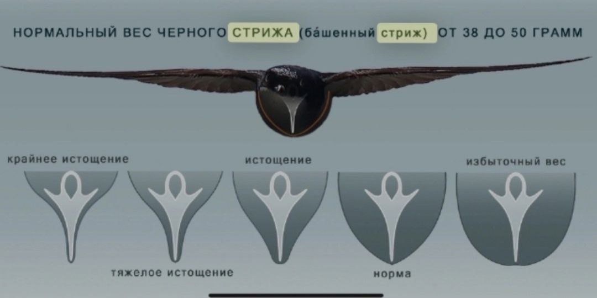
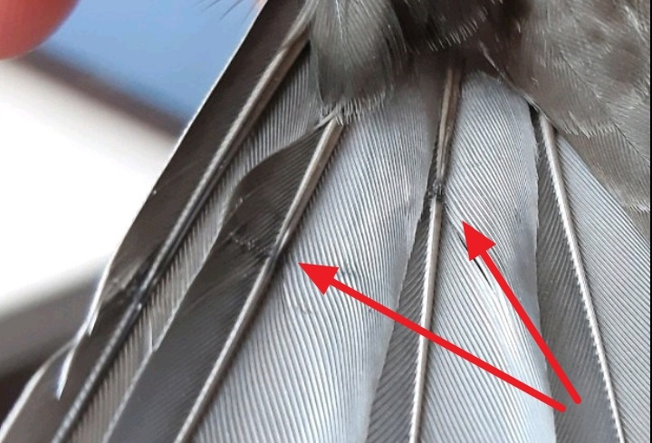
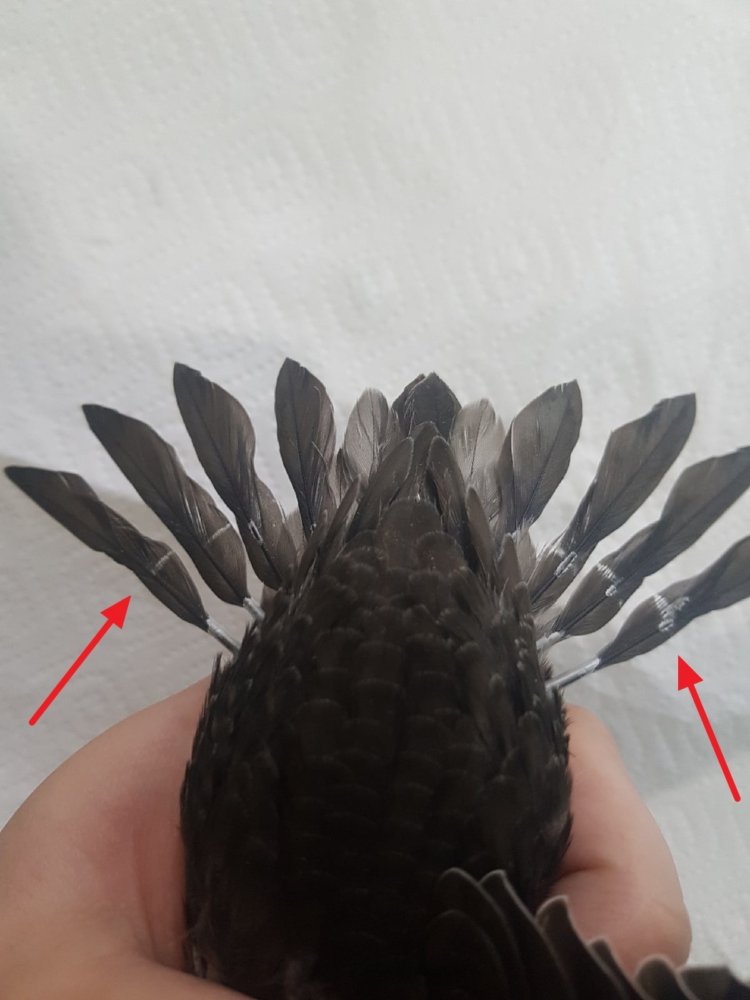
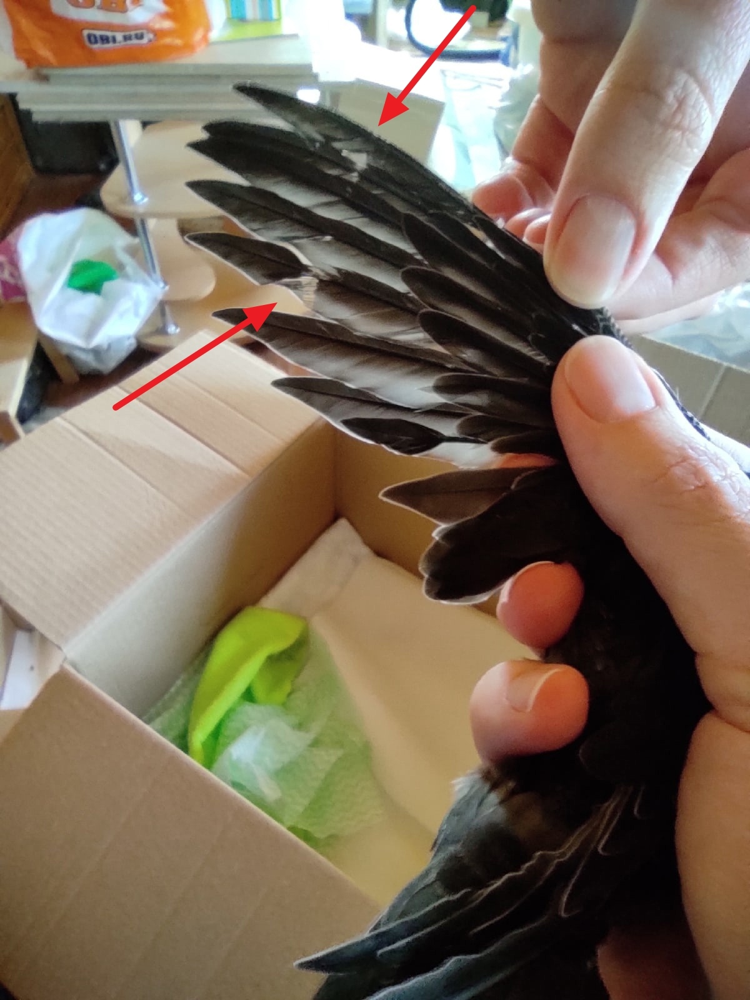

# Kasvanud piiritaja poja vabastamine

(Täiskasvanud linnu vabastamine pärast vigastust avaldatakse hiljem. Veebisait täieneb materjalidega vastavalt nende valmimisele.)

Looduses lahkub piiritaja poeg pesast täielikult kasvanuna ja vormis 40.–45. päeval pärast sündi. Kui piiritaja poega on inimene üles kasvatanud, ei muutu see reegel. Te ei tohiks proovida teda enneaegselt lendama õpetada. Piiritaja pojad treenivad oma lihaseid pesas, lehvitades tiibu, tõukudes ja selga painutades. See on evolutsiooniliselt välja kujunenud, kuna piiritaja pojal on vaid üks võimalus edukaks (või ebaõnnestunuks) väljalennuks. Enneaegne lendu saatmise katse on talle sama stressirohke kui pesast välja kukkumine.

## Mahutiivad ja sabasuled

**Peamine väljalennu valmisoleku kriteerium on täielikult kasvanud mahutiivad ja sabasuled.**

Sulgede torukesed, millest suled kasvavad, peituvad tiiva siseküljel olevate väikeste sulgede all. Ärge proovige piiritajat torukestest “vabastada”. See võib sulge kahjustada.

<figure>
    
    <figcaption>Sulg kasvab torukestest, mis peavad enne vabastamist täielikult kaduma.</figcaption>
</figure>

**Vabatahtlike sage viga on mitte märgata, et sulgede kasv veel jätkub.**

Torukeste puudumise kontrollimiseks niisutage mahutiibade kohal olevaid katvuslugusid veega, et näha kohta, kust suled kasvavad. Katvuslugusid tuleb mitu korda niisutada, kuna need ei märgu kohe.

Täielikult kasvanud sulg väljub otse nahast (sulenahast, mida palja silmaga ei näe). Kasvav sulg väljub torukesest, mida on näha, ja mida lind ise eemaldab, kui sulg on valmis. Kasvava sule varres on veel vereringe, valmis sule varres seda enam ei ole.

<figure>
    
    <figcaption>Torukesed on täielikult kadunud kuni aluseni, mis näitab sulestiku valmisolekut vabastamiseks.</figcaption>
</figure>

<figure>
    
    <figcaption>Näiteks, nii näeb välja piiritaja 38. päeval torukestega. Ilmselgelt pole ta veel lendamiseks valmis.</figcaption>
</figure>

Enneaegselt pesast välja lennanud piiritaja pojad laskuvad maapinnale, kuna nad ei suuda pikka lendu taluda. Kui vabatahtlik vabastab lennuks mittevalmis linnu, võib see lennata meetreid või kilomeetreid, enne kui väsib enneaegsest koormusest ja langeb maapinnale kellegi saagiks.

## Lendukaal

**Teine oluline kriteerium on kaal.** Üle 20 päeva vanune (sulistunud) poeg kaalub tavaliselt rohkem kui täiskasvanud lind. Tema kaal väheneb samaaegselt sulgede kasvamise lõppemisega: rasvkude muutub lihaskoeks. Viimase 1–2 nädala jooksul enne väljalendu võib piiritajat olla raske toita, kuid oluline on säilitada tema kaal, et arendada vastupidavaid lihaseid.

Piiritaja lendukaal varieerub väiksemate isendite puhul 37 grammist kuni suuremate isendite 45 grammini. Standardkaal on 40 grammi. Paksul linnul on raske end õhku tõsta, kõhnale linnule jääb lihasjõust puudu. Kui teil on piiritajatega vähe kogemusi, aitab see pilt mõista toidetuse astet, juhuks kui teil on eriti suur või väike piiritaja poeg.

<figure>
    
    <figcaption>Määrame piiritaja toidetuse astme rinnaluu järgi.</figcaption>
</figure> 

## Sulgede kvaliteedi kontroll

Pärast pesast lahkumist on piiritaja kodu taevas. Piiritajad ei naase pesadesse, nad isegi magavad lennul. Mahutiivad moodustavad tiheda pinna, nagu ka sabasuled. Pildistage laiali sirutatud tiib ja saba heledal taustal mõlemalt poolt, uurige fotot suurenduses. Kui toitsite piiritajat putukatega, järgides vanusele vastavaid toitmise intervalle, näete tõenäoliselt tihedat elastset sulestikku, millel on tugevad, sirged ja ühtlaselt värvunud sulevarded.

< foto heade sulgedega >

Inimeste kätte satuvad pojad on sageli nälginud ja kurnatud, mida võib näha sulgedel nn stressijoonte või -triipudena. Vale toitmise korral on suled hõredad, mitte tihedad, haprad. Selline lind ei ela looduses kaua.

<figure>
    
    <figcaption>Stressijoon 1</figcaption>
</figure>

<figure>
    
    <figcaption>Stressijoon 2</figcaption>
</figure>

<figure>
    
    <figcaption>Stressijoon "kolmnurgana"</figcaption>
</figure>

Kui märkate, et mõned mahutiivad või sabasuled puuduvad, kontrollige, kas nende kohal nahas kasvab uus sulg. Kui jah, laske piiritaja pojal see enne vabastamist täielikult kasvatada. Eriti kriitilised on tiiva kolm välimist mahusulge või saba kolm välimist sabasulge.

< Foto, kus on näha sulgede numeratsioon >

# Vabastamiseks ettevalmistamine

Kui teie piiritaja poeg on sulgede kasvatamise lõpetanud ja tal on lendukaal, veenduge enne vabastamist, et ta on täiesti puhas. Saba või jalgade suled võivad olla määrdunud väljaheidetega. Sel juhul peske neid märja vatipadjaga. Kui saba tuleb tugevalt märjaks teha ja puhastada, lükake vabastamine järgmisele päevale. Lind peab oma suled uuesti veekindla määrdega katma.

## Vabastamise aeg ja koht

Looduses lahkuvad valmis piiritaja pojad pesast õhtul või öösel. Valige ka õhtune aeg, mil päevased röövloomad on juba söönud ja ei jahti nii aktiivselt. Siiski peaks olema piisavalt valge, et vajadusel leida lind rohust, kui midagi läheb valesti.

Vabastamiskoht peab olema avatud, hästi nähtav ja ilma traumaohtlike tingimusteta: suurte peegeldavate pindade, juhtmete, maanteede jms läheduses. Kui piiritaja kukub, peaks ta maanduma rohtu, mitte asfaldile. Sobib koolistaadion, väli või suur lagendik.

## Ilm

Ärge vabastage piiritajat tuulise või äikeselise ilmaga. Parim on soe selge päev või vahelduv pilvisus.

Hiliste poegade vabastamisel suve lõpus kontrollige, et öised temperatuurid ei langeks alla 9 °C, muidu ei leia poeg õhus toitu ja tal on raske kehatemperatuuri hoida.

Oluline on vaadata ilmaprognoosi, kas vabastamiskohast lõunapoolsetesse piirkondadesse on oodata soe koridor, mida mööda piiritaja saaks lennata.

# Piiritaja poja vabastamine

Asetage lind peopessa ja tõstke käsi üles. Ärge visake teda õhku ega liigutage kätt. Tal on vaja aega, sest tal on palju tegemist. Ta uurib ümbrust, otsides röövloomi ja peidupaiku, kust need võiksid välja lennata. Samuti peab ta orienteeruma tuule suunas (tavaliselt stardivad nad vastutuult) ja soojendama lihaseid vibratsiooniga. Kui piiritaja poeg vaatab ringi ja väriseb või “sumiseb” kehaga, on ta peagi lendamas.

Kui hoiate teda rahulikult tõstetud käel ja ta ei lenda, on sellel põhjus. Võite proovida panna ta tagasi kasti, liikuda mõne vahemaa võrra ja pakkuda uuesti võimalust startida. Kui ta ikkagi ei lenda, lükake vabastamine järgmisele päevale või proovige leida täiesti uus vabastamiskoht.

## Lisateave

Piiritajatel ei tööta imprinting nii, nagu paljudel teistel lindudel. Seetõttu ei vaja nad täiendavat metsistumist ega õpetamist parvaga elamiseks. Pole registreeritud juhtumeid, kus piiritaja naaseb “oma” inimese juurde.

## Teadusartikli fragment

Dina Safonovna Ljulejeva märgib oma töös:

— Pesade kontrollimisel kohtasime sageli täiskasvanud välimusega noori linde, kes hoidsid visalt pesast kinni isegi korduvalt häirituna. Põhjuseks oli see, et äärmised mahutiivad olid peaaegu täielikult lahti rullunud, kuid 10.–7. mahusule aluses olid näha veel lahtirullumata torukesed pikkusega kuni 3–5 mm või katted kuni 2 mm. Eriti üllatav oli selliste noorte piiritajate viivitus hilisel väljalennu ajal, kui enamik mustpiiritajaid oli juba pesitsuspiirkonnast lahkunud. Selline noorte piiritajate käitumine on mõistetav, kuna teadaolevalt muutuvad nad pesast lahkudes kohe iseseisvaks, olles võimelised ilma täiskasvanute toeta toitu hankima. Noorte tiivad peavad seega olema täielikult lahti rullunud, vastates täiskasvanud piiritajate tiibadele, mis on alati võimelised pikaks ja manööverdavaiks lennuks. Tiiva sulestiku, eriti tipus olevate esmaste mahusulgede (10.–8.) erilist vastupidavust kinnitab iga-aastane tähelepanek, et üheaastased mustpiiritajad ei vaheta oma esmasi mahusulgi peaaegu täpselt aasta jooksul pärast pesast lahkumist. Teadaolevalt ei pruugi teise kalendriaasta noored piiritajad abielueelsel sulgimisel vahetada äärmist esmast mahusulge, mis jääb alles järgmise talvitumiseni.