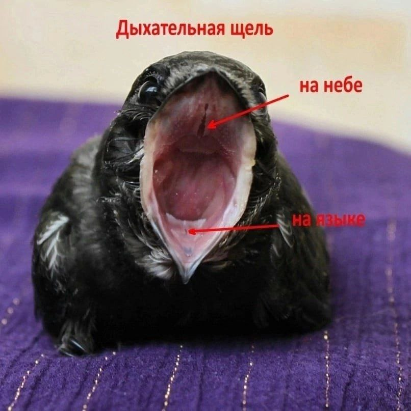

Praktilised soovitused ja kogenud piiritajapäästjate nõuanded kurnatud piiritaja hooldamiseks. Alljärgnev kehtib võrdselt nii täiskasvanud lindudele kui ka poegadele. Erinevused on eraldi märgitud.

---

**Jäta kurnatuse tunnused vahele ja mine otse [elustamise juhendisse](#reanimation)**

Kurnatud piiritajat ei tohi kohe sööta nagu tervet lindu. **Ärge andke suures koguses toitu!** Vastasel juhul võib mao talitlus häiruda ja piiritaja hukkub.

Terve, mitte kurnatud poja jaoks: [Tabel vajaliku toidukoguse kohta ühe piiritajapoja jaoks](amount-of-feed.md)

## Kurnatuse astme määramine
Piiritaja kurnatuse aste määrab meie edasised tegevused.

### Rinnalihaste seisund

Rinna keskel kulgeb kaarekujuline luu kaelast kõhuni – see on kiiluu. Niisutage rinnal olevad suled sooja veega ja lükake need sõrmedega külgedele. Kuidas kiiluu välja näeb? Kas rinnaluu küljed on ümarad ja rind ise U-kujuline? Või on need tasased ja rinnaluu V-kujuline (terav nurk)? Või on rinnaluu nagu õhuke plank, Y- või I-kujuline?

### Kaal

Terve piiritaja, sealhulgas üle 10 päeva vanuse poja kaal on **35 grammi ja rohkem**.

Poja jaoks on kriitiline kaal **18–22 grammi**. Täiskasvanud linnu jaoks on kriitiline kaal alla **30 grammi**.

Leitud kurnatud piiritajapojad kaaluvad tavaliselt **20–27 grammi**.

Kõigepealt tuleb piiritaja täpne kaal teada saada elektrooniliste (köögi- või juveliirkaaludega). Kaal peab olema täpne kuni **1 grammi**. ±10-grammine kõikumine ei sobi, seega mehaanilised kaalud ligikaudse kaaluga ei kõlba.

Kui kodus pole kaalu ega saa seda laenata, saab kaalu mõõta poes iseteenindusosakonnas (puu-, köögivilja-, kuivainete või kommide kaalumine). Pange piiritaja näiteks teekarpi ja kaaluge koos karbiga. Seejärel kaaluge tühi karp eraldi ja lahutage selle kaal kogukaalust. Kaalu dünaamika põhjal saab hinnata, kui kiiresti on vaja tegutseda.

[Vanuse ja kaalu vastavus](identifying-swift.md)

### Suuõõne värvus

Mis värvi on piiritaja suu seest?

- **Ere roosa**  
  Normaalne limaskest. Piiritajapoeg on piisavalt toidetud.

- **Hele roosa**  
  Piiritajapoeg on nõrgenenud, kuid mitte surmaohus.

- **Valge, kollane, hall**  
  Piiritajapoeg on surma lähedal.  

  **Tähelepanu!** Suud **ei tohi** avada nokkade otstest – see võib nokka murda. Hoidke piiritaja pead ühe käe sõrmedega külgedelt, teisega tõmmake nokk nahast (koos sulgedega, mitte ainult sulgedest) õrnalt allapoole, et nokk avaneks. Avatud nokka saab sõrmega fikseerida. Ärge pigistage nokka külgedelt, see vigastab liigest.

### Silmad

Kas silmad on enamasti avatud või suletud? Kui avab, kas täielikult (suured ja ümarad)? Või pooleldi, nagu oleksid poolkinni? Võrrelge [kasvutabeliga](identifying-swift.md): laialt avatud silmad on ainult üle kahe nädala vanustel piiritajatel.

- **Normaalselt avatud silmad**  
  Piiritajapoeg on korras.

- **Kinnised silmad**  
  Piiritaja on nõrgenenud.

- **Sissevajunud silmad** (mõnikord tundub, nagu polekski silmi, nii kuivad)  
  Piiritajapoeg on äärmiselt kurnatud.

### Piiritaja väljaheited

Normaalne linnu väljaheide koosneb kolmest osast: fekaalid, uraadid ja uriin. Valge osa on neerude väljutatud uriin ja uraadid. Tume osa on seedetrakti jäägid – kitiin ja seeditud putukate osad.

- **Väljaheited kurnatuse korral**  
  Midagi musta ja laialivalguvat, väga väheses koguses. Ümberringi võib olla roheline loik. Lindudel on maomahl roheline, ja roheline loik väljaheites näitab, et magu ei seedi midagi.

- **Hea väljaheide**  
  Suur loik kapsli ümber viitab liigsele veele toidus.

- **Ideaalse väljaheide**  
  Hästi vormitud valge kapsel, mis ei valgu laiali, väikese musta sabaga.

- **Väljaheide rohutirtsudega toitmisel**  
  Kapsel on laialivalguvam, must saba pikem, võib olla roosakas, peedivärvi või rohekas.

### Muud kurnatuse tunnused

Jalad ja keha on külmad, äärmise kurnatuse korral võivad olla jäised.  
Normaalselt peaksid need olema soojad või kuumad, kuna piiritajate kehatemperatuur on kõrgem kui inimesel.

Kurnatud piiritaja on kühmus, seljasuled on püsti (seda võib märgata ka fotolt).  
- Normaalselt on suled siledalt keha vastas.

Hingamine on aeglane, sarnane inimese aeglase hingamisega, selg võib märgatavalt tõusta. Kui piiritaja avab nokka rütmiliselt iga hingetõmbega – ta on juba surma lähedal.  
- Normaalselt on hingamine kiire, kaks korda kiirem kui inimesel, ja selja liikumist on vaevu näha.

## Reanimatsioon algab soojendamisest {#reanimation}

Kurnatud piiritaja ei suuda ise soojeneda. Iga lind saab energiat ja soojust toidu seedimisest. Isegi kui panna piiritaja karusnahka, ei saa ta sooja, kuna ta peab esmalt ise seda oma kehaga soojendama.

Soojendamiseks kasuta:
- Oma käsi: hoia piiritajat peopesades, suru enda vastu või pista rinnataskusse.
- Veega täidetud soojenduskotti.
- Pudelit väga sooja veega, mis on sokki pandud.
- Hõõglampi, suunates selle piiritaja peale. Lambiga tuleb olla väga ettevaatlik! Kui linnul on peavigastus (kukkumisel löönud pea ära), ei tohi pealt soojendada!
- Elektrilist soojenduskotti (ainult madalaimal temperatuuril ja sinu järelevalve all, et piiritaja ei kuumeneks üle; kasuta, kui muid võimalusi pole).
- Kingakuivatit soojenduskotina.

Piiritajal peab kastis olema ruumi, et ta saaks kuumuse korral soojusallikast eemale roomata.

Kõik vedelikud ja toit tuleb anda **soojalt**! Soe toit imendub paremini, organism kulutab vähem energiat seedimisele ja taastumine on kiirem.

### Hügieen

Enne reanimatsiooni või mis tahes tegevust piiritajaga pese käed põhjalikult puhtaks ja töötle antiseptikumiga. Kõik kasutatavad vahendid ja esemed peavad olema pestud või steriilsed. Valmista ette puhtad salvrätid, paberirätikud ja puhas nõu.

Kui toiduputukas kukub põrandale, ei tohi seda piiritajale anda. Piiritajad on väga vastuvõtlikud nakkustele! Kurnatusele ei tohi lisada veel probleeme.

Kasuta toitmisel kindaid. Kõige mugavamad on nitriilkindad, mis ei tundu käes ja ei sega.

### Reanimatsiooni ettevalmistus

Vaja läheb füsioloogilist lahust või Ringeri lahust, kuna kurnatud piiritaja on esmalt tugevalt dehüdreeritud. Füsioloogilist lahust saab ise valmistada: sega 1 täis teelusikatäis keedusoola 1 liitris keedetud vees.

Valmista ka meevesi: 1 teelusikatäis mett klaasi keedetud vee kohta. (Ideaalis kasuta meevee asemel 6% glükoosilahust süstide jaoks, kuid see on retseptiravim.)

Sega füsioloogiline lahus meeveega vahekorras 1:1. Hoia vedeliku temperatuur umbes 40 kraadi (väga soe, kuid mitte kuum).

Valmista ette nõelata süstal, eelistatavalt 1 ml insuliinisüstal.

Vaja läheb ka vatitikke ja salvrätikuid.

Mezym tablette (saadaval apteegis, sisaldab seedimist soodustavaid ensüüme). Eemalda tabletilt roosa kate (kraabi noaga) ja purusta tablett pulbriks.

Toiduputukad, ideaalis ritsikad. Lisateave toiduputukate kohta: [toitmine](feeding-swift.md).

### Reanimatsioon

Esmalt anna piiritaja nokka **0,2–0,3 ml** füsioloogilise lahuse ja meevee segu (1:1). See on 5–7 tilka. Tee seda nõelata süstlaga, soojalt, tilgutades tilkhaaval ja veendudes, et vedelik jõuab kurku ning piiritaja neelab selle alla. Ole väga ettevaatlik linnu keelel ja suulael olevate hingamisavade suhtes – vedelik ei tohi sinna sattuda.

Noka avamiseks hoia piiritaja pead ühe käe sõrmedega külgedelt, teisega tõmba nahast (koos sulgedega, mitte ainult sulgedest) nokk õrnalt allapoole. Avatud nokka saab sõrmega fikseerida. Ära pigista nokka külgedelt, see vigastab liigest. Ära hoia nokka otstest ega ava nii – see võib alalõua murda.

<figure class="image-float">
 
  <figcaption>Piiritaja hingamisavad</figcaption>
</figure>

Oota 20 minutit. Lind peab kogu aeg olema soojas. Mugav on hoida soojenduskotti süles ja piiritajat käes selle kohal.

Seedetrakti töö alustamiseks toida sageli väikeste portsjonitega. Valmista ritsika või prussaka mahl. Eemalda putukalt pea koos maoga ja pigista kõhust välja “liha”. Kitiinist kest on surevale linnule liiga jäme, seda ära anna. Mida suuremad putukad, seda rohkem mahla saab. Koguge **0,2–0,25 ml** mahla. Lisa portsjonisse Mezymi pulbrit seesamiseemne suuruses. Silitage piiritaja kurku ülalt alla, et tal oleks kergem neelata. Kui mahl jääb kurku, tõmba pea ettevaatlikult ette ja üles (diagonaalis), et kael sirguks ja mahl liiguks söögitorusse. Hoia lähedal vatitikke, et vajadusel kiiresti puhastada hingamisavad, kui vedel toit sinna satub. Iga tilk toitu pigista süstlast alles siis, kui eelmine tilk on kindlasti alla neelatud.

Kui putukaid pole, ära asenda neid muu toiduga. Piiritajat võib 1 päeva hoida füsioloogilise lahuse ja meevee segul (1:1), kuid anna maksimaalselt **5 tilka** ühe “toitmise” kohta. Sama kehtib, kui leidsid piiritaja õhtul ja midagi osta ei saa. Kogenud vabatahtlikel on soovitatav kodus varu hoida.

Esimesel päeval toida ainult mahladega. Valmista putukatest **0,2–0,25 ml** mahla (2–3 ritsika või prussaka mahl) ja toida iga **25–40 minuti** tagant esimesed 5 toitmist. Pärast viiendat toitmist ilmub tavaliselt väljaheide. Kui väljaheide on olemas, suurenda portsjonit **0,3–0,35 ml-ni** (4–5 mahla) ja pikenda intervalli 1 tunnini kuni päeva lõpuni. Öised pausid toitmiste vahel ei tohi olla pikemad kui 3 tundi.

### Kaalu kontroll

Igal hommikul enne esimest toitmist kaalu piiritaja tühja kõhuga. Iga päev peab piiritaja juurde võtma vähemalt **1–1,5 grammi**. Esimesed paar grammi tulevad esimestel tundidel dehüdratsiooni taastumisel. Edasi peab kaal järk-järgult suurenema, kuni see vastab vanusele. Eriti oluline on poega piisavalt toita. Näljase piiritajapoja sulestik ja siseorganid arenevad halvasti, sulgedel võivad olla defektid, need võivad murduda või välja langeda. Halva sulestikuga piiritaja ei ela looduses ellu.

### Paisunud kõht

Kui toidad piiritajat, kuid väljaheidet ei tule, võib tekkida probleem. Väljaheide peab ilmuma alates viiendast toitmisest (alates hetkest, kui magu oli tühi). Katsuge piiritaja kõhtu (mitte rinda, kus on kiiluu, vaid just kõhtu). Kui see on kõva ja paisunud, lõpeta toitmine kuni väljaheite ilmumiseni. Anna **2 tilka vaseliiniõli** veega nokka. Määri pärak õliga. Hoia piiritajat kõhuga sooja kohal. Masseeri kõhtu ettevaatlikult vatipadjaga.

### Putukatest tükeldatud toit

Kui piiritaja suuõõs on hele roosa, mahl imendub ja väljaheide on regulaarne, võid järk-järgult alustada tükeldatud putukatega toitmist, **1,5-tunnise intervalliga**. Tükeldatud toit on maniküürikääridega hakitud ritsika- või prussakakõhud.

Asenda üks mahlatoitmine sama koguse tükeldatud toiduga. Lisa Mezymi pulbrit. Kui väljaheide on korras ja selles on vähe või üldse mitte seedimata jääke, tähendab see, et piiritaja seedib toitu. Siis asenda kaks mahlatoitmist sama koguse tükeldatud toiduga. Üleminek tükeldatud toidule võib kesta terve päeva või isegi paar päeva, suurendades järk-järgult tükeldatud toidu kogust ja viies piiritaja sujuvalt täielikult tükeldatud toidule.

Kontrolli piiritaja suud pärast toitmist, veendumaks, et hingamisavad on korras! Peenikesed tükeldatud kitiiniosakesed võivad kleepuda suulaele või sattuda hingamisavadesse.

### Kõhutäitega toitmine

Terved, tükeldamata ritsikakõhud võta kasutusele järk-järgult. Anna 2–3 kõhtu koos tükeldatud toiduga ja vaata, milline on väljaheide ning kas tükeldamata toit seedub. Kui toit ei seedu, on kõhud veel liiga vara. Kui piiritajat hakkab iiveldama, ära anna rohkem kõhutäiteid ja naase mahlatoitmisele. Kui iiveldust ei esine, ritsikad seeduvad ja piiritaja teeb tunni jooksul väljaheite, võid jätkata, suurendades järk-järgult portsjoni suurust **2–4 kõhuni**, kuni jõuad vanusele vastava normaalse portsjonini.

## August – hüljatud ja kurnatud piiritajapoegade kuu

Parv lendab lõunasse augusti alguses või keskel, jättes osa poegi alatoitunult pesadesse. Tavaliselt on tegemist hiliste poegadega, kui esimene pesakond ebaõnnestus ja vanemad tegid uue pesakonna. Pojad ootavad päev-paar, mõnikord nädal… ja siis ei pea enam vastu ning lähevad ise toitu otsima. Siis leitaksegi nad maapinnalt.

Kiiluu on terav ja õhuke nagu vineer, silmad on suletud ja sissevajunud, suuõõs on hele roosa või valge, kaal **20–24 grammi**.

Vabatahtlikult on vaja erilist visadust, kiiret otsustamist ja valmisolekut raskusteks. Aeg tiksub minutitega! Kui kiireid meetmeid ei võeta, hukkub piiritajapoeg ööpäeva jooksul. Reanimeeritud piiritajapojad taastuvad järk-järgult, jõuavad normaalse kaalu ja arenguni ning võivad potentsiaalselt loodusesse naasta.
