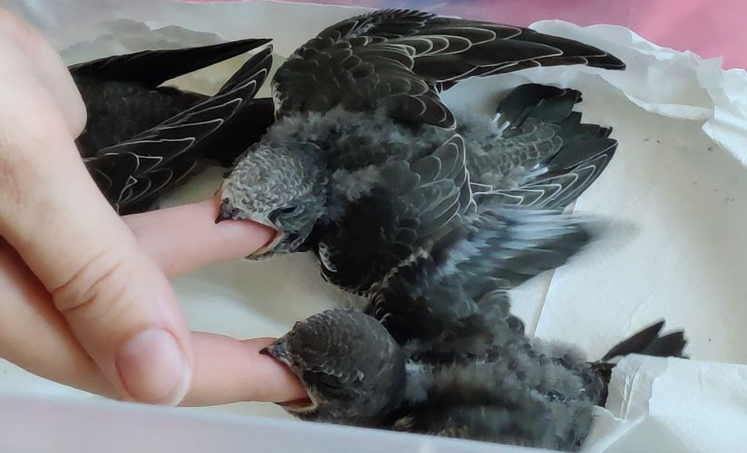

# Põhipunktid

Piiritaja on täielikult putuktoiduline lind. Absoluutselt.

Tema seedesüsteem ei ole üldse kohanenud loomsest valgust (kodujuust, lihatooted) ega tõukude, kirpude, vihmausside, gammaruse jms tõhusaks seedimiseks. Piiritaja loomulik toit on õhuplankton. Lihtsamalt öeldes: sääsed ja muu pisipuder. Kõige lähedasem koostiselt on söödaputukad: ritsikad ja prussakad.

<figure>
    
    <figcaption>Väikesed piiritajad haaravad sõrmedest</figcaption>
</figure> 

Poegade jaoks on oluline eesmärk kasvatada lendamiseks sobiv sulg. Piiritajad elavad sõna otseses mõttes taevas: nad mitte ainult ei toitu, vaid ka magavad õhus. Pesa kasutatakse ainult pesitsushooajal. Teie juures kasvanud sulestik peab võimaldama piiritajal jõuda Lõuna-Aafrikasse. Kui poeg jääb ellu, kuid tal kujuneb kehv sulg, ei suuda ta loodusesse naasta või hukkub peagi pärast vabastamist. Siinsed nõuanded on konservatiivsed ja keskenduvad hea sulestiku ning poja organismi täieliku arengu kogemusele.

Sel põhjusel välistab see juhend igasugused linnutoidusegud, sealhulgas need, mis on väidetavalt mõeldud putuktoidulistele lindudele.
Sundtoitmise viise piiritajate puhul vaata allpool põhi- ja lisatoidu kirjeldustest või mine otse edasi.

## Põhitoidud

- **Toaritsikad või banaaniritsikad**
- **Marmor- või Türkmenistani prussakad**

Need putukad võivad olla elusad (värskelt tapetud) või külmutatud. Parim on osta elusaid ja külmutada need ise. Putukatel on erinevad arengustaadiumid. Täiskasvanud (tiibadega) isendid sobivad halvasti toitmiseks: need on kõvad ja vajavad palju töötlemist. Eeltäiskasvanud – suured, kuid mitte täiskasvanud – sobivad ideaalselt. Väga väikesed, veel mitte eeltäiskasvanud – sobivad samuti, kuid on kallid, kuna neid kulub palju. Kõik kõvad ja teravad putukaosad tuleb eemaldada.

## Lisatoidud

- **Zophobas (vastsed)**
- **Jahuussid**
- **Mustlase kärbsed**

Zophobas on liiga rasvane, et olla põhitoit. Kuid 3–5 zophobast päevas võib olla lisand põhitoidule. Zophobas antakse ilma pea ja soolikata.
Jahuussid on koostiselt kehvemad, seega ei sobi need põhitoitmiseks. Hädaolukorras võib neid kasutada koos vitamiinikompleksidega. Neil on kõva kest, seega vali karbist värskelt sulanud (valged) ussid.
Mustlase kärbsed on koostiselt täisväärtuslikud ja väga hea toit. Ainus puudus on nende väike kaal. Ühe toitmise jaoks on vaja väga palju kärbseid, mistõttu on piiritaja söötmine ainult kärbestega töömahukas.

## Kui söödaputukaid pole võimalik osta

Looduslik toit:
- **Külmutatud kärbsed** (mitte kleepuva lindi pealt)
- **Ritsikate või rohutirtsude kõhud**
- **Mittevärvilised tiibadeta liblikad** (eelkõige öised)
- **Mittevärvilised karvutud röövikud** (mitte ussid!)
- **Sipelgamunad**

Tähtis! Loodusest püütud kärbsed ja ritsikad tuleb külmutada vähemalt 4 tundi, et vältida linnu nakatumist parasiitidega.

## Lühike toidukoguste tabel

<table>
  <tr>
    <th>Poja vanus (päeva)</th>
    <th>Vajalik toidu maht päevas (g)</th>
    <th>Banaaniritsikaid päevas (tk)</th>
    <th>Toaritsikaid päevas (tk)</th>
    <th>Väikeseid toaritsikaid päevas (tk)</th>
    <th>Suuri marmorprussakaid päevas (tk kõhtusid)</th>
    <th>Väikseid marmorprussakaid päevas (tk terveid)</th>
  </tr>
<tr><td>10-16</td><td style='background-color:#ff4500'>20</td><td>60</td><td>100</td><td>200</td><td>80</td><td>160</td></tr>
<tr><td>17-20</td><td style='background-color:#ff7f50'>18</td><td>54</td><td>90</td><td>180</td><td>72</td><td>144</td></tr>
<tr><td>21-38</td><td style='background-color:#f4a460'>15</td><td>45</td><td>75</td><td>150</td><td>60</td><td>120</td></tr>
</table>

Ja lingilt [**täpne päevade kaupa tabel** vajaliku toidukoguse ja kaalukontrolliga ühe piiritaja poja jaoks](amount-of-feed.md)

[Loe toidu liikide kohta põhjalikumalt spetsiaalses jaotises, seal on palju nüansse](#types-of-food)

# Piiritaja toitmise iseärasused

Väike inimeste kätte sattunud poeg ja teismeline, kes on juba harjunud vanemaga, toituvad erinevalt. Teismelise puhul on toitmine tõenäoliselt sundtoitmine. Täiskasvanud piiritajat toidetakse sundkorras.

  <figure>
    <video width="300" height="405" controls>
      <source src="{{ 'assets/video/feeding-adult-swift2-rus.mp4' | relative_url }}" type="video/mp4">
      Teie brauser ei toeta videot.
    </video>
    <figcaption>
      Põhjalik selgitus, kuidas piiritajat toita.
    </figcaption>
  </figure>

  <figure>
    <video width="570" height="405" controls>
      <source src="{{ 'assets/video/feeding-adult-swift1.mp4' | relative_url }}" type="video/mp4">
      Teie brauser ei toeta videot.
    </video>
    <figcaption>
      Lühidalt (video ilma helita): toidame täiskasvanud piiritajat. Prussakas asetatakse sügavale ja seejärel silitame.
    </figcaption>
  </figure>

On täheldatud, et mitme poja grupp toitub tavaliselt paremini kui üksikud.

# Nüüd toidu liikidest detailsemalt {#types-of-food}

## Ritsikad

### Ainult eeltäiskasvanud (mitte tiibadega):
- Toaritsikas: 1,5–2 cm, kõrge toiteväärtus, proteiin 17,8%, rasv 5,33%
- Banaaniritsikas: kuni 3 cm, proteiin 17,51%, rasv 5,33%
- Kahelaik-ritsikas: kuni 3 cm, proteiin 17,7%, rasv 5,33%

#### Ettevalmistus:
1. Külmutatud ritsikaid raputada karbis, et eemaldada jalad.
2. Sulatada soojas vees (mitte keevas).
3. Asetada salvrätikule, eemaldada ülejäänud jalad, muljuda pea (kui kõva), suurte puhul on parem tõmmata pea ja soolik välja.

## Prussakad

Sobivad ainult kultiveeritud söödaliigid, punaseid prussakaid ei tohi kasutada.

- **Marmorprussakas**: kuni 3,5 cm, proteiin 22,13%
- **Türkmenistani prussakas**: ~2,5 cm, proteiin 18,16%, rasv 8,645%

#### Ettevalmistus:
- Marmorprussakas: suurte puhul kasuta ainult kõhtusid, lõika need pikuti. Väikseid (1 cm) anna tervelt, jalad eemaldatud.
- Türkmenistani prussakas: eemalda jalad.

## Zophobas (vastsed)

- Proteiin 17,4%, rasv 16,56%
- Ära külmuta!

## Toitmise sagedus ja portsjonite arvutamine

- Poeg sööb 15–20 g päevas, toidetakse iga 1,5–2 tunni tagant – umbes 8–9 korda päevas, öine paus 6 tundi.
- Täiskasvanud piiritaja – ~12 g päevas, 3–4 toitmist (võib ka 2 toitmist, kui suudab süüa päevanormi kahe korraga).

**Portsjonite näited toitmiseks**:
- Toaritsikad: 15–20 tk (1,5–2 cm)
- Banaaniritsikad: 10–15 suurt või 15–20 väikest
- Marmorprussakad: 10–15 kõhtu või 20–25 väikest
- Sipelgamunad: 1 tl “kühmuga”

Kasuta kaalu täpsusega 0,01 g portsjonite kontrollimiseks.

## Mida teha, kui söödaputukaid pole

Kiired hankimisvõimalused:
- Öised liblikad – püüda veeanumaga, mille taga on hele kangas ja taskulamp.
- Ritsikad/rohutirtsud – püüda rohus, paluda lastel abiks. Külmutada, anda ainult kõhtusid.
- Kärbsepüünis (mitte kleepuv lint), püütud kärbsed külmutada.
- Sipelgamunad – pesta, vormida “tükiks”.
- Mesilaste haud – mesilaste kasvatajate kaudu.

## Vitamiinid

Mitmekesisuse puudumisel:
- **Multibiotin‑Birds (ExoticMenu)** või **NEKTON‑Biotin**
- Anna iga päev kuni vabastamiseni. Pulbrit kanna toidule kuivade kätega või lahusta vees ja anna süstlaga ravimina keele taha, vältides hingamisteid.

/foto piiritaja suust koos märgistustega/

## Toitmise viisid
/toitmise protsess, tekstiline kirjeldus/
/Tanino video subtiitritega/
/minu vana video/

<figure>
<video width="300" height="405" controls>
  <source src="{{ '/assets/video/how-to-give-water-to-swift.mp4' | relative_url }}" type="video/mp4">
  Teie brauser ei toeta videot.
</video>
<figcaption>Anname piiritajale vett, riputades tilga nokale. Kahtlustatava põrutuse korral vett ei anna.</figcaption>
</figure>

## Jäägid tihaste toiduks

Putukate jalad, pead ja koorikud võib säilitada sügavkülmas ja lisada talvel tihaste toidule.