---
layout: default
title: Piiritaja vanuse ja seisundi määramine
lang: est
is_home: false
---

## Kuupäevad
Kui leidsite rästiku maikuus või juunikuus, siis on tegemist täiesti kindlasti täiskasvanud rästikuga, kes on lennanud Aafrikast(!). 
Sel ajal puskareid veel ei ole.

  <table style="border-collapse: collapse; width: 60%; table-layout: auto;">
    <tr style="background-color: #f2f2f2;">
      <th style="border: 1px solid #ddd; padding: 8px; width: 80px; white-space: nowrap;">Kuu</th>
      <th style="border: 1px solid #ddd; padding: 8px;">Kirjeldus</th>
    </tr>
    <tr>
      <td style="border: 1px solid #ddd; padding: 8px; white-space: nowrap;">Mai</td>
      <td style="border: 1px solid #ddd; padding: 8px;">🟢 Saabumine Leida võib ainult täiskasvanud rästiku</td>
    </tr>
    <tr>
      <td style="border: 1px solid #ddd; padding: 8px; white-space: nowrap;">Juuni</td>
      <td style="border: 1px solid #ddd; padding: 8px;">🟡 Pesitsemine ja munad Leida võib ainult täiskasvanud rästiku</td>
    </tr>
    <tr>
      <td style="border: 1px solid #ddd; padding: 8px; white-space: nowrap;">Juuli</td>
      <td style="border: 1px solid #ddd; padding: 8px;">🐣 Puskard</td>
    </tr>
    <tr>
      <td style="border: 1px solid #ddd; padding: 8px; white-space: nowrap;">August</td>
      <td style="border: 1px solid #ddd; padding: 8px;">🔴 Äralend Leitakse hüljatud ja kurnatud rästikupuskareid</td>
    </tr>
    <tr>
      <td style="border: 1px solid #ddd; padding: 8px; white-space: nowrap;">September</td>
      <td style="border: 1px solid #ddd; padding: 8px;"></td>
    </tr>
  </table>

Tähtis!
Piiritajatel ei ole "lennuvõimelisi poegi". Poeg oskab pesast lahkudes kohe lennata ja toitu hankida.  
Seetõttu ärge püüdke piiritajat puu oksale asetada. Kui piiritaja on maas, vajab ta abi!  

Puskardi vanuse määramiseks kasutage visuaalseid tunnuseid (suled, silmad, käitumine) ja võrrelge kirjeldustega.

<body>
    <h1> Piiritajate vanus: areng 1.–42. päevani </h1>
    
Tabel kirjeldab rästikute (Apus apus) puskardite arengut 1. kuni 42. päevani, sealhulgas välimus, käitumine ja eripärad. "Vanemate söötmise ajad" – kellaajad, mil vanemad lendasid kohale ja toitsid, mõnikord isegi samaaegselt.

<table>
        <tr>
            <th style="width: 65%;">Kirjeldus</th>
            <th style="width: 35%;">Foto on klõpsatav</th>
        </tr>
        <tr>
            <td>Esimene tund ja 1. päev 
Embrüonaalset udusulgi ei ole. Nahk on õrnroosa. Pterüülid pole märgistatud. Nok on hele, suunurkades valge voldik. Kuulmekäigud on suletud. Silmalaud on kinni.  
Keha pikkus 40 mm. Tiiva pikkus 7−8 mm. Kaal 3,0 (2,5−3,6) g. 
  Vanemate söötmise ajad: 
5:10, 7:28, 7:56, 9:05, 10:03, 11:35, 12:29, 15:40, 15:57, 17:07, 18:29, 20:22, 20:34, 21:17, 21:35</td>
            <td>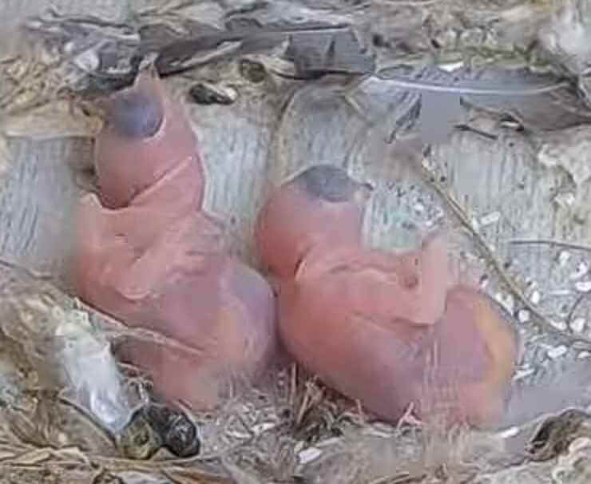</td>
        </tr>
</table>

  
Klõpsake tabeli kokkuvoltimiseks

<table>

<body>

<table>
        <tr>
            <th style="width: 65%;">Kirjeldus</th>
            <th style="width: 35%;">Foto on klõpsatav</th>
        </tr>
        <tr>
            <td>Esimene tund ja 1. päev 
Embrüonaalset udusulgi ei ole. Nahk on õrnroosa. Pterüülid pole märgistatud. Nok on hele, suunurkades valge voldik. Kuulmekäigud on suletud. Silmalaud on kinni.  
Keha pikkus 40 mm. Tiiva pikkus 7−8 mm. Kaal 3,0 (2,5−3,6) g. 
  Vanemate söötmise ajad: 
5:10, 7:28, 7:56, 9:05, 10:03, 11:35, 12:29, 15:40, 15:57, 17:07, 18:29, 20:22, 20:34, 21:17, 21:35</td>
            <td></td>
        </tr>
</table>

  
Klõpsake tabeli kokkuvoltimiseks

<table>
        <tr>
            <th style="width: 65%;"></th>
            <th style="width: 35%;"></th>
        </tr>
        <tr>
            <td>2. päev 
Nahk on heledam roosa. Pterüülid ilmuvad väikeste tumedate täppidena (suurusega 0,2 mm) õlgadel ja sabapiirkonnas. Selja- ja kõhupoolel pterüülid ei ole nähtavad. Kuulmekäigud on suletud. Silmalaud on kinni. Nok ja küünised tumenevad.  
Keha pikkus 56 mm. Tiiva pikkus 11 mm. Kaal 5,5 (5,0−6,6) g. 
  Vanemate söötmise ajad: 
5:36, 7:23, 8:18, 10:03, 13:06, 16:16, 17:32, 19:16, 20:36, 20:58</td>
            <td>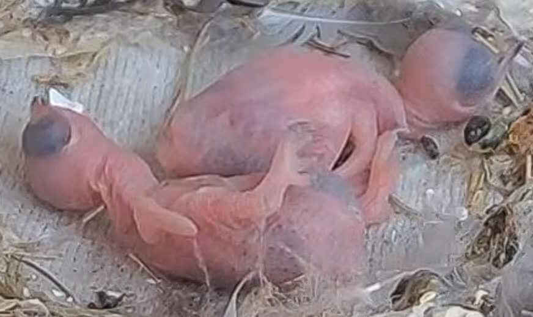</td>
        </tr>
        <tr>
            <td>3. päev 
Sulgede pterüülid ilmuvad nõrgalt märgatavate punktjoonte kujul (nahasiseselt arenevad suled) pea-, õla-, tiiva-, selja- ja rinnapterüülidel (iga areneva sule algmaterjal on suurusega 0,5−1,5 mm, suurimad õlapterüülid — 1,5 mm). Tiivapterüülid on 1 mm laiused punktribad. Kuulmekäigud on suletud. Silmalaud on kinni. Nok on helesinine, küünised heledad.  
Keha pikkus 60 mm. Tiiva pikkus 12 mm. Kaal 8,5 (7,5−10,4) g. 
  Vanemate söötmise ajad: 
4:02, 4:13, 5:23, 5:58, 6:34, 9:22, 10:42, 12:40, 13:44, 13:57, 14:52, 16:06, 16:45, 17:56, 18:08, 20:00, 20:55</td>
            <td>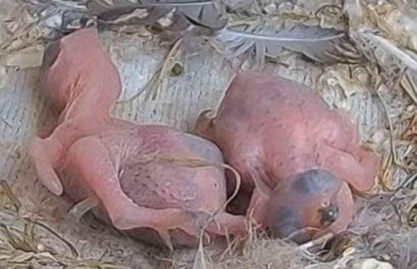</td>
        </tr>
        <tr>
            <td>4. päev 
Kõik pterüülid on märgistatud punkt- ja kriipsjoonte kujul, mis kujutavad nahasiseselt arenevaid sulgi. Pea-, õla-, tiiva-, selja- ja rinnapterüülidel on suled tähistatud punktjoonte, täppide või väikeste kriipsudena (0,5−1 mm). Õla- ja seljapoolsed kriipsjooned on suurusega 1,5−2 mm. Nok on helesinine. Munahammas on olemas. Küünised on heledad. Kuulmekäigud on suletud. Silmalaud on kinni.  
Keha pikkus 65 mm. Tiiva pikkus 12−16 mm. Kaal 10,7 (9,6−12,8) g. (kõhn − 5,6 g) 
  Vanemate söötmise ajad: 
4:18, 4:51, 5:18, 6:03, 7:07, 9:01, 10:44, 11:01, 12:37, 13:12, 14:51, 15:44, 16:36, 18:07, 18:14, 19:48, 20:30, 20:44, 21:19</td>
            <td>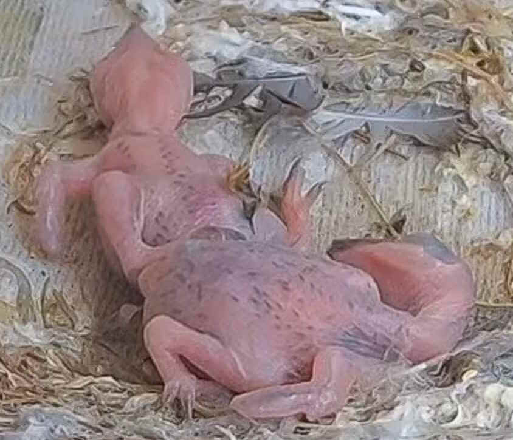</td>
        </tr>
        <tr>
            <td>5. päev 
Pterüülid on selgelt märgistatud nahasiseselt arenevate sulgede kriipsribadena (õla-, selja- ja külgpterüülidel sule suurus 2−3 mm; rinna- ja jalapterüülidel: 2−1,7 mm). Tiivapterüülid on 2 mm laiused tumedad ribakesed. Tulevaste lend- ja sabasulgede kohal on väikesed valkjad täpid. Kuulmekäigud on suletud. Silmalaud on kinni. Nok on tume, munahammas on säilinud. Küünised on helesinised.  
Keha pikkus 70−75 mm. Tiiva pikkus 15−18 mm. Kaal 13,0 (10,7−14,8) g. 
  Vanemate söötmise ajad: 
3:47, 4:03, 4:38, 4:43, 5:25, 7:56, 10:17, 11:59, 12:55, 13:34, 14:02, 14:33, 15:38, 16:38, 17:36, 19:06, 18:44, 19:41, 20:34, 20:35, 21:25</td>
            <td>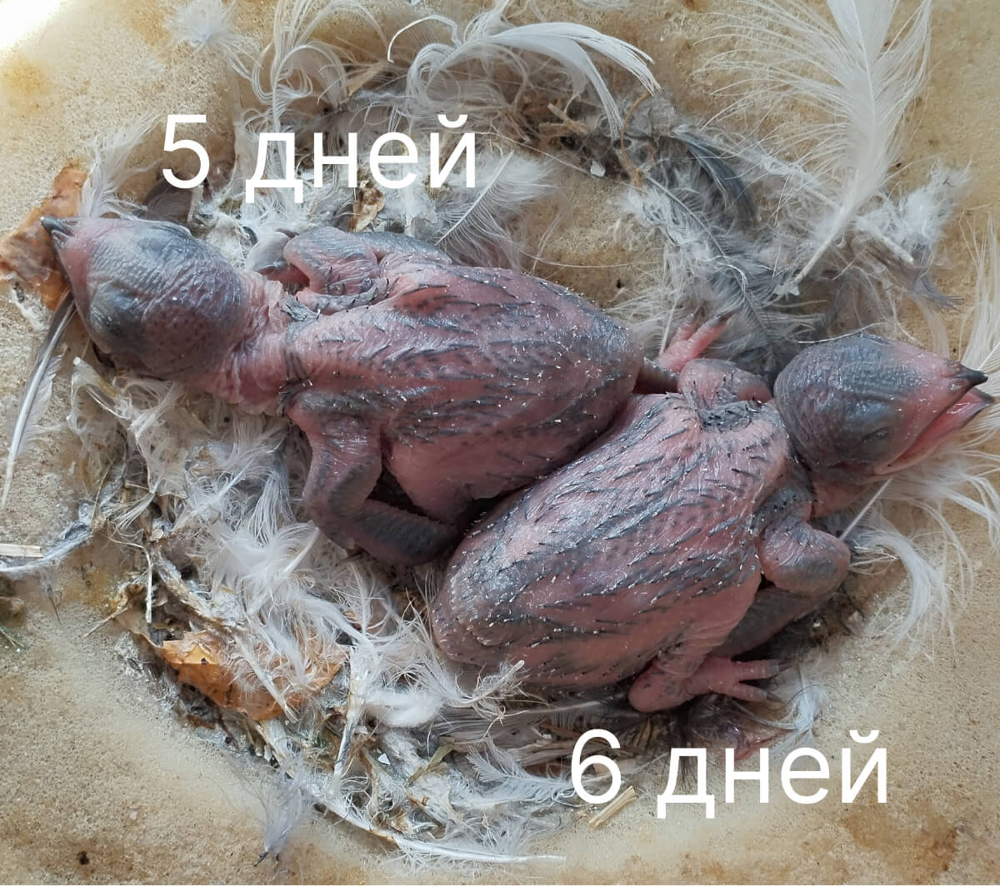</td>
        </tr>
        <tr>
            <td>6. päev 
Tibu on täielikult tume nahasiseselt arenevate sulgede tõttu. Silmalaud on lahti. Kuulmekäik on suletud. Seljapoolsel küljel on nahast välja tunginud valkjad udusulgede otsad (nahasisene sule osa on 3−4 mm). Põhisulg on esindatud heledate muhkudena, mis ilmuvad kahe ribana udusulgede vahel. Pea on tumenenud nahasiseselt arenevate sulgede tõttu. Tiivapterüülid on tumedad soonilised ribakesed (5 mm). Lendsuled on väikeste hammastena (0,2 mm). Sabasuled näevad samasugused välja. Kõhupoolel arenevad suled nahasiseselt (3 mm). Munahammas on säilinud.  
Keha pikkus 78−83 mm. Tiiva pikkus 20−23 mm. Kaal 17,5 (16,3−19,2) g. 
  Vanemate söötmise ajad: 
4:14, 4:21, 6:34, 8:34, 11:50, 12:43, 13:04, 14:43, 14:45, 16:07, 17:06, 17:16, 18:47, 18:51, 20:15, 20:27, 20:59</td>
            <td></td>
        </tr>
        <tr>
            <td>7. päev 
Udusulg on nahast välja tunginud (5 mm) väikeste valkjate tuttidena (0,5−1 mm). Nahasiseselt kasvavate sulgede jooned on sulandunud tumedateks laikudeks ja ribadeks pea-, tiiva- ja õlapterüülidel. Selja-, nimme-, kõhu- ja jalapterüülid on kaetud nahasisese sule kriipsude ja joontega (3−6 mm). Silmad avanevad osaliselt. Kuulmekäigud on osaliselt avatud.  
Keha pikkus 80−86 mm. Tiiva pikkus 16−26 mm. Kaal 16,0 (19,8−22,2) g. 
  Vanemate söötmise ajad: 
3:48, 5:11, 6:51, 8:11, 9:23, 10:05, 10:29, 12:13, 13:26, 13:50, 14:36, 15:06, 16:49, 17:06, 18:26, 19:36, 20:01, 20:54, 21:13</td>
            <td>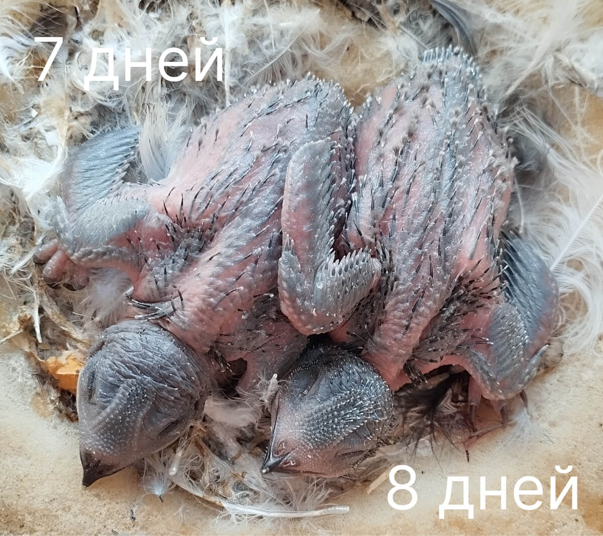</td>
        </tr>
        <tr>
            <td>8. päev 
Kõik pterüülid on selgelt nähtavad nahasiseselt arenevate sulgede sooniliste ja kumerate tumedate ribadena. Selja-nimme pterüülil on nahast välja tunginud suleotsad lõhkenud — ilmunud on arvukad valkjashallid udusulgede tutid (1−2 mm), nahasisene sule osa (4−5 mm). Udusulg on nahast välja tunginud ka rinnapterüülil. Nok ja küünised on mustad. Munahammas on säilinud. Kuulmekäik on avatud.  
Keha pikkus 82−88 mm. Tiiva pikkus 20−29 mm. Esmaste lendsulgede pikkus 0,2−1,7 mm. Sabasulgede pikkus 0,2−1,0 mm. Kaal 18,0 (16,3−22,0) g. 
  Vanemate söötmise ajad: 
3:39, 3:52, 4:26, 4:56, 7:02, 11:24, 12:56, 13:22, 13:50, 15:00, 15:44, 18:52, 19:59, 20:09, 21:05</td>
            <td>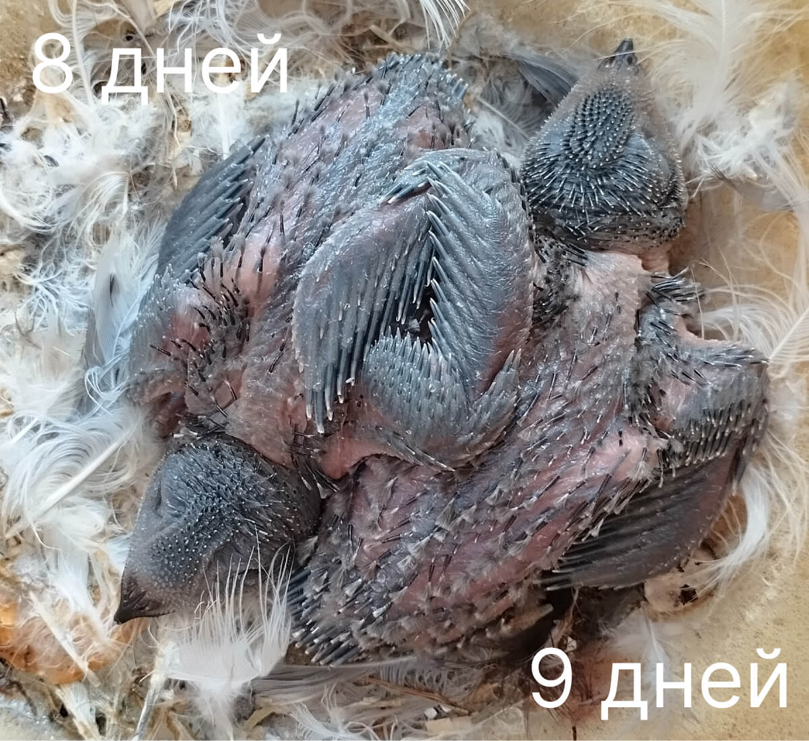</></td>
        </tr>
        <tr>
            <td>9. päev 
Arvukad nõeljad sulejuured on ilmunud pea- (1 mm), selja-, tiiva- ja sabapterüülidele (3−4 mm). Õlgadel, seljal ja ülasabal on arvukad udusulgede tutid (3−4 mm). Silmad on osaliselt avatud. Kuulmekäik on avatud.  
Keha pikkus 90−95 mm. Tiiva pikkus 33−36 mm. Kaal 25,0 (23,8−26,7) g. 
  Vanemate söötmise ajad: 
3:59, 4:23, 4:39, 8:59, 12:07, 12:44, 13:38, 14:45, 15:02, 15:13, 15:49, 16:39, 17:25, 18:04, 19:00, 19:19, 20:02, 20:28</td>
            <td>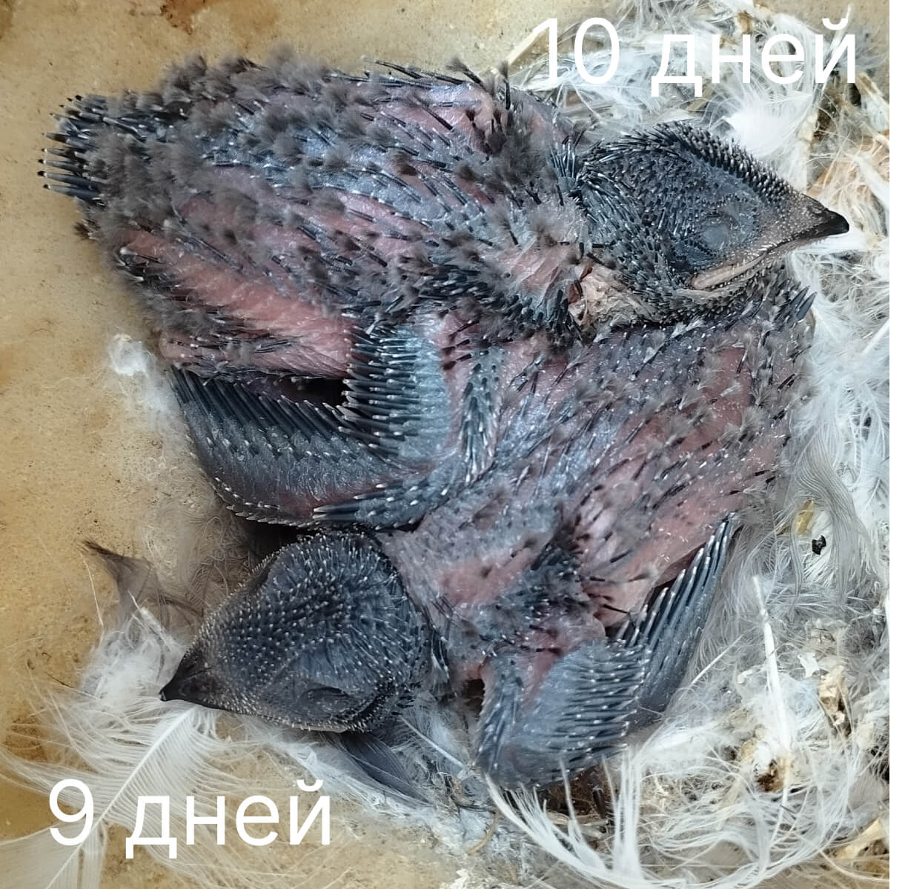</td>
        </tr>
        <tr>
            <td>10. päev 
Arvukad udusulgede tutid (3−4 mm) lahtuvad seljapoolel ja moodustavad õlgadel ja sabapiirkonnas hõreda koheva katte. Selja-nimme pterüülil on suled väikeste juurdena (1−1,5 mm). Silmad on poolavatud. Munahammas on säilinud. Esmaste ja teiseste lendsulgede ning sabasulgede juured on väikeste torukestena.  
Keha pikkus 98−103 mm. Tiiva pikkus 37−42 mm. Esmaste lendsulgede pikkus 3−8 mm. Sabasulgede pikkus 1−3 mm. Kaal 23,5 (15,5−31,1) g. 
  Vanemate söötmise ajad: 
6:20, 8:59, 9:38, 12:43, 14:43, 16:29, 17:39, 18:08, 20:23, 20:45, 21:02, 21:08</td>
            <td>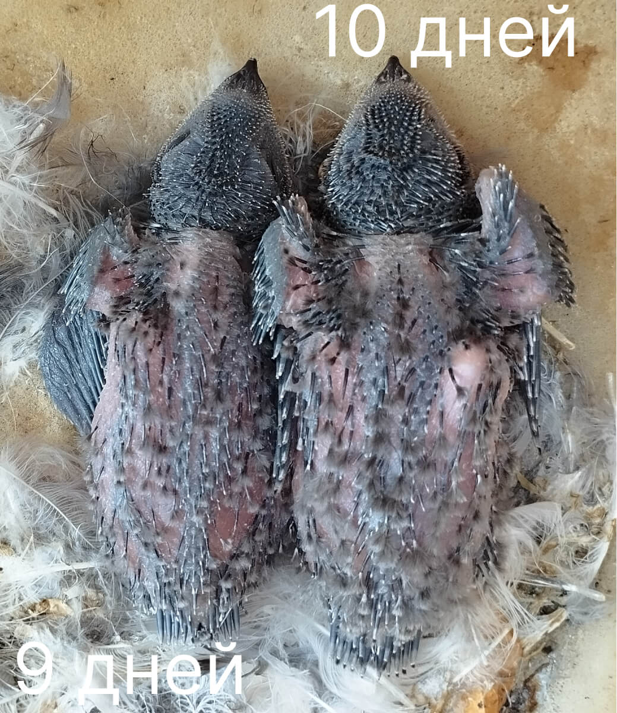</td>
        </tr>
        <tr>
            <td>11. päev 
Kohevus on suurenenud)))  
Vanemate söötmise ajad: 
3:46, 3:54, 4:26, 5:16, 6:31, 8:16, 9:41, 10:23, 12:44, 13:05, 14:44, 15:18, 15:57, 15:58, 16:58, 17:44, 18:54, 20:04, 20:11</td>
            <td></td>
        </tr>
        <tr>
            <td>12. päev 
Tibu välimus sarnaneb 11. päeva omaga, ainult sule torukesed (juured) on pikemad. Pea-, tiiva- ja sabapterüülidel on torukesed 3−5 mm. Seljapoolel ja sabapiirkonnas on hõredad udusulgede tutid (3−5 mm). Esmaste lendsulgede (2−5) torukesed. Suured esmaste lendsulgede katte suled on sama pikad. Teiseste lendsulgede torukesed (kattesuled 1−4 mm). Sabasuled on torukestes (3−5 mm), mis on lõhkenud otstes.  
Tiiva pikkus 38−45 mm. Esmaste lendsulgede pikkus 4−8 mm. Sabasulgede pikkus 3−5 mm. Kaal 28,5 (24,2−34,2) g. 
  Vanemate söötmise ajad: 
3:58, 5:15, 5:53, 7:22, 7:48, 8:28, 9:39, 10:03, 10:44, 11:53, 11:58, 14:15, 14:48, 15:30, 16:16, 17:41, 18:17, 19:07, 19:50, 20:42, 20:46, 21:10</td>
            <td>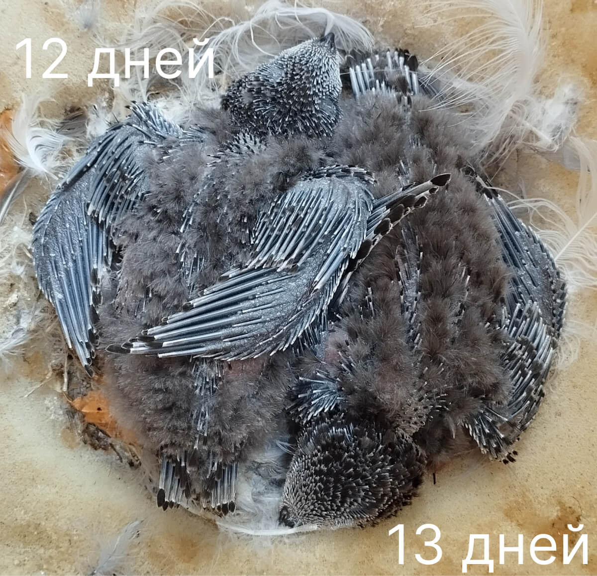</td>
        </tr>
        <tr>
            <td>13. päev 
Tibu on kaetud lühikeste terashallide torukestega, mis on lõhkenud otstes. Peal on nõeljad juured ja väikesed ookerhallid tutid areneva sule (0,5−1 mm). Seljal ja kõhupoolel on hõre udusulg (3−5 mm). Rinnapterüülil on õhukesed torukesed (3 mm). Esmaste lendsulgede torukesed (7−8) väikeste tuttidena (0,5 mm). Teiseste lendsulgede torukesed (5 mm). Sabasuled on torukestes (keskmised lühikesed, äärmised pikad).  
Keha pikkus 95−103 mm. Esmaste lendsulgede pikkus 7−8 mm. Sabasulgede pikkus 0,5−7 mm. Kaal 28,5 (17,6−39,0) g. 
  Vanemate söötmise ajad: 
4:38, 5:59, 6:06, 7:12, 8:49, 9:14, 10:57, 11:16, 13:24, 13:26, 14:38, 15:04, 15:58, 17:06, 17:11, 19:14, 19:29, 20:24, 20:33, 20:58, 21:01, 21:11</td>
            <td>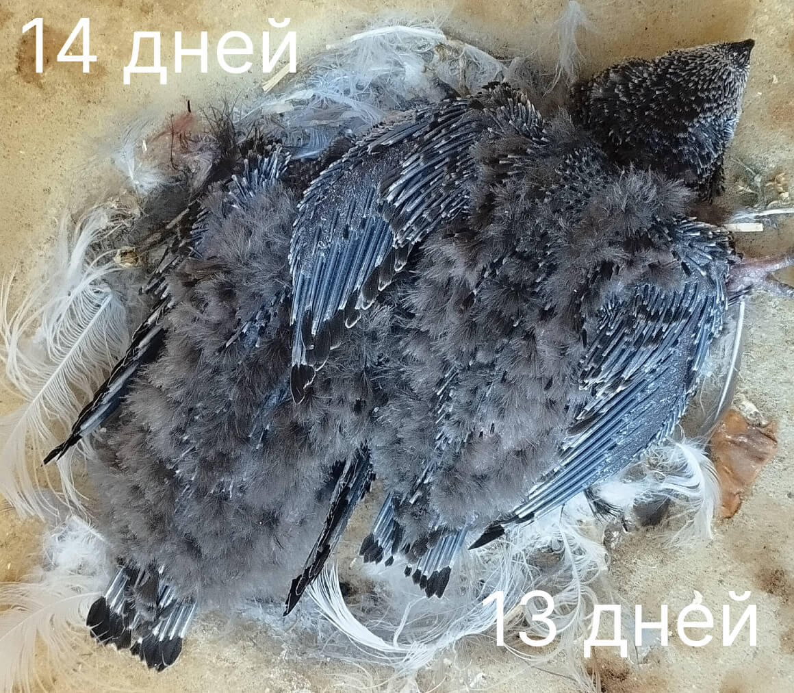</td>
        </tr>
        <tr>
            <td>14. päev 
Tibu on kaetud pikkade sule torukestega, mis on lõhkenud otstes, ja tiheda udusulgedega. Udusulg on otstes tugevalt harunenud, pooleldi lahtivolditud, kohevad tutid ümbritsevad tihedalt selja-nimme ja kõhu pterüüle, mis on kaetud nõelja juurte ja torukestega. Pea on kaetud väikeste hallikas-ookri tuttidena. Esmaste lendsulgede torukesed koos tuttidena (1−4 mm). Teiseste lendsulgede torukesed koos väikeste tuttidena (1 mm). Sabasuled väikeste tuttidena (1−2 mm). Udusulgede pikkus 5−6 mm. Põhipterüülide torukeste pikkus — 5 mm.  
Keha pikkus 110 mm. Tiiva pikkus 52 mm. Esmaste lendsulgede pikkus 13 mm. Sabasulgede pikkus 10 mm. Kaal 28,0 (17,5−38,0) g. 
  Vanemate söötmise ajad: 
3:47, 4:52, 5:00, 6:12, 7:55, 8:16, 9:52, 10:28, 12:00, 12:55, 13:14, 15:32, 15:58, 17:14, 17:16, 18:41, 18:49, 19:49, 20:31, 20:42, 20:57</td>
            <td>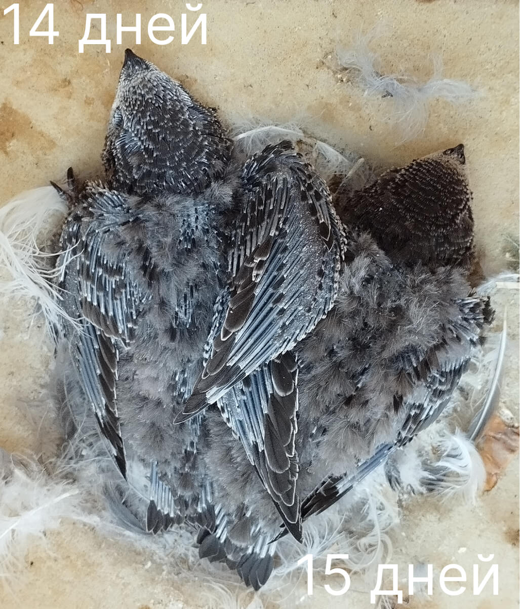</td>
        </tr>
        <tr>
            <td>15. päev 
Tibu on kaetud pikkade sule torukeste ja tiheda tumehalli udusulgedega, eriti hästi arenenud selja-nimme pterüülide ümber. Pea on kaetud väikeste torukeste ja põhisulgede tuttidena. Esmaste lendsulgede torukesed ja tutid otstes (2−5 mm). Teiseste lendsulgede välimus on sarnane (tutid: 2−3 mm). Sabasulgede tutid on rohkem lahtivolditud (5−7 mm). Munahammas on olemas.  
Keha pikkus 110 mm. Tiiva pikkus 60 mm. Esmaste lendsulgede pikkus 19−20 mm. Sabasulgede pikkus 10−17 mm. Kaal 33,0 (28,5−37,8) g. 
  Vanemate söötmise ajad: 
4:38, 4:42, 6:08, 6:26, 8:26, 9:17, 10:42, 13:58, 14:47, 16:17, 16:49, 19:00, 20:12, 20:54, 20:59</td>
            <td>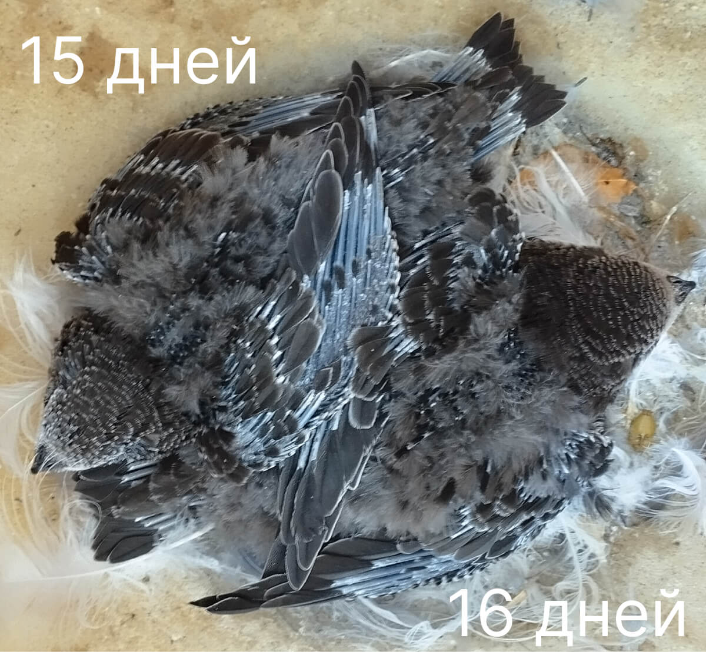</td>
        </tr>
        <tr>
            <td>16. päev 
Tibu on kaetud väikeste kontuursete sulgede tuttidena, mis arenevad ja lahtuvad kõigil pterüülidel (väikeste tuttidena, 1−3 mm, pea-, rinna- ja selja-nimme pterüülidel). Täielikult lahtivolditud udusulg on väga tihe ja otstes harunenud, ümbritseb kontuursete sulgede ribasid (väikeste torukeste ja tuttidena otstes) selja-nimme pterüülil. Esmaste lendsulgede tutid (5−7 mm), suured katte suled 5−20 mm (tutid 1−6 mm). Teiseste lendsulgede pikkus 5−20 mm (tutid 0,2−0,5 mm). Sabasuled pikkades torukestes ja väikestes tuttidena (0,2−3 mm). Nok ja küünised on mustad. Munahammast pole. Silmad on täielikult avatud.  
Tiiva pikkus 68 mm. Esmaste lendsulgede pikkus 15−25 mm. Sabasulgede pikkus 7−18 mm. Kaal 35,5 (26,6−45,0) g. 
  Vanemate söötmise ajad: 
4:20, 4:30, 6:16, 6:38, 8:25, 9:07, 9:54, 10:20, 10:56, 12:08, 14:10, 14:45, 15:46, 16:41, 19:01, 19:13, 20:15, 20:47, 21:00</td>
            <td>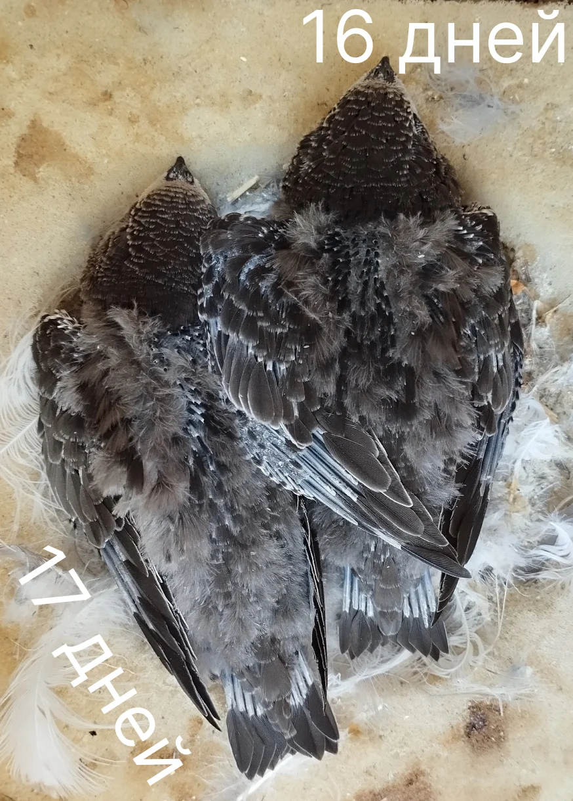</td>
        </tr>
        <tr>
            <td>17. päev   
Vanemate söötmise ajad: 
3:50, 3:59, 4:50, 4:51, 5:33, 6:21, 6:50, 8:16, 9:42, 10:08, 11:06, 12:01, 12:13, 13:29, vihm, 16:15, 16:25, 16:55, 16:57, 18:16, 18:33, vihm, 20:05</td>
            <td>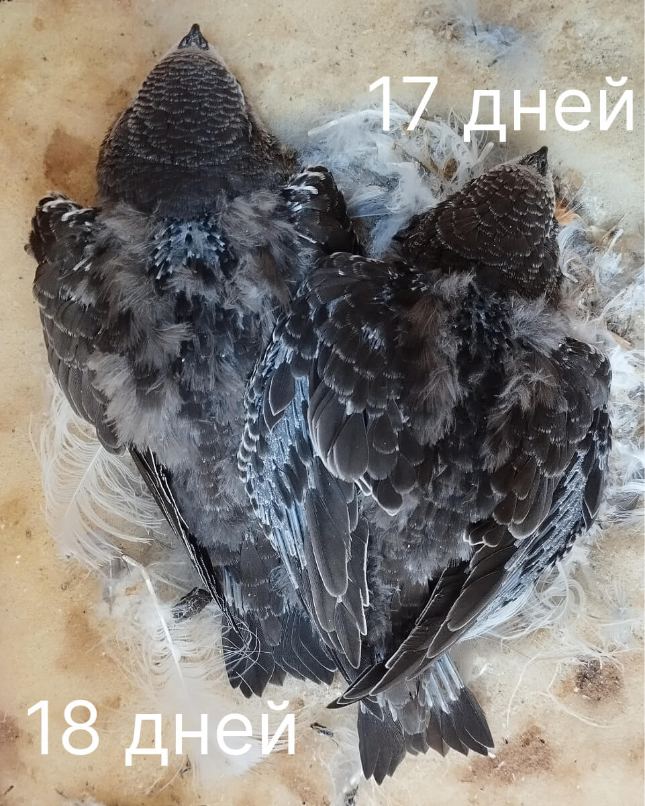</td>
        </tr>
        <tr>
            <td>18. päev 
Tibu on rikkalikult kaetud tumehalli koheva udusulgedega. Põhipterüülid on torukestes (otstes tutid), mis arenevad ja lahtuvad, vaevu paistavad udusulgede katte alt. Pea on sulgedega kaetud, nokk ümbritsetud väikeste torukeste ja areneva, kuid lahtivoldimata sule tuttidena. Sabasuled on lahtivolditud pooleldi (tutid 5−10 mm).  
Tiiva pikkus 78 mm. Sabasulgede pikkus 12−20 mm. Kaal 37,5 (32,5−43,0) g. 
  Vanemate söötmise ajad: 
4:04, 4:24, 5:08, 5:59, 7:36, 9:40, 10:14, 11:19, 12:29, 12:45, 13:14, 13:23, 14:18, 14:44, 15:27, 15:35, 16:38, 16:50, 17:51, 18:17, 19:29, 19:35, 20:45, 20:49</td>
            <td>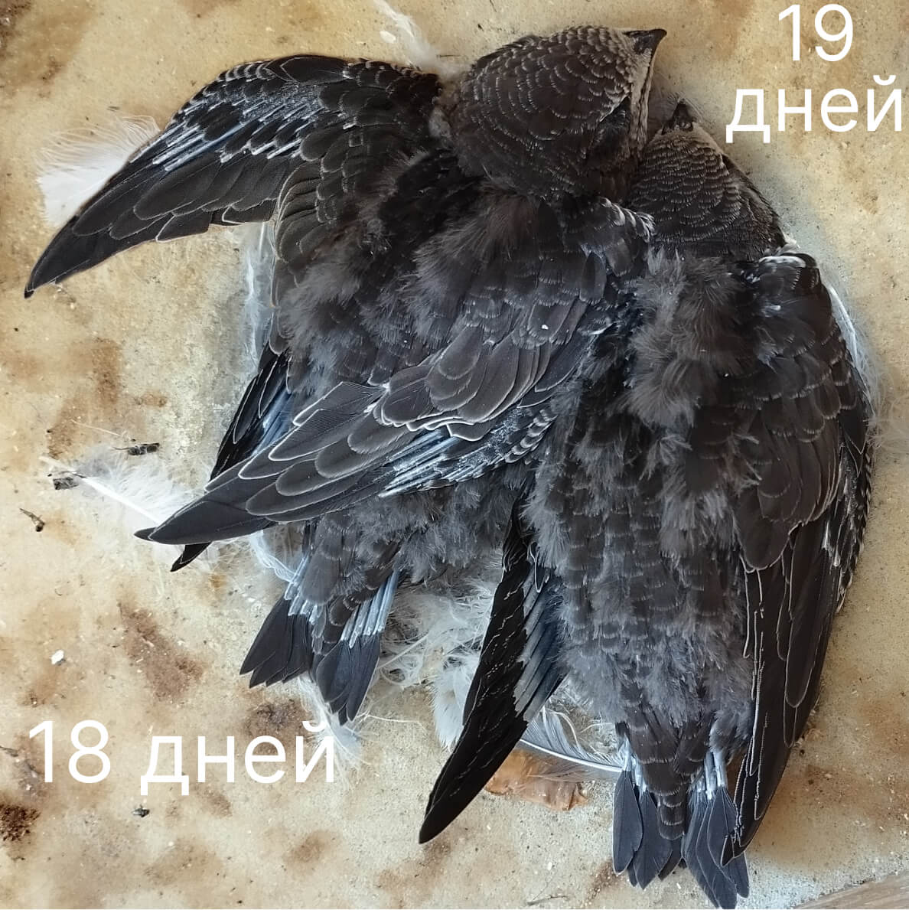</td>
        </tr>
        <tr>
            <td>19. päev  
Vanemate söötmise ajad: 
4:12, 4:21, 8:25, 9:03, 11:12, 11:31, 12:53, 13:03, 14:30, 15:24, 16:30, 18:07, 18:20, 18:54, 20:13, 20:21</td>
            <td>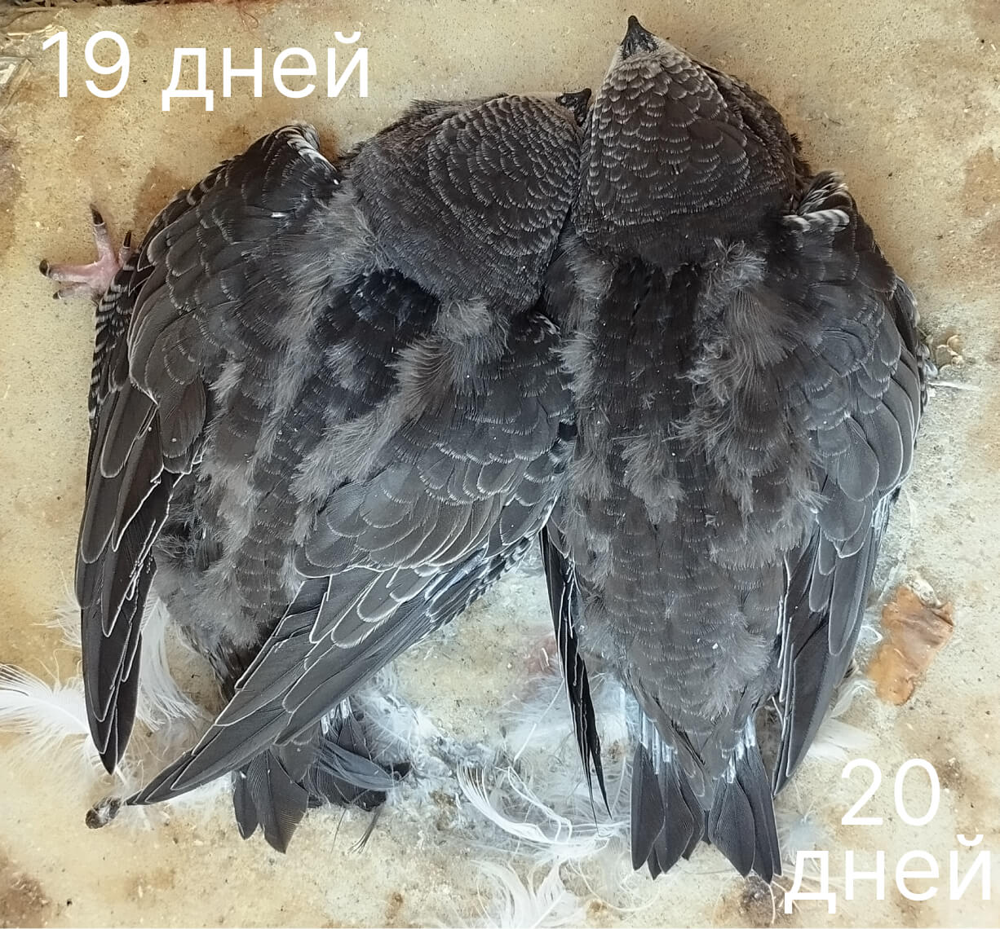</td>
        </tr>
        <tr>
            <td>20. päev 
Tibu on sulgedega kaetud 1/3 ulatuses, kaetud suurte areneva sule tuttidena. Pea on täielikult sulgedega kaetud. Põhipterüülide kontuursete sulgede ribad paistavad selgelt udusulgede katte alt. Rinnapterüül on kaetud väikeste lahtivolditud sulgedega. Esmaste lendsulgede opaakid on lahtivolditud 1/3 ulatuses. Sabasuled on suurtes tuttidena (12−14 mm).  
Tiiva pikkus 82−91 mm. Sabasulgede pikkus 8−22 mm. Kaal 40,0 (31,5−48,0) g. 
  Vanemate söötmise ajad: 
4:11, 4:41, 4:48, 6:37, 8:41, 11:42, 12:51, 13:35, 14:03, 15:06, 16:02, 16:30, 17:05, 17:07, 18:59, 19:07, 20:20, 20:30</td>
            <td>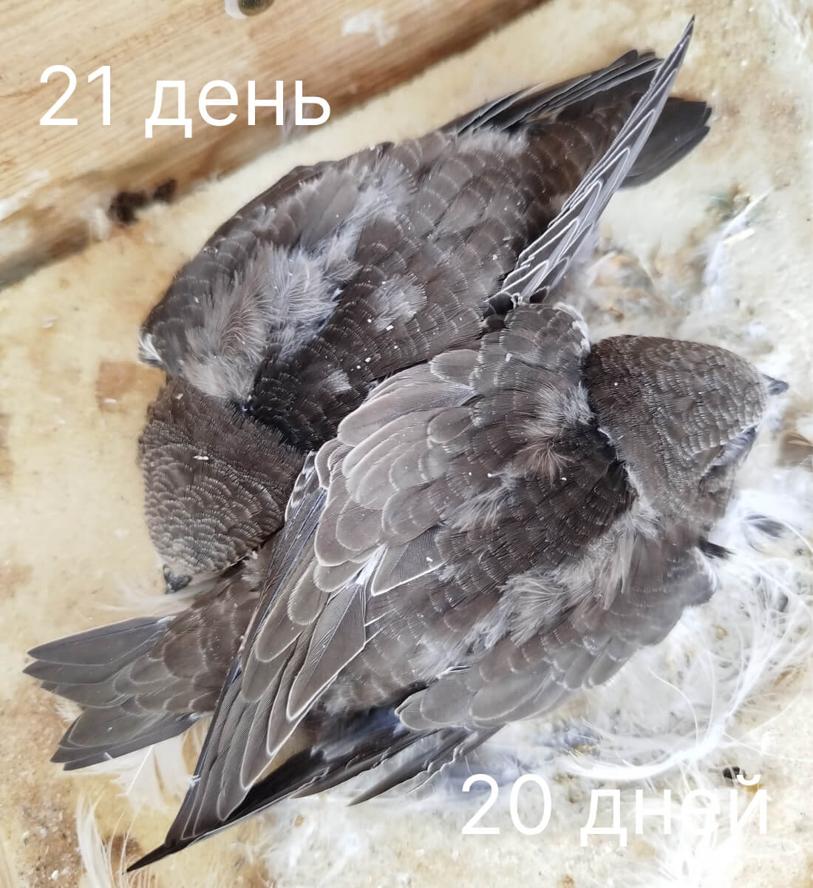</td>
        </tr>
        <tr>
            <td>21. päev   
Vanemate söötmise ajad: 
4:37, 4:44, 6:24, 7:34, 7:34 (ei, ma ei eksinud, nad lendasid üksteise järel), 10:48, 11:05, 13:57, 16:21, 16:56, 17:51, 18:39, 20:31, 20:33</td>
            <td>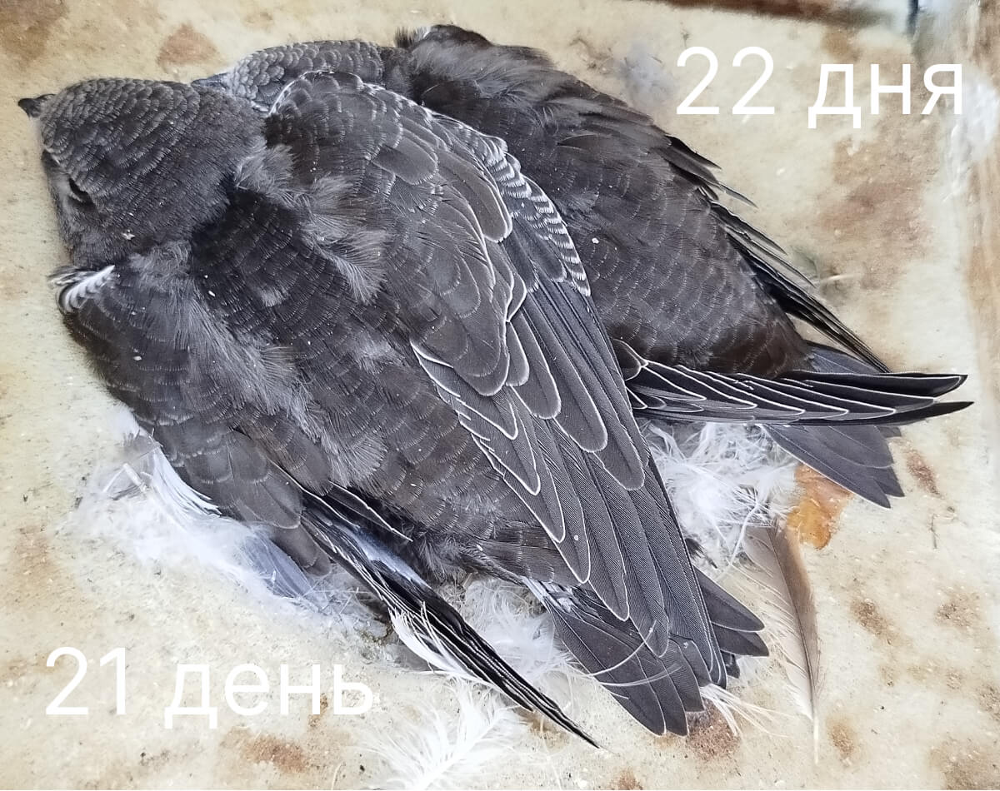</td>
        </tr>
        <tr>
            <td>22. päev 
Tibu on suurtes sule tuttidena, lahtivolditud 1/3 ulatuses. Selja ja sabapiirkonna udusulg on 50% ulatuses kaetud kontuurse sulgedega. Tiibadel ja sabal on selgelt nähtavad pooleldi lahtivolditud sulgede torukesed. Silmade ümber ja kaelal on väikesed tutid. Esmaste lendsulgede (9−6 ja 5−2) opaakid on lahtivolditud umbes pooleldi (tutid 15−22 mm). Teiseste lendsulgede opaakid on samuti pooleldi lahtivolditud (tutid 14 mm). Sabasulgede tutid (15 mm) moodustavad samuti poole sule pikkusest.  
Tiiva pikkus 95 mm. Esmaste lendsulgede pikkus 38−42 mm. Sabasulgede pikkus 28−34 mm. Kaal 43,5 (35,7−51,0) g. 
  Vanemate söötmise ajad: 
5:11, 7:12, 7:23, 8:28, 11:45, 11:47, 13:35, 14:03, 14:33, 14:34, 15:12, 17:55, 17:58, 19:22, 19:42, 20:18</td>
            <td>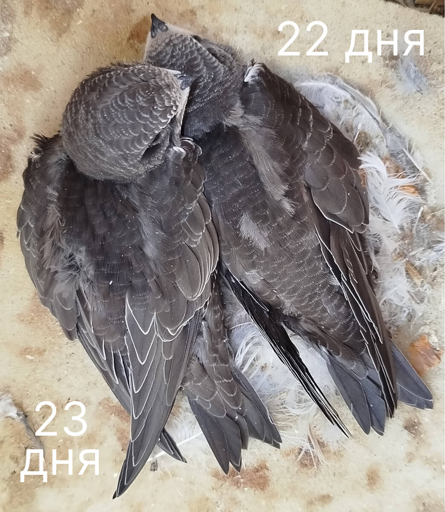</td>
        </tr>
        <tr>
            <td>23. päev   
Vanemate söötmise ajad: 
5:40, 5:52, 9:24, 11:44, 11:56, 12:38, 13:06, 13:18, 15:53, 16:35, 16:55, 17:31, 18:48, 18:49, 20:16, 20:50</td>
            <td>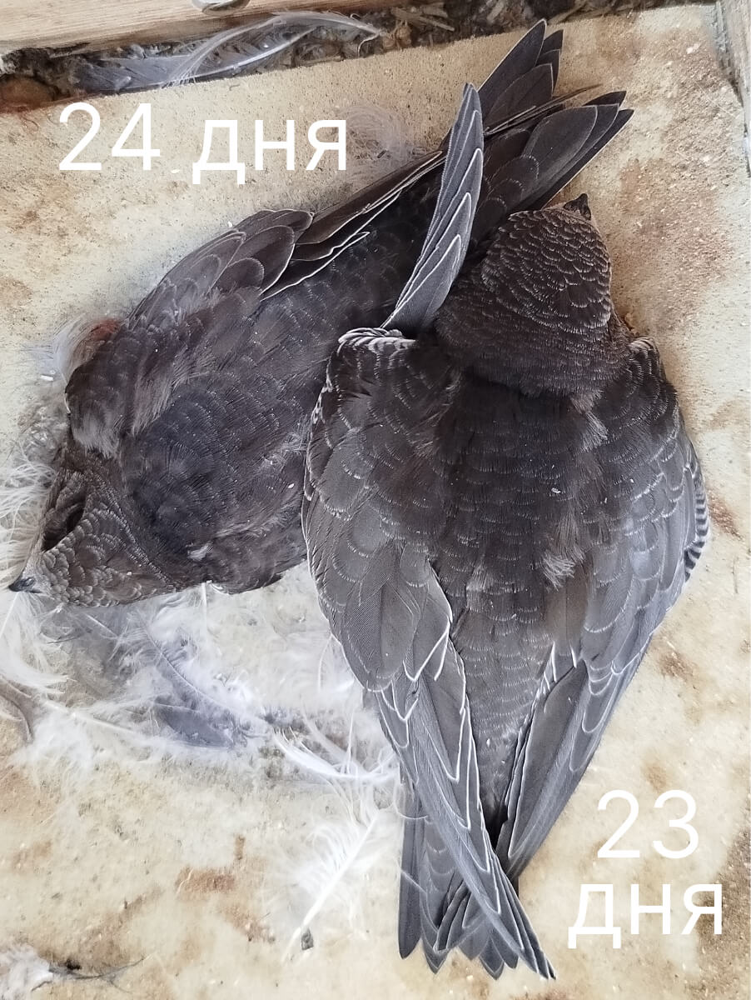</td>
        </tr>
        <tr>
            <td>24. päev 
Tibu on pooleldi sulgedega kaetud, rikkalikult kaetud suurte areneva, lahtivolditava sule tuttidena. Tiibadel ja sabal on pooleldi lahtivolditud sulgede torukesed, mida ei kata katte sulgede opaakid (samal ajal on tiiva pind ühtlane, ilma märgatavate vahedeta). Kaelal on nähtavad pooleldi lahtivolditud sule tutid. Udusulg on kaetud seljapterüülide sulgedega ja paistab kontuurse sule alt ainult õlgadel ja sabapiirkonnas. Sabasuled on lahtivolditud 2/3 ulatuses (opaakid 20−30 mm).  
Tiiva pikkus 105−114 mm. Sabasulgede pikkus 35−45 mm. Kaal 42,0 (30,8−52,2) g. 
  Vanemate söötmise ajad: 
5:06, 5:46, 6:30, 7:02, 8:12, 8:18, 10:20, 10:25, 11:35, 12:48, 13:02, 14:59, 17:04, 18:03, 18:32, 20:02, 20:10</td>
            <td>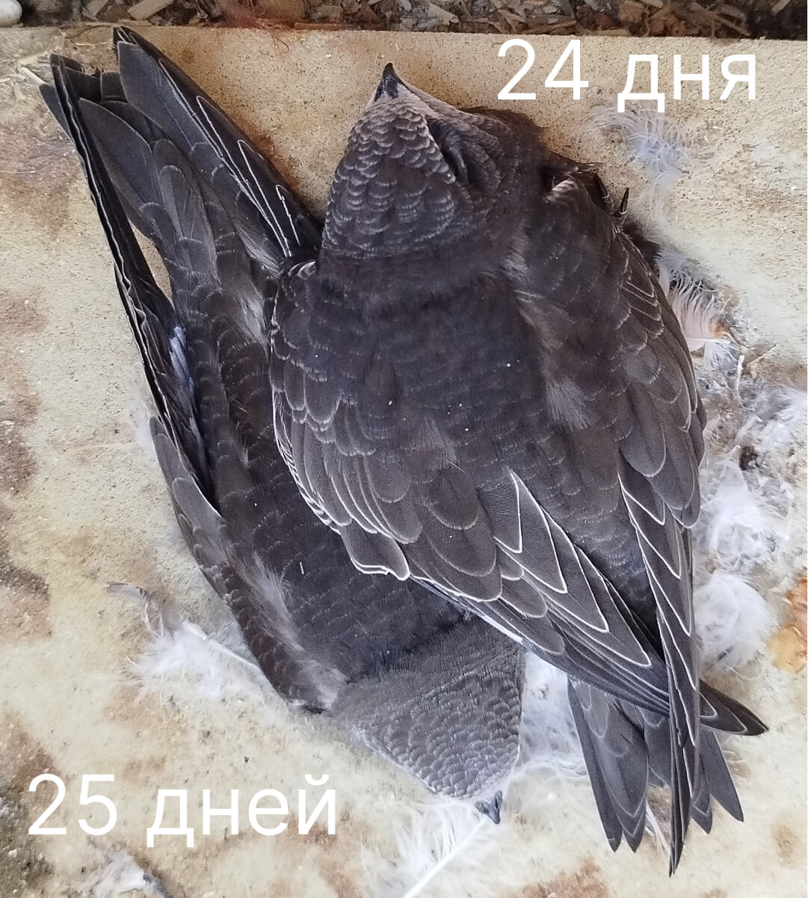</td>
        </tr>
        <tr>
            <td>25. päev   
Vanemate söötmise ajad: 
4:40, 4:58, 5:34, 5:48, 6:50, 8:32, 10:25, 10:43, 11:21, 12:33, 13:38, 14:30, 14:45, 16:36, 16:52, 18:21, 18:25, 19:28, 19:49</td>
            <td>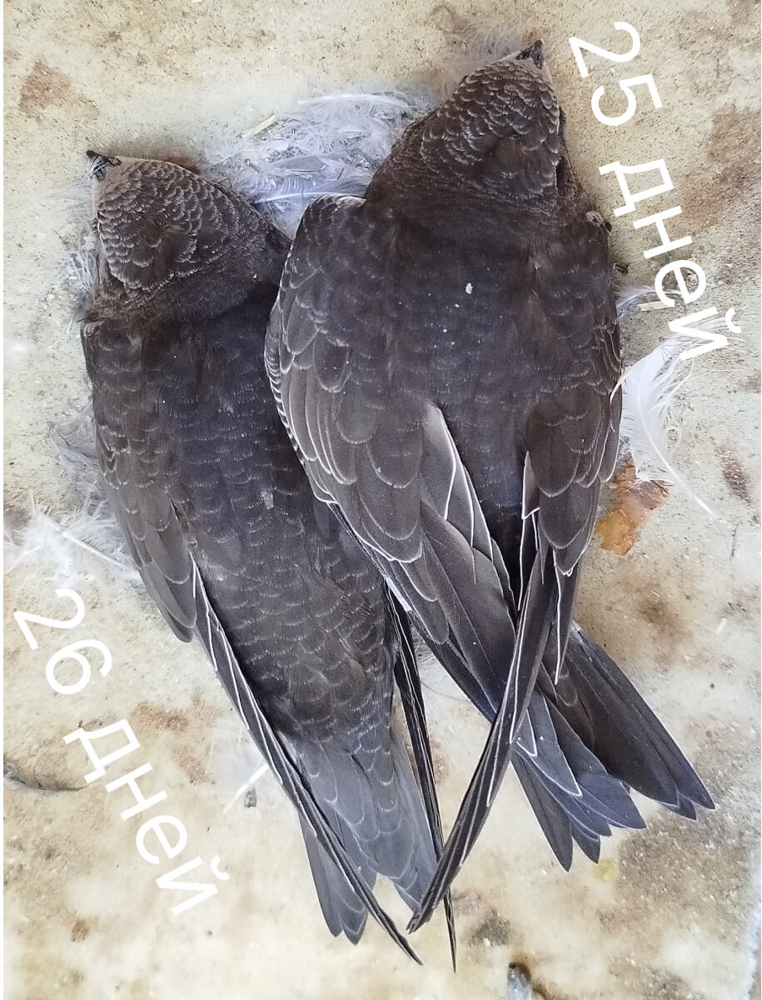</td>
        </tr>
        <tr>
            <td>26. päev 
Tibu on sulgedega kaetud 2/3 ulatuses. Sule torukesed on nähtavad ainult kaelal ja sabal. Ülejäänud keha pind on ülalt kaetud lahtivolditavate sulgede opaakidega. Udusulg paistab põhisulgede alt kaelal ja ülasabal. Tiib on 70% ulatuses sulgedega kaetud. Tiiva paindes on nähtav nahkne pind, mida ei kata suled. Esmaste lendsulgede opaakid on lahtivolditud 2/3 ulatuses. Sabasulgede opaakid on samuti lahtivolditud 2/3 ulatuses.  
Tiiva pikkus 110 mm. Esmaste lendsulgede pikkus 35−50 mm. Sabasulgede pikkus 43−48 mm. Kaal 44,5 (37,7−51,0) g. 
  Vanemate söötmise ajad: 
5:04, 5:30, 6:07, 9:02, 10:55, 12:20, 12:35, 13:33, 16:00, 16:31, 17:58, 18:47, 20:01</td>
            <td>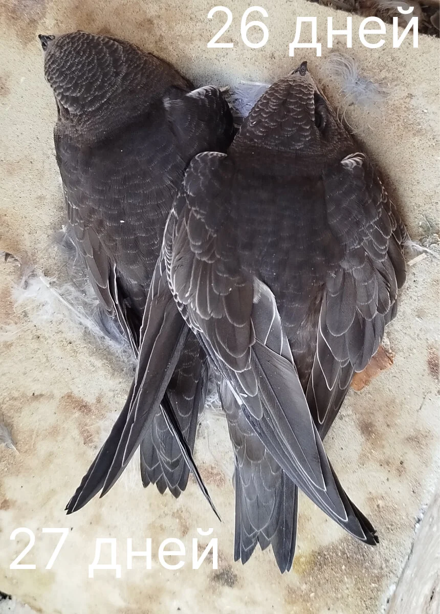</td>
        </tr>
        <tr>
            <td>27. päev   
Vanemate söötmise ajad: 
5:20, 5:23, 8:28, 8:32, 11:06, 11:33, 12:51, 13:19, 14:57, 17:31, 17:45, 19:45</td>
            <td>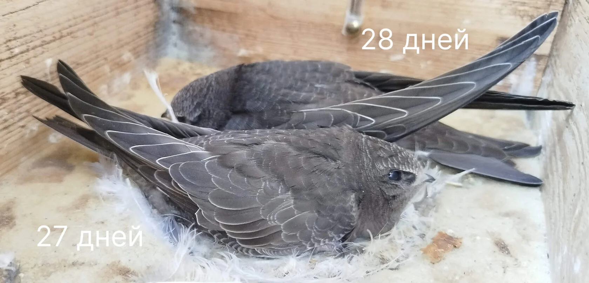</td>
        </tr>
        <tr>
            <td>28. päev 
Tibu on täielikult kaetud mustjaspruunide sulgedega, millel on õhukesed heledad äärised, eriti märgatavad õlgadel ja peal. Selja udusulg on kaetud kontuurse sulgedega, lahtivolditud ¾ ulatuses. Kõhupoolel on jäänud väike nahalaik, mida ei kata suled. Tiiva paindes on nähtav nahkne pind, mida ei kata suled. Esmaste lendsulgede opaakid on lahtivolditud 3/4 ulatuses (47−57 mm). Sabasulgede opaakid on lahtivolditud 2/3 või 3/4 ulatuses (35−43 mm).  
Tiiva pikkus 125 mm. Esmaste lendsulgede pikkus 74−78 mm. Sabasulgede pikkus 45−60 mm. Kaal 47,5 (45,3−49,4) g. 
  Vanemate söötmise ajad: 
5:11, 5:38, 6:17, 6:44, 8:11, 8:54, 11:49, 12:18, 14:32, 18:25, 19:44, 20:21</td>
            <td></td>
        </tr>
        <tr>
            <td>29. päev   
Vanemate söötmise ajad: 
8:07, 10:29, 11:41, 13:05, 13:45, 15:38, 17:30, 17:46, 19:04, 20:16</td>
            <td>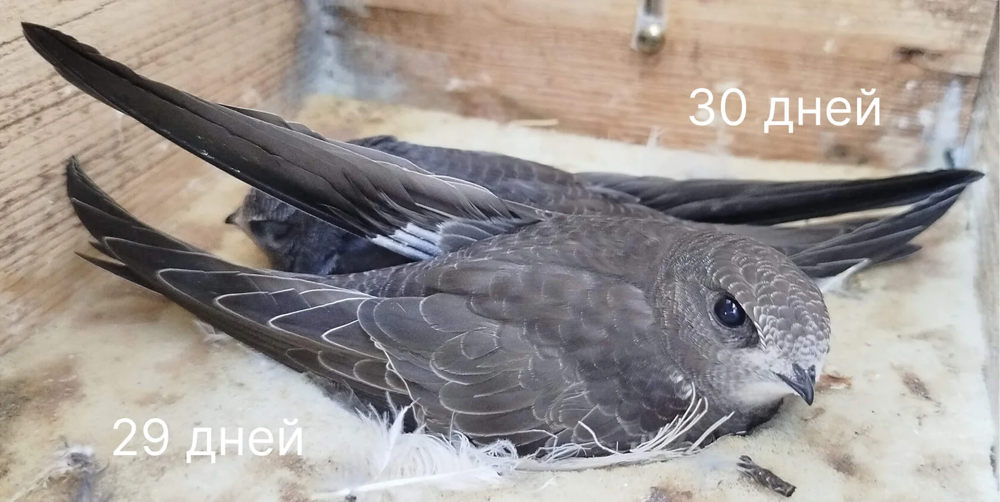</td>
        </tr>
        <tr>
            <td>30. päev 
Väliselt näeb tibu täielikult sulgedega kaetud, kuid sulgede puhumisel on nähtavad arvukad lahtivoldimata sule tutid. Ülalt on tiival ühtlane kandev pind, kuid lendsulgede torukesed on nähtavad läbi lahtivolditud sulgede. Tiiva paindes on nähtav nahkne laik. Esmaste lendsulgede opaakid 52−57 mm, torukesed 25−30 mm. Sabasulgede opaakid 32−35 mm.  
Tiiva pikkus 123−127 mm. Esmaste lendsulgede pikkus 80−85 mm. Sabasulgede pikkus 47−60 mm. Kaal 45,5 (40,5−49,0) g. 
  Vanemate söötmise ajad: 
5:13, 6:02, 6:47, 7:08, 8:42, 10:35, 11:11, 14:53, vihm, 19:57</td>
            <td>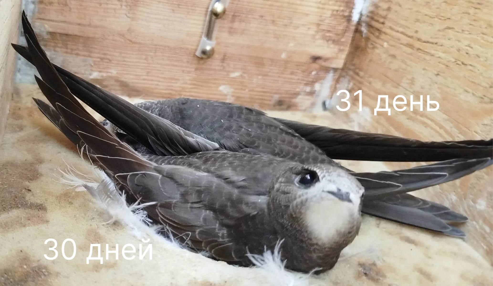</td>
        </tr>
        <tr>
            <td>31. päev   
Vanemate söötmise ajad: 
vihm, 11:15, 11:28, 13:51, 14:56, 18:37, 19:22, 20:21</td>
            <td>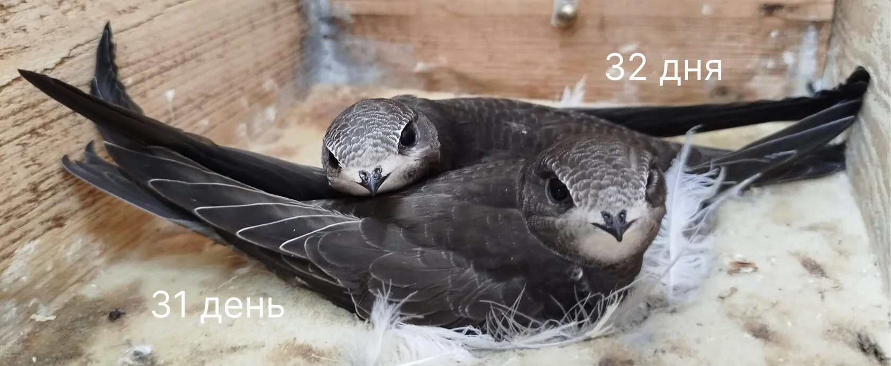</td>
        </tr>
        <tr>
            <td>32. päev 
Tibu on kaetud hästi lahtivolditud sulgedega, torukesed pole nähtavad. Tiiva pinnal pole vahesid: ülalt on tiiva katte suled täielikult lahtivolditud, altpoolt on katte suled torukestes koos otstes olevate tuttidena. Esmaste lendsulgede opaakid pole täielikult lahtivolditud (opaakid 54−69 mm). Teiseste lendsulgede opaakid on lahtivolditud, kuid sule alused on torukestes. Sabasuled pole täielikult lahtivolditud (opaakid 39−43 mm).  
Tiiva pikkus 128−136 mm. Esmaste lendsulgede pikkus 80−87 mm. Sabasulgede pikkus 54−60 mm. Kaal 45,3 (37,0−50,5) g. 
  Vanemate söötmise ajad: 
Üks vanem lendas talvituma, jättes lapsed teise vanema, arvatavasti ema (kuid see pole kindel) hooleks. See tähendab, et söötmiste vahelised intervallid ühe tibu puhul pikenesid ja portsjonite arv päevas vähenes. 
peaaegu kogu päeva lühiajaline vihm, 13:11, 16:52, 18:16, 19:40</td>
            <td>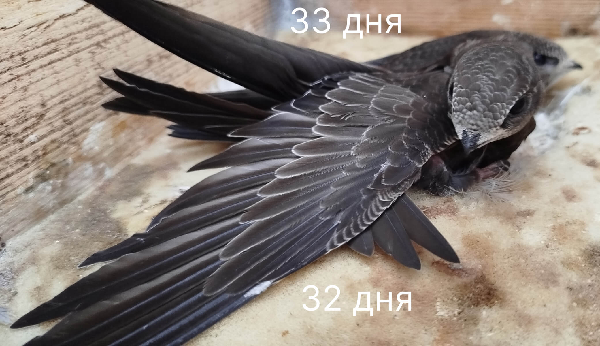</td>
        </tr>
        <tr>
            <td>33. päev    
Vanemate söötmise ajad: 
Öösel algas pikaajaline vihm ja see kestis kogu päeva. Vanem sai majast välja lennata alles õhtupoole ja tõi toitu vaid ühe korra, söötes üht tibu. Teine tibu jäi sel päeval nälga. 
Jätame nende päevade toimetamise järgmiseks aastaks.</td>
            <td>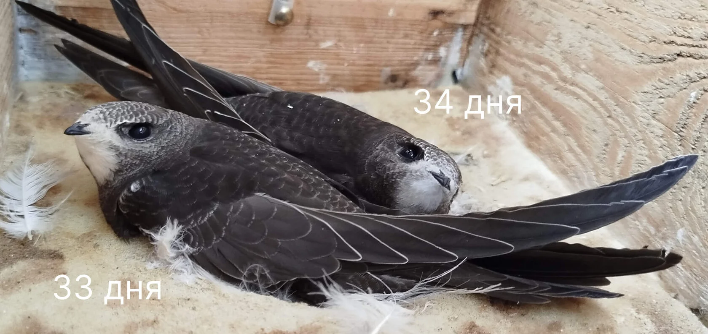</td>
        </tr>
        <tr>
            <td>34. päev 
Sulgedega kaetud noor lind. Tiivad on pikad, ilma vahedeta. Selja, pea ja kõhu sulestik on täielikult lahtivolditud. Teiseste lendsulgede ja tiiva alumiste katte sulgede opaakid on lahtivolditud aluseni. Esmaste lendsulgede ja tiiva alumiste katte sulgede opaakid pole täielikult lahtivolditud, sule torukesed on tiiva alumisel küljel hästi nähtavad (esmaste lendsulgede opaakid 65−87 mm, torukesed 20−28 mm). Sabasuled on aluses torukestes (15−17 mm).  
Tiiva pikkus 137−155 mm. Esmaste lendsulgede pikkus 92−95 mm. Sabasulgede pikkus 56−63 mm. Kaal 44,0 (37,5−51,0) g. 
  Vanemate söötmise ajad: 
16:17, 10:20, 12:14, 15:04, 18:07, 19:59, 20:11</td>
            <td>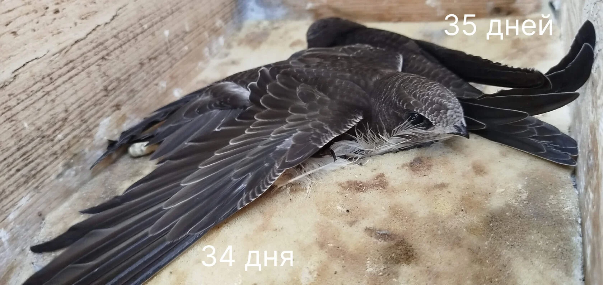</td>
        </tr>
        <tr>
            <td>35. päev  
Vanemate söötmise ajad: 
5:53, 8:32, 12:53, 13:10, 16:05, 19:24</td>
            <td>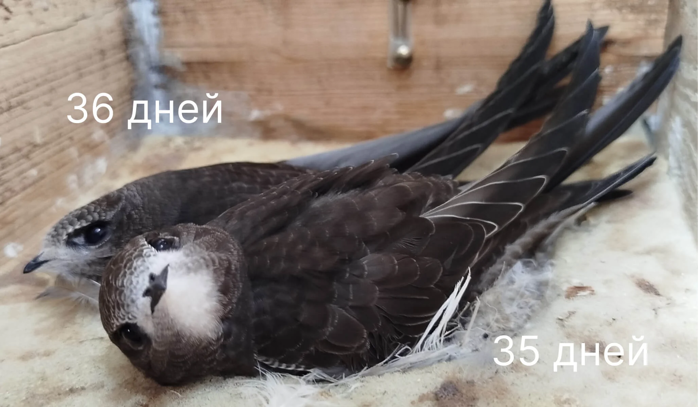</td>
        </tr>
        <tr>
            <td>36. päev 
Sulgedega kaetud noor lind (väliselt näeb välja nagu 35. päeval). Tiiva alumised katte suled on aluses torukestes. Esmaste lendsulgede (9−3) torukesed (17−25 mm). Äärmised sabasuled on aluses torukestes (12−14 mm).  
Tiiva pikkus 150−160 mm. Sabasulgede pikkus 63−64 mm. Kaal 47,5 (40,5−54,2) g. 
  Vanemate söötmise ajad: 
15:14, 20:08, 19:27</td>
            <td>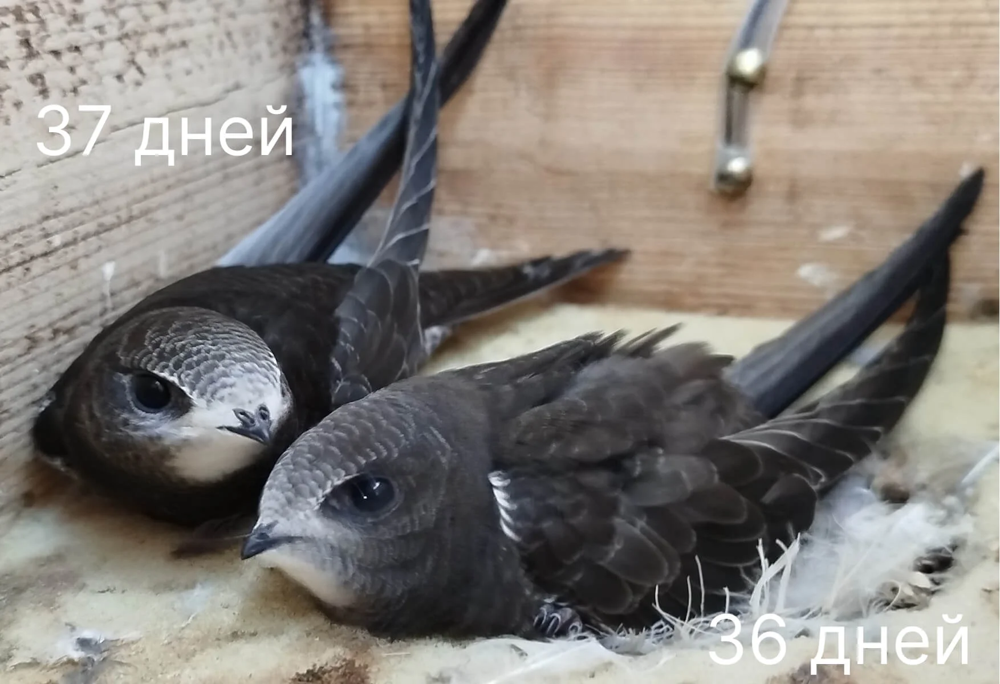</td>
        </tr>
        <tr>
            <td>37. päev   
Vanemate söötmise ajad: 
10:24, 12:31, 13:21, 15:17, 17:16, 18:45, 19:51  
Kell 20:20 sai esimesel tibul vanust 39 päeva ja kell 20:44 lendas ta pesast välja, alustades oma esimest lendu Aafrikasse.</td>
            <td>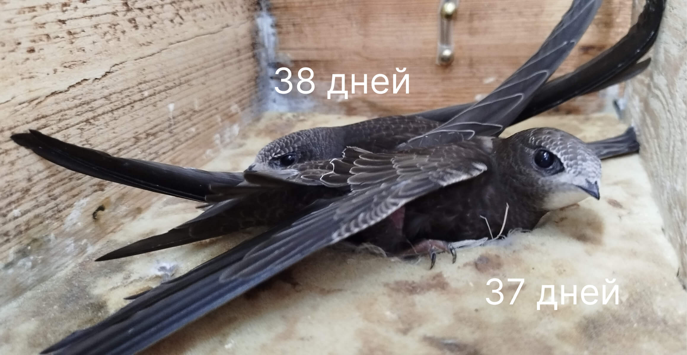</td>
        </tr>
        <tr>
            <td>38. päev 
Noor lind. Mustjaspruun sulestik õhukeste heledate ääristega katab tihedalt kogu keha pinda. Lahtivoldimata sule tutid on nähtavad seljal, ülasabal ja tiiva alumistel katte sulgedel. Esmaste lendsulgede alused on torukestes (12−20 mm). Sabasuled on aluses torukestes (10−12 mm).  
Tiiva pikkus 160−162 mm. Sabasulgede pikkus 60−68 mm. Kaal 43,0 (34,5−47,5) g. 
  Vanemate söötmise ajad: 
7:19, 11:46, 15:04, 18:36, vihm  
Meie tibu kaal on 42,57 g.</td>
            <td>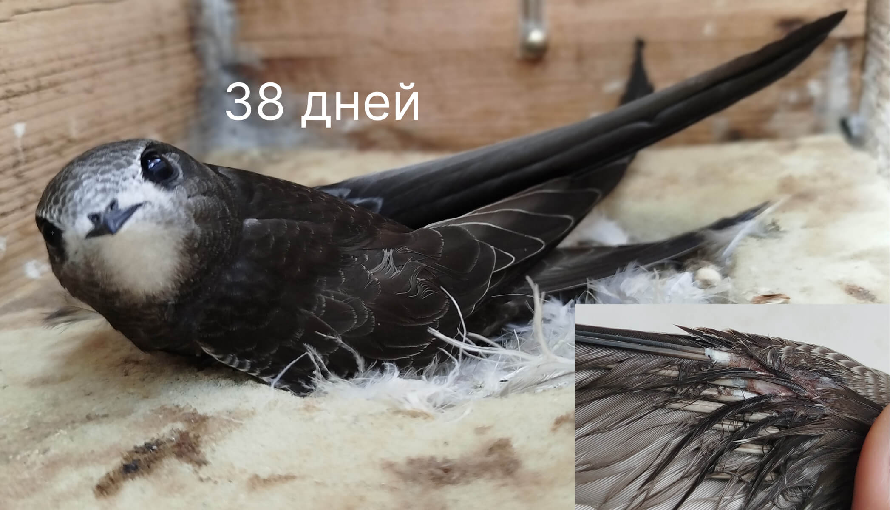</td>
        </tr>
        <tr>
            <td>39. päev 
Teine vanem veetis kogu hommiku tibuga. Lendas ära kell 7 hommikul ega naasnud. Tibu istus kogu päeva näljas. Kell 18:17 sai ta 40 päeva vanuseks. Päeval ma teda uurisin: kaal 38,75 g, sulg on täielikult lahtivolditud, torukesi pole. Õhtul plaanisin teda sööta, kui vanem ei tule, kuid ei jõudnud. Kell 20:30 lendas ta pesast välja ja suundus Aafrikasse oma venna ja vanemate järele. Lendas ära näljasena. Mees ja mina käisime igaks juhuks taskulampidega kontrollimas — kedagi ei leidnud. Head teed!</td>
            <td>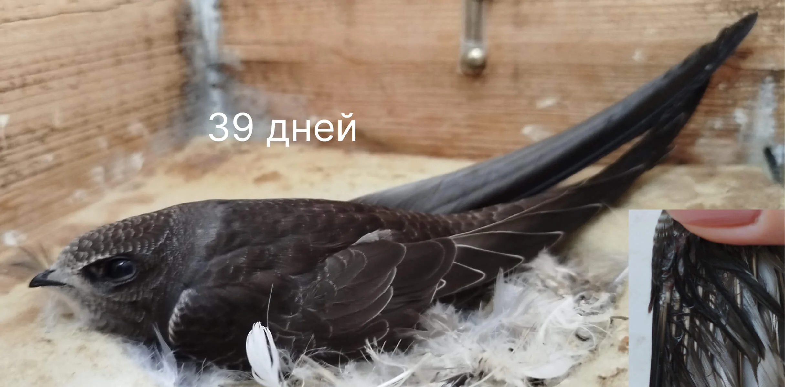</td>
        </tr>
        <tr>
            <td>40. päev 
Ja need on jälle Mihhaili tibud</td>
            <td>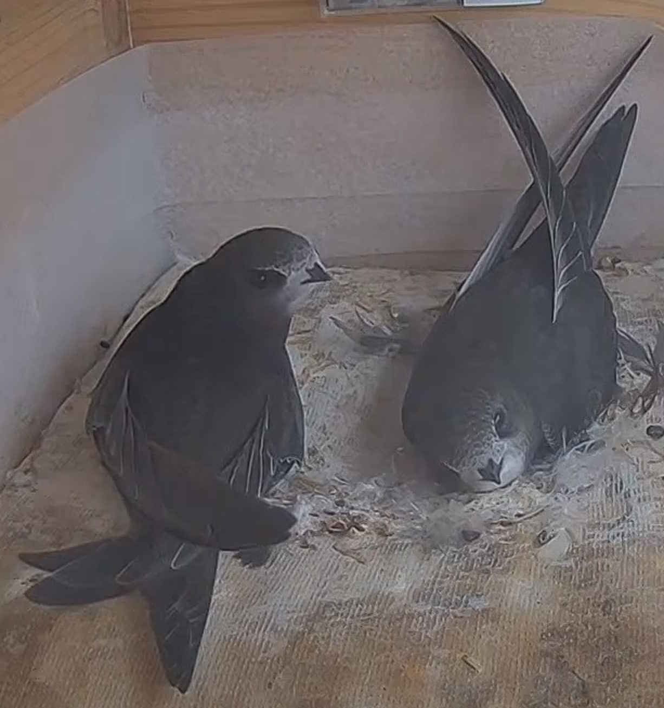</td>
        </tr>
        <tr>
            <td>41. päev 
Sulgedega kaetud noor lind, kes erineb täiskasvanust heledama sulestiku värvi poolest tänu valgetele sule ääristele, eriti märgatavatele peal, tiiva paindes ja keha kõhupoolel.  
Tiiva pikkus 165−173 mm. Sabasulgede pikkus 64−70 mm. Kaal 43,0 (37,0−46,7) g.  
Esimene tibu lahkus pesast öösel.</td>
            <td>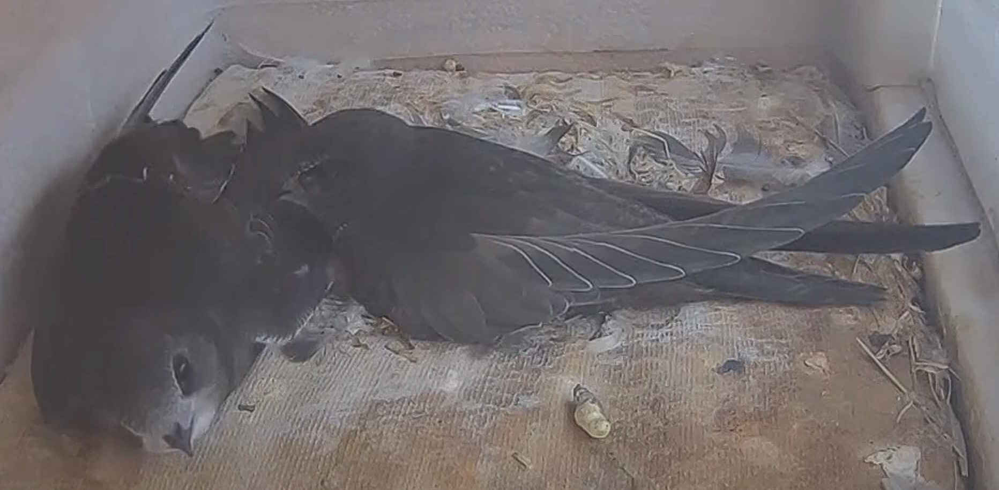</td>
        </tr>
        <tr>
            <td>42. päev 
Teine tibu lendas pesast välja samuti öösel.
        </td>
            <td>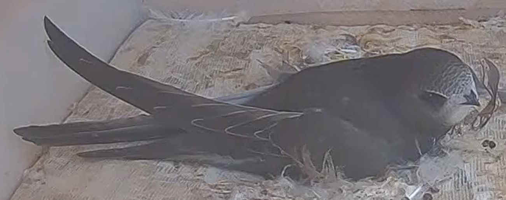</td>
        </tr>
    </table>

Dina Safonovna Lüleeva märgib oma töös ka järgmist:  
— Pesi kontrollides kohtasime sageli täiskasvanud välimusega noori linde, kes jäid pesasse isegi korduvalt häirituna. Selle põhjuseks oli see, et äärmised esmasuled olid peaaegu täielikult avanenud, kuid 10.–7. esmasulgede aluses olid nähtavad avanemata torukesed, pikkusega mitte rohkem kui 3–5 mm, või ümbrised kuni 2 mm. Eriti üllatav oli selliste noorte piiritajate viibimine hilistel äralennu aegadel, kui enamik musti piiritajaid oli juba pesitsusala jätnud. Selline noorte piiritajate käitumine on mõistetav, kuna on teada, et pesast lahkudes muutuvad nad kohe iseseisvaks, suutes ilma vanemate toeta toitu hankida.  
Noorte lindude tiivad peavad seega olema täielikult avanenud, vastates täiskasvanud piiritajate tiibadele, mis on alati võimelised pikaajaliseks ja manööverdatavaks lennuks. Tiiva sulestiku, eriti esmasulgede, mis moodustavad tiiva tipu (10.–8.), eriline vastupidavus kinnitub iga-aastaselt sellega, et üheaastased mustad piiritajad ei vaheta esmasulgi peaaegu täpselt aasta jooksul pärast pesast lahkumist. On teada, että mõned teise kalendriaasta noored piiritajad ei jõua abielueelse sulgimise ajal äärmist esmasulge vahetada ja see jääb alles järgmise talvitumiseni.

<h2>Märkused</h2>
<ul>
</ul>

 <!-- 
 #Lightbox for all images  -->

