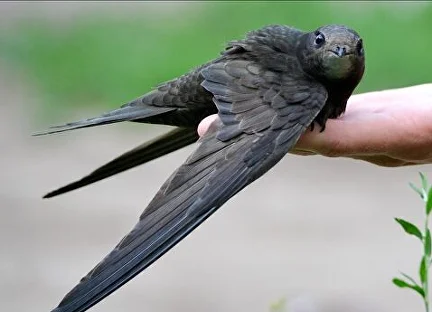
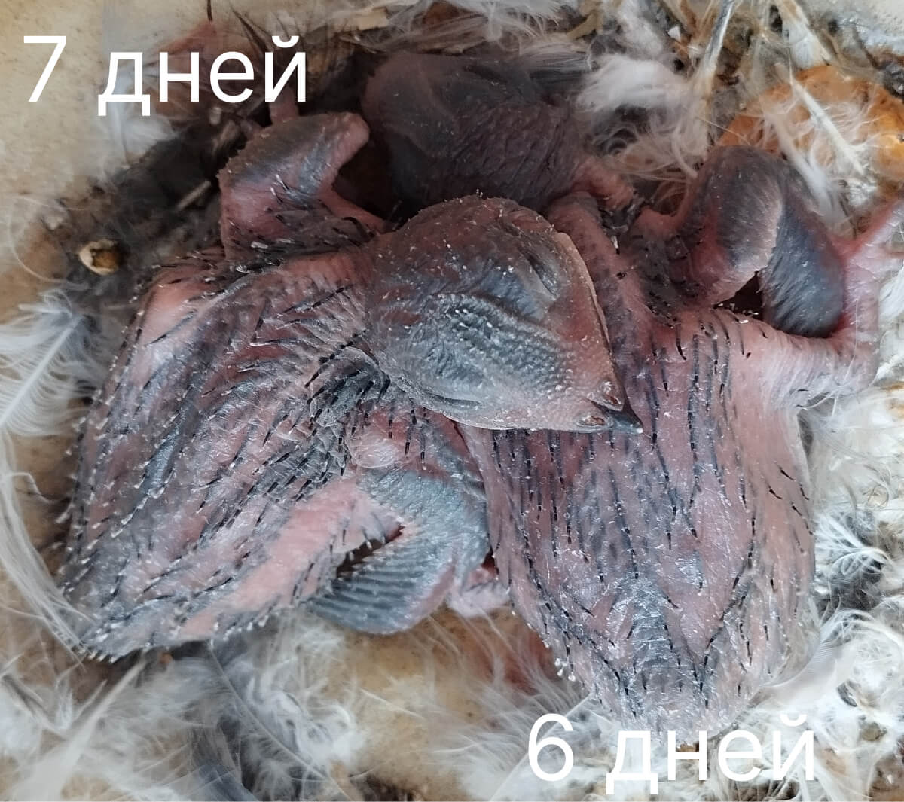
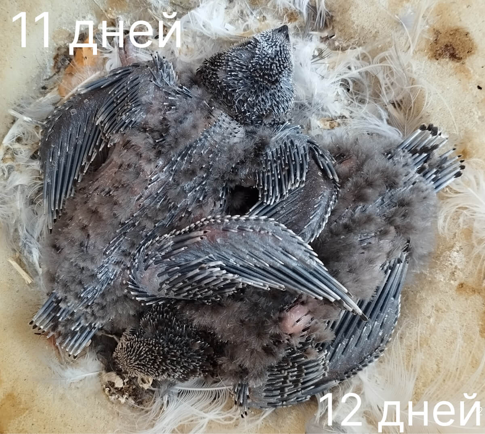
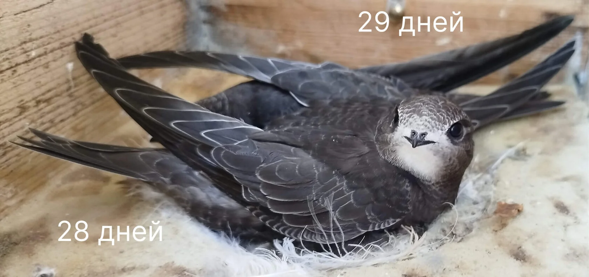
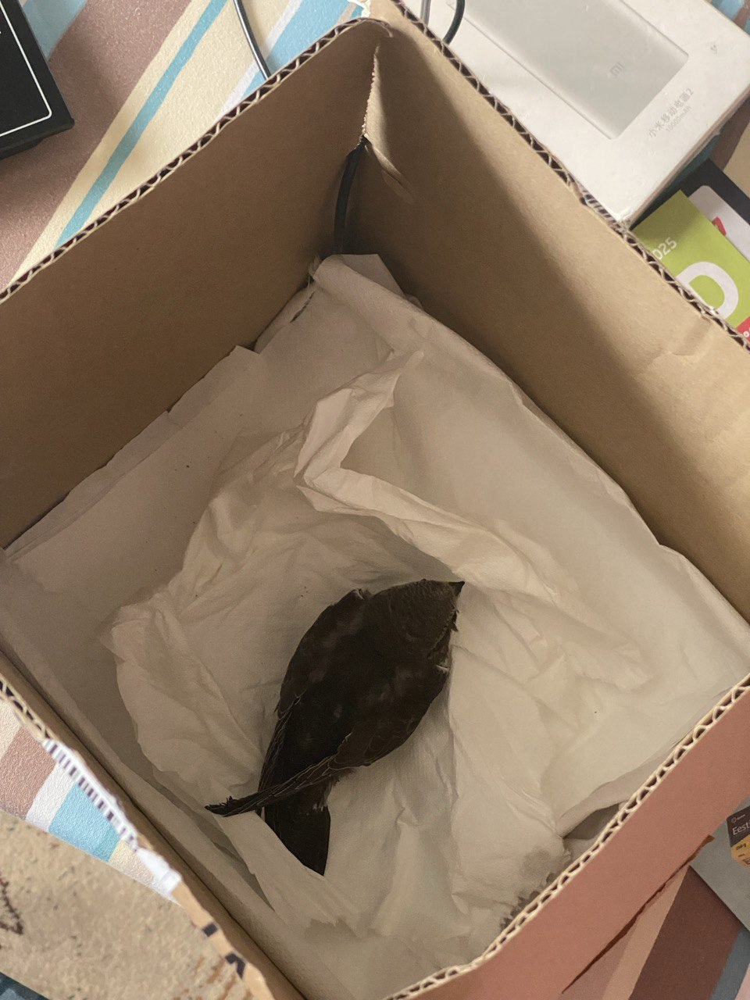

**See veebileht on loodud vabatahtlikele, kes päästavad piiritajaid (Apus apus)**

Eestis on selleks [Eesti Metsloomaabi (avaneb uues aknas)](https://www.facebook.com/profile.php?id=61579913521431/) 
või [Eesti Metsloomaühing (avaneb uues aknas)](https://www.metsloom.ee/kontaktid/)

Veebisait sisaldab looduslikke fotosid, sealhulgas putukatest, nende osadest ja meditsiinilistest protseduuridest jms.

## Kuidas näeb välja piiritaja (must- või tornipiiritaja, Apus apus)

<figure class="float-right">
  
  <figcaption>Täiskasvanud piiritaja. On lennanud Aafrikasse</figcaption>
</figure>

Piiritaja on väike, peopesa suurune lind, tumepruuni, peaaegu ühevärvilise sulestikuga, millel on väike valge laik noka all ja tumepruunid pärlilaadsed silmad. Tiivad on pikad, sirbikujulised, **täiskasvanud linnul** ulatuvad sabast umbes 3,5 cm võrra välja, normaalne kaal on 38–43 grammi.

Täiskasvanud linnu jalad on tumedat värvi, kõigil neljal varbal mõlemal jalal on suund ettepoole (räästalindudel on see teisiti), neil on pikad teravad küünised.

## Kui piiritaja on maas, vajab ta abi

Kui olete leidnud täiskasvanud piiritaja, kellel pole sulgedel heledat äärist ja nähtavaid vigastusi, võite ta üles tõsta ja hoida avatud kohas sirutatud käel, ilma teda õhku viskamata.  
Seda tuleb proovida pehme pinnase kohal, et lind võimaliku kukkumise korral end rohkem ei vigastaks.

Võimalik, et ta on juba toibunud ja suudab ära lennata. Kui ta ei lenda, vajab ta abi ja teile on vaja pappkasti, kuhu lind panna.

Järgmine samm – [võtke ühendust Metsloomaabiga või Metsloomaühinguga](contact-abi.html)

### Kiireloomulised seisundid

  <h3>⚠️ Kõrge kurnatuse tase</h3>
  
<strong>Märgid:</strong> poja kaal alla 25 g, täiskasvanud linnu puhul alla 35 g.

  
Piiritaja vajab välist soojendamist ja tuleb hakata tegutsema vastavalt kurnatuse leevendamise skeemile, kuna isegi õige toidu seedimiseks ei pruugi pojal jõudu olla.

  <a href="exhaustion.html" class="btn-emergency">👉 Kurnatuse leevendamise skeem</a>

  <h3>🩸 Kassihammustus (Pasteurelloosi oht)</h3>
  
Vajalik on <strong>veterinaari määratud kiire antibiootikumikuur</strong> pasteurella vastu. Ilma ravita võib surm saabuda mõne tunni jooksul!

  <ul>
    <li><strong>Täiskasvanud piiritajale:</strong> Ciprofloxacin</li>
    <li><strong>Pojale:</strong> Amoxicillin / clavulanate <em>(Ciprofloxacin võib mõjutada sulgede kasvu, seetõttu püütakse seda poegadele mitte anda)</em></li>
  </ul>

### Poeg

Piiritajatel pole lennuvõimetuid poegi – täiskasvanud linnud ei toida kunagi oma kasvavaid poegi maapinnal.

Väga sageli satuvad pojad inimeste kätte juba vedelikupuuduses ja märgatavalt kurnatuna. Tegutseda tuleb kiiresti, et lind sellest seisundist minimaalsete tagajärgedega välja tuua.

Poja elule kriitiline kaal on 18–22 grammi. Kurnatud piiritajapojad kaaluvad tavaliselt **20–27 grammi**.

Kui kahtlete, siin on [piltidega juhend linnu vanuse määramiseks päevade kaupa](identifying-swift.html)

<figure>
  
  <figcaption>Piiritaja poeg 6 päeva vanuselt, ta on veel paljas</figcaption>
</figure>
<figure>
  
  <figcaption>Piiritaja poeg 11 päeva vanuselt. Suled kasvavad nn "torukestest", mistõttu ta näeb välja nagu dinosaur.</figcaption>
</figure>
<figure>
  
  <figcaption>Ka see on poeg! Nooruk, kes pole veel Aafrikasse lennanud, tal on peas ja tiibadel heledad sulgede äärised. Ja roosad, veel päevitamata jalad.</figcaption>
</figure>



<h2 id="housing">Piiritaja turvaline majutamine <a href="#housing" class="btn-anchor-copy" title="{{ copy_anchor_label }}" onclick="if (navigator.clipboard && navigator.clipboard.writeText) { navigator.clipboard.writeText(window.location.origin + window.location.pathname + '#housing').catch(function(){}); } showCopyMessage('{{ copy_anchor_msg }}'); return false;"><i class="fas fa-link"></i></a></h2>

Piiritajale ei sobi puur, see on traumaatiline ja rikub sulgi.

Otsige jalatsikarbi suurune või suurem karp, tehke seestpoolt väljapoole ventilatsiooniavad. Sobib ka kauss või mõni plastkonteiner, mis on kaetud kangaga. Põhja pange lõhnata ja värvaineta kuivad paberisalvrätikud. Salvrätikud võimaldavad kiiresti eemaldada karbist linnu väljaheited.

  <figure class="image-float">
  
  <figcaption>Tibu karbis, allpool soojendatakse matiga</figcaption>
  </figure>

Asetage lind pimedasse kohta, et ta saaks rahus olla.

  <h3>⚠️ Olge küünistega ettevaatlik!</h3>
  
Ärge kartke piiritajat karpi panna. Isegi kui piiritaja teie peale susiseb, ei hammusta ta teid. <strong>Olge siiski ettevaatlik küünistega</strong>, ta võib neid tugevalt pigistada, näiteks sõrme kinni haarates.

Ärge pange karpi heinu, toitu ega proovige panna veega kaussi, kuna piiritaja ei oska nokaga toitu võtta.  
Piisab salvrätikutest või pehmest kangast, millesse linnu küüned ei takerdu, karbi ventilatsioonist, soojendamiseks mõeldud pudelist ja rahust.

Loodusesse naasmiseks peab piiritajal olema täiuslik sulestik. Võtke piiritaja kätte puhaste kinnastega või mähkige ta kangasse.  
Ärge proovige lindu toita talle mittesobiva toiduga: **piiritajad on eranditult putuktoidulised**.

Paljudel on kodus lemmikloomi, see ei tohiks teid linnu abistamisel segada.  
Asetage piiritajaga karp lemmikloomadele kättesaamatusse kohta, näiteks kapi otsa.

### Kaal ja kurnatuse seisund

Püüdke lind kaaluda – see on tema seisundi väga oluline näitaja.  
Kui köögikaalu pole, võib piiritajat kaaluda poes karbis, seejärel võtta lind välja ja vaadata karbi kaalu. Vahe on linnu kaal.

Kui kaal on alla normaalse 38–42 grammi, tuleb alustada soojendamist ja söötmist kindlate kellaaegade järgi. Kaalu taastumisel ja hea ilmaga naasevad need linnud loodusesse. Kui leitud täiskasvanud piiritajal ei ole kaalupuudust, pole vaja esimese ööpäeva jooksul teda iga hinna eest sööta, tal on varud olemas.

**Sügava nälja korral on vajalik spetsiaalne näljast väljatoomise protokoll** [putukate ekstrakti kasutamisega](exhaustion.md#extraction)

### Muud veebisaidi jaotised:

- [**Teisene ülevaatus**](secondary-inspection.md)
- [**Kurnatuse märgid**](exhaustion.html)
- [**Linnu vabastamise kriteeriumid**](back-to-nature.md)
- [**Tibu paigutamine kasupesasse**](swift-fostering-guidelines.md)