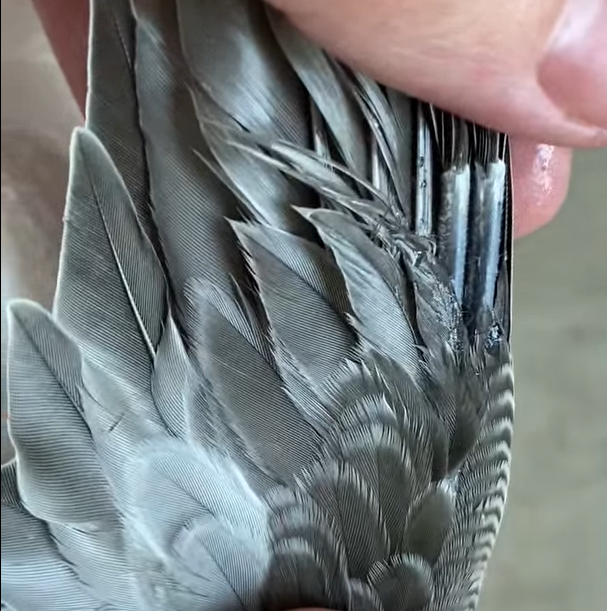
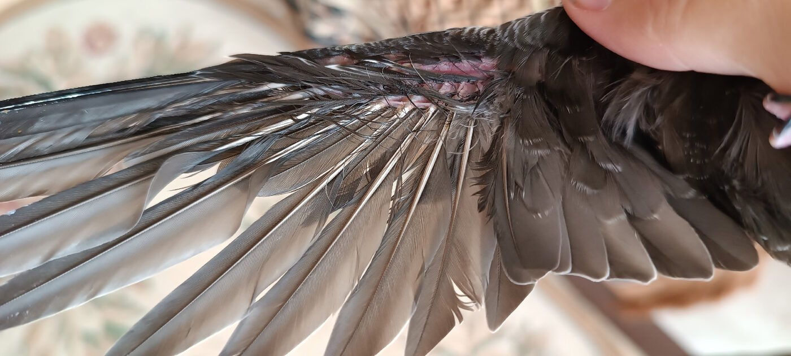
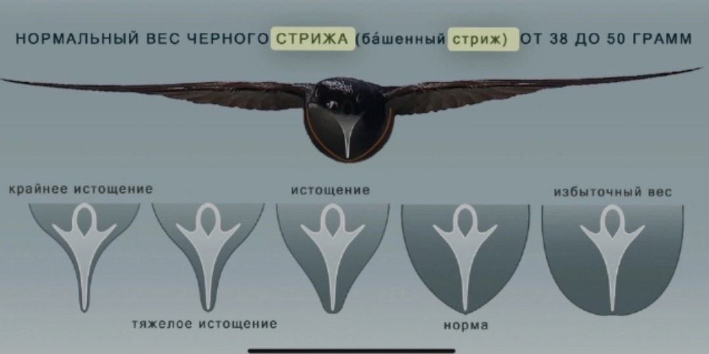
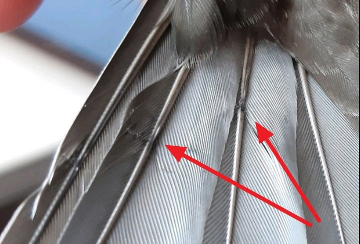
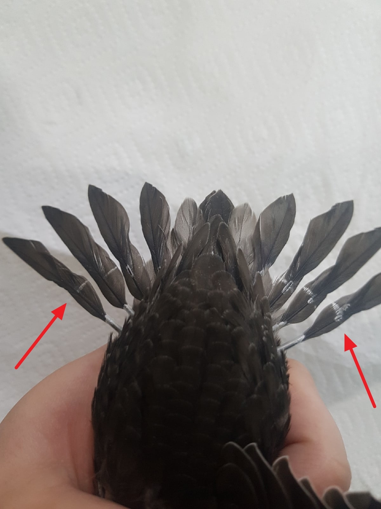
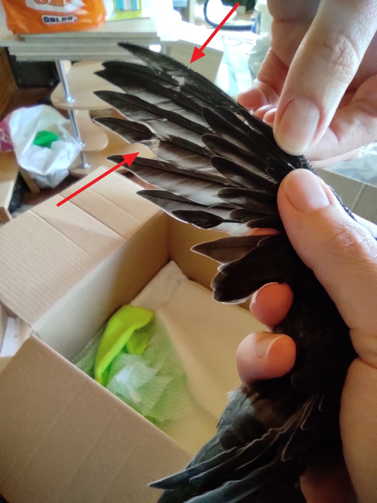

# Выпуск выросшего птенца стрижа

(Выпуск взрослой птицы после травмы будет опубликован позже.
Сайт дополняется материалами по мере готовности.)

В природе стрижонок покидает гнездо полностью выросшим и сформированым на 40-45 день от его рождения. Если стрижонка выкормил человек, это правило не изменяется. Вы не пробуете "учить" его летать преждевременно. Стрижата тренируют свои мышцы в гнезде, хлопая крыльями, отжимаясь и выгибая спину. Так сформировалось эволюционно, поскольку у стрижонка есть только одна попытка для удачного (или неудачного) вылета. Попытка запустить стрижонка в полёт раньше срока для него такой же стресс как выпадение из гнезда.

## Маховые и рулевые перья

**Главный критерий готовности к вылету — полностью выросшие маховые перья крыла и рулевые хвоста.** 

Трубочки, из которых растут перья, прячутся под мелкими пёрышками на внутренней стороне крыла. Не пытайтесь "помогать" освобождаться стрижу от трубочек. Это может привести к повреждению пера.

<figure>
    
    <figcaption>Перо растёт из трубочек, которые должны сойти до выпуска.</figcaption>
</figure>

**Частая ошибка волонтёров — не заметить, что рост перьев ещё продолжается.**

Чтобы проверить отсутствие трубочек, нужно намочить водой кроющие перья над маховыми перьями и увидеть то место на теле птицы, откуда они растут. Кроющие перья промокают не сразу и их придется намочить несколько раз.

Готовое полностью выросшее перо выходит прямо из кожи (из перьевой сумки, которую не видно глазом). Растущее перо выходит из трубочки, которую видно глазом, и которую птица счищает сама тогда, когда перо готово. Стержень ещё растущего пера кровоснабжается, а стержень готового пера уже нет.

<figure>
    
    <figcaption>Трубочки полностью сошли до основания, что показывает готовность оперения к выпуску</figcaption>
</figure>

<figure>
    
    <figcaption>Для примера, вот так выглядит стриж на 38 день с трубочками. Он очевидно, он ещё не готов к полёту</figcaption>
</figure>

Стрижата, по несчастью вылетевшие из гнезда раньше, опускаются на землю, не в силах выдержать долгий полёт. Если волонтёр выпускает неготовую к полёту птицу, она может пролететь метры или километры, прежде чем устанет от преждевременной нагрузки и станет чьей-то добычей на земле.

## Полётный вес

**Второй важный критерий это вес**. Птенец старше 20 дней (оперённый) в норме весит больше, чем взрослая птица. Его вес снижается одновременно с окончанием роста перьев: жировая ткань переходит в мышечную. В последние 1-2 недели перед вылетом стрижа бывает трудно кормить, но важно поддерживать его вес для развития выносливых мышц.

Полётный вес стрижа колеблется от 37 грамм для мелких особей до 45 грамм  для крупных. Стандартный вес 40 грамм. Толстой птице тяжело поднять себя в воздух, а у худой нет достаточной силы в мышцах. Если у вас было мало опыта со стрижами, то эта картинка поможет понять степень упитанности, вдруг вам попался особенно крупный или мелкий стрижонок.

<figure>
    
    <figcaption>Определяем степень упитанности стрижа по килю</figcaption>
</figure> 

## Проверка качества перьев

После вылета из гнезда дом стрижа — это небо. Стрижи не возвращаются в гнёзда, они даже спят в полёте. Маховые перья крыла складываются в сплошное полотно, как и хвостовые рулевые перья. Сфотографируйте развёрнутое крыло и развёрнутый хвост над светлым фоном с каждой стороны, изучите фотографию в приближении. Если вы кормили стрижа насекомыми, соблюдая интервалы кормления в соответствии с возрастом, скорее всего вы увидите плотную эластичную ткань перьев с крепкими прямыми ровно окрашенными стержнями (очинами).

< фото хороших перьев > 

Птенцы часто попадают к человеку истощёнными и голодавшими, и этот дефицит можно увидеть на перьях в виде так называемых стресс-линий или стресс-полосы. При неправильном кормлении перья будут рыхлыми, неплотными, хрупкими. Такая птица проживёт в природе недолго.

<figure>
    
    <figcaption>Стресс-линия 1</figcaption>
</figure>

<figure>
    
    <figcaption>Стресс-линия 2</figcaption>
</figure>

<figure>
    
    <figcaption>Стресс-линия "треугольником"</figcaption>
</figure>

Если вы увидели, что какие-то маховые и рулевые перья отсутствуют, проверьте, не растёт ли на этом месте из кожи новое перо. Если да, то лучше дать стрижонку его вырастить полностью до выпуска. Особенно критичны крайние три маховых пера на крыле или три крайних рулевых пера хвоста.

< Фото где видна нумерация перьев >

# Подготовка к выпуску

Итак, если ваш стрижонок закончил растить свои перья и у него полётный вес, то перед выпуском убедитесь, что он полностью чистый. Перья хвоста или лапы бывают испачканы в помёте. Тогда их нужно помыть мокрым ватным диском. Если хвост придётся сильно намочить и чистить, то подождите выпускать в этот день стрижа, отложите на завтра. Ему нужно снова смазать перья своей водоотталкивающей смазкой.

## Время и место выпуска

В природе готовые стрижата вылетают из гнезда вечером или ночью. Выберите тоже вечернее время, когда дневные хищники уже наелись и охотятся не так активно. Лучше, если будет достаточно светло, чтобы вы могли найти птицу в траве, если что-то пойдёт не так. 

Место для выпуска должно быть открытым, хорошо просматриваться и не иметь рядом травмоопасных условий: больших отражающих поверхностей, проводов, шоссе и т.д. Если стриж упадёт, то не на асфальт, а в траву. Подходит школьный стадион, поле, большая поляна. 

## Погода

Не выпускайте стрижа в ветренную или грозовую погоду. Хорошо, если это будет тёплый ясный день или переменная облачность.

Если речь идёт о выпуске поздних птенцов в самом конце лета, то нужно проверить, чтобы ночные температуры не были ниже 9°, иначе у птенца не будет в воздухе корма, а температуру тела будет трудно поддержать.

Важно посмотреть по прогнозу погоды, ожидается ли теплый коридор от места выпуска в южные регионы, чтобы стриж мог по нему пролететь. 

# Выпуск стрижонка

Посадите птицу на ладонь и поднимите руку. Не подкидывайте его и не качайте рукой. Ему нужно время, потому что у него много дел. Он осматривает окрестности на предмет хищников и укромных мест, откуда они могли бы вылететь. Ещё ему нужно сориентироваться в направлении ветра (обычно они выбирают стартовать против ветра), и прогреть мышцы вибрацией. Если стрижонок смотрит по сторонам и дрожит или "гудит" телом, то он вот-вот улетит.

Если вы держите его спокойно на вытянутой руке и он не улетает, значит есть причина. Можно попробовать положить его обратно в коробку, перенести на некоторое расстояние и заново предложить ему стартовать. Если всё-таки он не улетает, перенесите выпуск на следующий день или попробуйте найти совсем другое место для выпуска.

## Дополнительная информация

У стрижей не работает импринтинг так, как у многих других птиц. Поэтому они не нуждаются в дополнительном одичивании или обучении жизни в стае. Не зарегистрировано случаев, чтобы стриж прилетал к "своему" человеку.

## Фрагмент научной статьи

Дина Сафоновна Люлеева в своей работе также отмечает: 

— Проверяя гнезда мы часто встречали вполне взрослых на вид молодых птиц, которые упорно держались в гнезде даже многократно потревоженные. Причиной тому было то, что крайние маховые перья практически целиком развернулись, но в основании 10−7-го махового пера были видны недоразвернувшееся трубочки длиной не более 3−5 мм или чехлы до 2 мм. Особенное удивление задержка таких молодых стрижей вызывала в поздние сроки отлета, когда основная масса черных стрижей уже улетела, покинув территорию гнездования. Подобное поведение молодых стрижей понятно, поскольку известно, что при вылете из гнезд они сразу становятся самостоятельными, способными без поддержки взрослых добывать себе корм.
Крылья молодых, таким образом, должны быть развернуты полностью, соответствуя крыльям взрослых стрижей, всегда способных к длительному и маневренному полету. Факт особой прочности оперения крыла и особенно первостепенных маховых, образующих вершину крыла (10−8-го) ежегодно подтверждается отсутствием линьки у годовалых черных стрижей, которые меняют свои первостепенные маховые практически ровно через год после вылета из гнезда. Известно, что молодые стрижи 2-го календарного года в некоторых случаях также не успевают сменить крайнее первостепенное маховое во время предбрачной линьки и оно остается до следующей зимовки.
