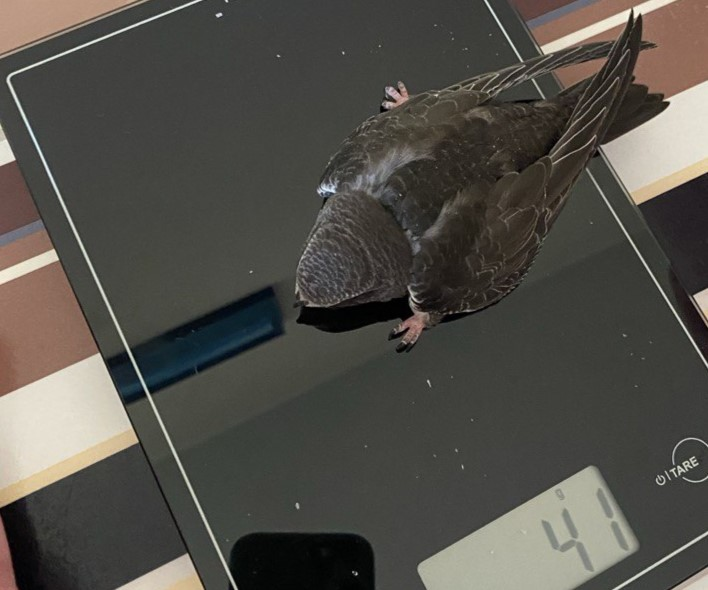
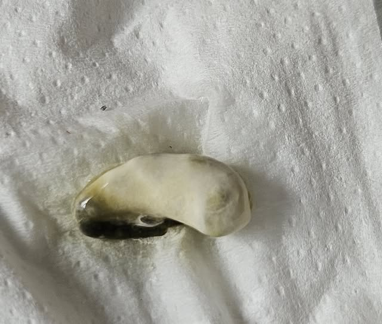
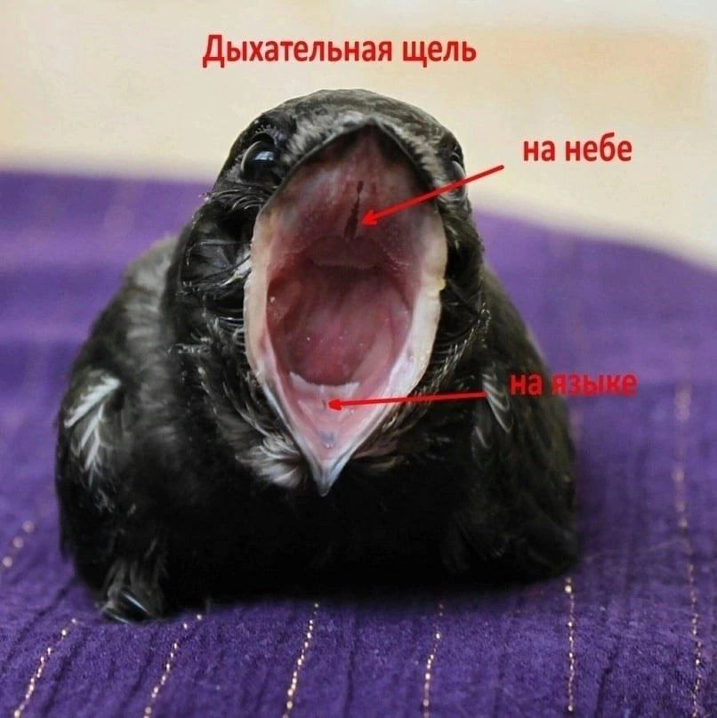
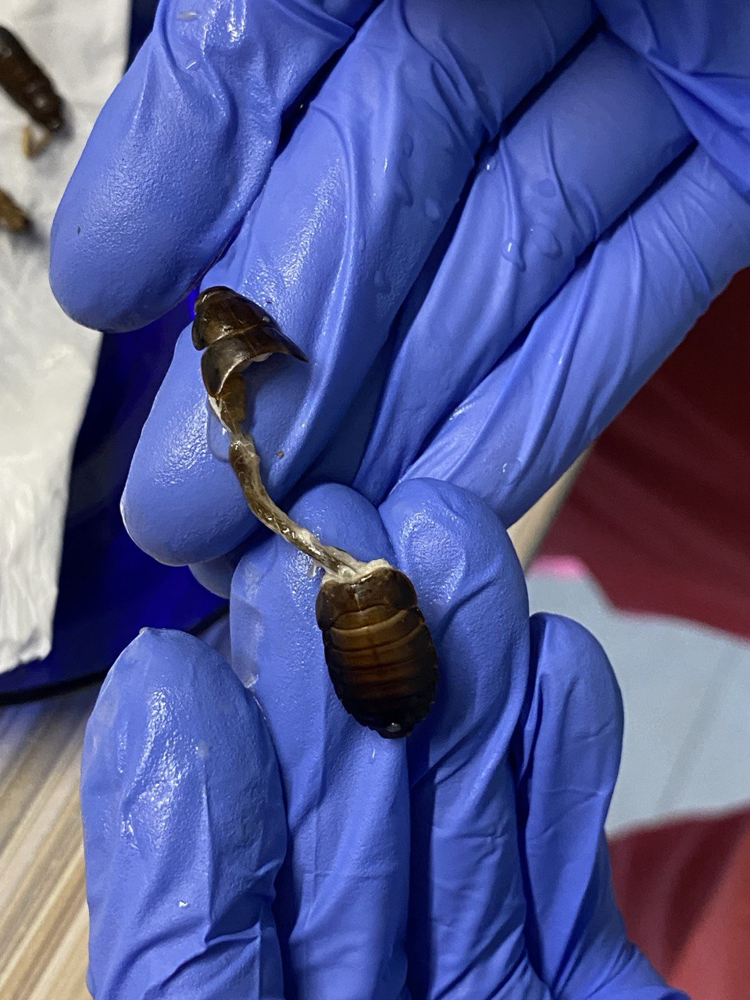
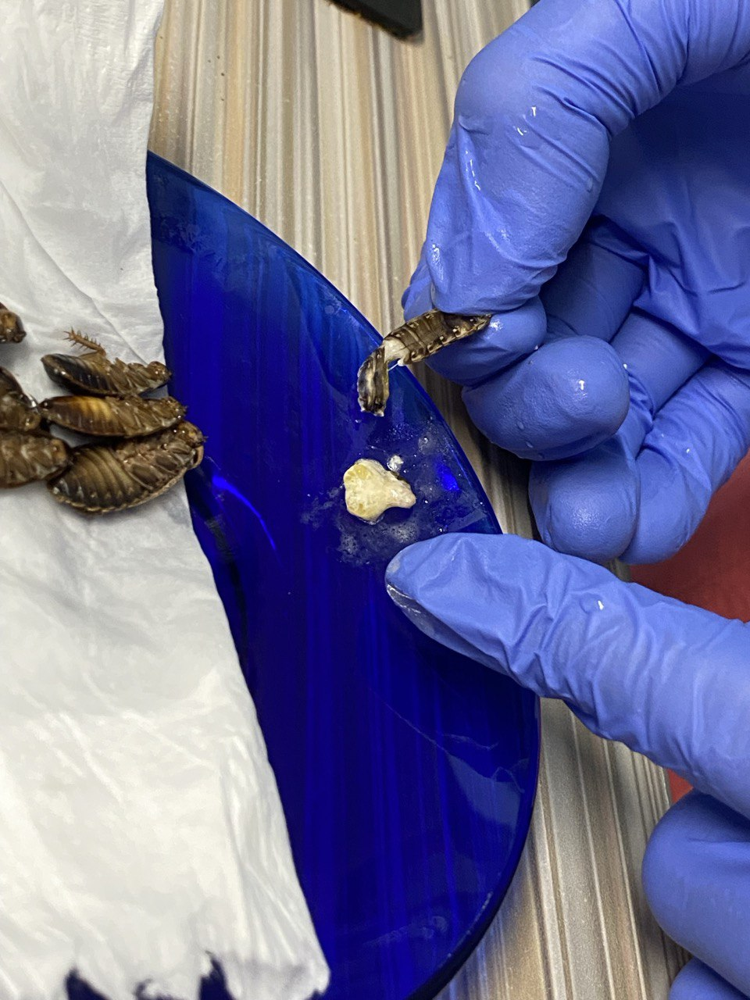
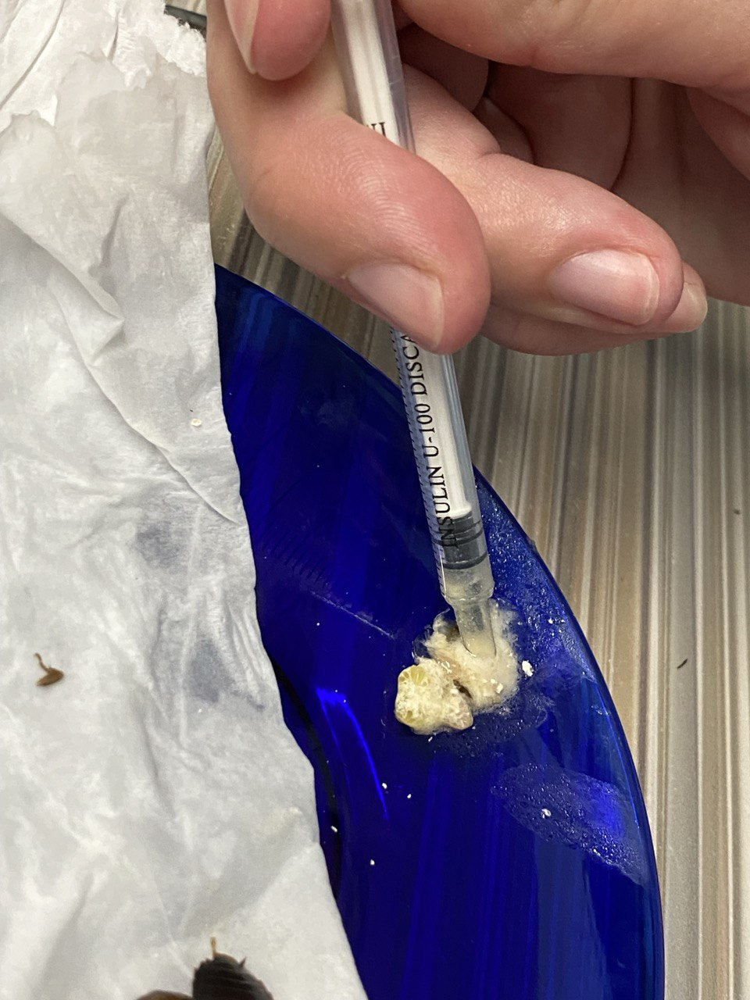
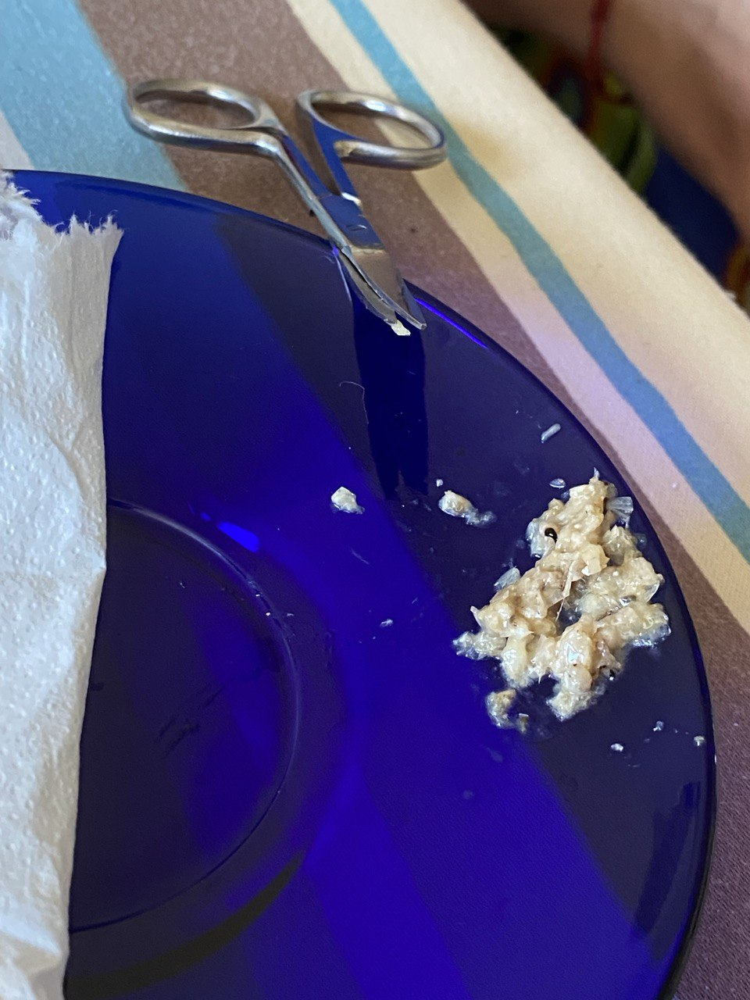

Подробно о том, как определить истощение у стрижа и что делать в случае его наличия. Практические рекомендации и советы опытных стрижеспасателей о том, как выходить истощенного стрижа. Всё написанное ниже одинаково для взрослых и птенцов. Отличия будут указаны особо.

---

Пропустить признаки истощения и перейти сразу [к описанию реанимации](#reanimation)

При истощении стрижа нельзя сразу кормить как здорового. Не давать еду в больших объёмах! Иначе откажет желудок, и стриж погибнет.

Для здорового не истощённого птенца [Таблица с необходимым количеством еды для одного птенца стрижа](amount-of-feed.md)

## Определяем степень истощения
От того, насколько истощен стриж, будут зависеть наши дальнейшие действия

### Упитанность грудки

По центру грудки есть кость, которая идёт дугой от шеи к животу — это киль. Немного намочите перья на грудке теплой водой и разгребите их в стороны пальцами. Как выглядит киль? Боковинки грудины круглые, сама грудка буквой U? Или ровные, грудина буквой V? (острый уголок) Или грудина как тонкая дощечка, буквой Y, I?

### Вес

<figure class="image-float">
  
  <figcaption>Взвешиваем птенца, это очень важный показатель</figcaption>
</figure>

Вес здорового стрижа, в том числе птенца старше 10 дней — **от 35 грамм и больше.** 

Критический для жизни птенца вес — 22−18 грамм. Для взрослой птицы критический вес ниже 30 грамм.

Истощённые найденные стрижата обычно весят 20−27 грамм.

В первую очередь надо узнать точный вес стрижа на электронных (кухонных или ювелирных) весах. Вес надо знать с точностью до 1 грамма! Отклонение на весах +/- 10 грамм не подходит, поэтому механические весы с приблизительным весом не годятся.

Если дома нет весов и не у кого их одолжить, то взвесить можно незаметно в магазине в отделе самообслуживания (фрукты, овощи, сухофрукты, конфеты). Посадите стрижа в коробочку, например, из-под чая и взвесьте вместе с этой тарой. Потом коробочку взвесьте отдельно и вычтите этот вес из общего веса. В дальнейшем по динамике прироста веса будет понятна срочность тех или иных действий.

[Соответствие возраста и веса](identifying-swift.html)

### Цвет зева

Какого цвета рот внутри?

-   Ярко-розовый
    
    Нормальная слизистая. Стрижонок достаточно упитан.
    
-   Бледно-розовый
    
    Стрижонок ослаблен, но не при смерти.
    
-   Белый, желтый, серый
    
    Стрижонок при смерти.
    
    Внимание! Открывать рот за кончики клюва **нельзя**! Большой риск сломать клюв. Фиксируйте голову стрижа пальцами одной руки с боков, а другой рукой берите стрижа за кожу под клювом (не за одни перья, а за перья с кожей) и тяните вниз, чтобы приоткрылся клюв. Открытый клюв можно зафиксировать пальцем. Не сдавливайте клюв с боков, это травмирует его сочленение.
    

### Глаза

Они чаще открыты или закрыты? Если открывает, то открывает полностью (широкие круглые)? Или открывает наполовину, глаза как бы полуприкрыты? Сверьтесь с [таблицей роста](identifying-swift.html): широко открытые глаза могут быть только у стрижа старше двух недель.

-   Нормально открытые глаза 
    
    Стрижонок в порядке.
    
-   Плотно закрытые глаза
    
    Стриж ослаблен.
    
-   Ввалившиеся глаза (иногда кажется, что глаз будто бы нет, такие сухие)
    
    Стрижонок крайне истощен.
    
### Помет стрижа

Нормальный помёт птицы состоит из трёх частей: фекалий, уратов и мочи. Белая часть — это выводят почки: моча и ураты. Темная часть — из жкт остатки хитина и переваренные остатки насекомых.

-   Помет при истощении
    
    Что-то черное и размазанное. И этого чего-то крайне мало. Лужица вокруг может быть зеленого цвета. У птиц желудочный сок зеленого цвета и зеленая лужа в помете говорит нам о том, что желудку нечего переваривать.
    
-   Хороший помет
    
    Большая лужица вокруг капсулы говорит о лишней воде в корме
    
-   Идеальный помет
    
    Хорошо сформированная белая капсула, которая не растекается, с небольшим черным хвостиком

<figure class="image-block">
  
  <figcaption>Пример _достаточно_ хорошего помёта у птенца после первых кормлений</figcaption>
</figure>
    
-   Помет при кормлении кузнечиками
    
    Капсула более расплывчатая, черный хвостик более длинный, может быть розовый, свекольный или зеленоватый оттенок

### Другие признаки истощения

Лапки и тело холодные, при крайнем истощении могут быть ледяными.  
В норме должны быть теплые и горячие, т.к. температура тела стрижей выше, чем у человека.

Истощенный стриж нахохлен, перья на спинке стоят дыбом (так вы можете понять по фото)

-   В норме перья гладко прилегают к телу.

Дыхание замедлено, как у человека, который медленно дышит, спинка может при этом заметно вздыматься. Если стриж ритмично открывает рот при каждом вдохе — он уже при смерти.

-   В норме дыхание частое, в 2 раза чаще, чем у человека, а по спинке почти незаметно, что стриж дышит, надо очень сильно присмотреться.

## Реанимация начинается с обогрева {#reanimation}

Истощённый стриж сам согреться не может. Любая птица получает энергию и обогрев, переваривая пищу. Даже если вы посадите стрижа в мех он не будет получать тепло, потому что должен сначала нагреть его своим телом.

Для обогрева используйте:
-   свои руки: держите стрижа в ладонях, прижмите его к себе, посадите за пазуху
-   водную грелку
-   бутылку с очень тёплой водой, засунутую в носок
-   лампу накаливания, направив её на стрижа сверху. С лампой надо быть очень осторожным! Если у птицы ЧМТ (стукнулся головой при падении), то греть сверху нельзя!
-   электрическую грелку (только на самых невысоких температурах и под вашим наблюдением, чтобы стриж не перегрелся; используется в случае, если нет других вариантов)
-   сушилки для обуви в качестве грелки

У стрижа должно быть пространство в коробке, чтобы отползти от грелки в сторону, если станет жарко.

Все жидкости и еду давать нужно **тёплыми**! Теплое лучше усваивается и организму требуется меньше усилий на переваривание, а процесс восстановления идет быстрее.

### Гигиена 

Прежде, чем начинать реанимационные действия, как и любые действия со стрижом, тщательно вымойте руки до скрипа и обработайте их антисептиком. Все инструменты и предметы, которыми вы будете пользоваться, должны быть вымыты или стерильны. Подготовьте чистые салфетки, бумажные полотенца, чистую посуду.

Если кормовое насекомое упало на пол, значит стрижу оно уже не достанется. Стрижи очень подвержены инфекциям! Не стоит к истощению добавлять еще проблем.

Используйте перчатки при кормлении. Самые удобные, которые не ощущаются на руке и не мешают — нитриловые.

### Подготовка к реанимации 

Понадобится физраствор или раствор Рингера, поскольку истощённый стриж в первую очередь сильно обезвожен. Можно сделать физраствор самостоятельно: полную чайную ложку поваренной соли нужно размешать в одном литре кипяченной воды.

Также нужно сделать медовую воду из расчёта 1 чайная ложка мёда на стакан кипячёной воды. (В идеале вместо медовой воды - глюкоза 6% в ампулах для инъекций, но она продаётся по рецепту.)

Смешайте физраствор с медовой водой 1:1. Поддерживайте температуру жидкости около 40 градусов (очень тёплая, но не горячая)

Подготовьте шприц без иглы, лучше объёмом 1мл, как для инсулина.

Ватные палочки и салфетки.

Мезим (Mezym) в таблетках. Продаётся в человеческой аптеке, содержит пищеварительные ферменты, помогает желудку переваривать пищу. С таблетки нужно убрать (соскрести ножом) розовую оболочку, и таблетку размять в порошок.

Кормовые насекомые, в идеале сверчки. Подробнее о кормовых насекомых - в разделе [кормление](feeding-swift.html)

### Реанимация

Первым делом дать стрижу в клюв 0,2 — 0,3 мл смеси физраствора (или раствора Рингера) с медовой водой 1:1. В каплях это 5-7 капель. Со шприца без иглы в тёплом виде, выпаивая по капле и убеждаясь, что жидкость протекает в горло и стриж глотает её. Будьте очень осторожны с дыхательными щелями птицы на языке и на нёбе! Жидкость не должна туда попасть.

Чтобы открыть клюв, фиксируйте голову стрижа пальцами одной руки с боков, а другой рукой берите стрижа за кожу под клювом (не за одни перья, а за перья с кожей) и тяните вниз, чтобы приоткрылся клюв. Открытый клюв можно зафиксировать пальцем. Не сдавливайте клюв с боков, это травмирует его сочленение. Не держите клюв за кончики и не открывайте так, сломается подклювье.

<figure class="image-float">
 
  <figcaption>Дыхательные щели стрижа</figcaption>
</figure>

Ждём 20 минут. Птица всё это время находится в тепле. Может быть удобно держать грелку на коленях и стрижа в руках над грелкой.

Чтобы ЖКТ начал работать, кормить надо часто маленькими дозами.
Приготовьте выжимку из сверчка или таракана. Для этого удалите у насекомого голову с желудком, а из брюшка выдавите "мясо" насекомого. Хитиновая оболочка слишком грубая для птицы в состоянии при смерти, её не давайте. Чем крупнее насекомые, тем больше выжимку удаётся получить из каждого сверчка или таракана. Нужно набрать 0,2−0,25 мл выжимок. В порцию добавить порошок Mezym размером с кунжутное семечко. Поглаживайте стрижа по горлышку сверху вниз, чтобы ему легче было глотать выжимки. Если выжимки стоят в горле, можно чуть вытянуть голову вперёд и вверх (по диагонали), чтобы шея распрямилась и выжимки легче прошли в пищевод. Имейте под рукой ватные палочки, чтобы быстро очистить дыхательные щели стрижа, если жидкая еда попадёт. Каждую каплю еды выдавливайте из шприца после того, как предыдущая капля точно проглочена.

Если нет насекомых, не заменяйте их никакой другой едой. Допустимо продержать стрижа 1 день на смеси физраствора (или Раствора Рингера) с медовой водой 1:1. Но давать не более 5 капель за "кормление". Та же рекомендация и в случае, если вы нашли стрижа вечером и ничего не можете купить. Опытным волонтёрам лучше иметь дома запас необходимого.

В первые сутки кормим только выжимками. Делаем выжимки из насекомых по 0,2−0,25 мл (2- 3 выжимки из сверчков предимаго) и кормим каждые 25−40 минут первые 5 кормлений. После пятого кормления обычно появляется помёт. Когда есть помет, увеличиваем порцию до 0,3−0,35 мл (4−5 выжимок), а интервал до 1 часа до конца суток. 
Ночные перерывы между кормлениями не более трех часов.

#### Выжимка 

Подготовка выжимки на примере мраморного таракана (предымаго).

<figure>
  
  <figcaption>Отделяем голову таракана, вытаскивая вместе с ней и кишечник</figcaption>
</figure>
<figure>
  
  <figcaption>Получаем белую жижу из брюшка</figcaption>
</figure>
<figure>
  
  <figcaption>Набираем смесь в шприц, чтобы залить прямо в горло стрижу.</figcaption>
</figure>

### Контроль веса

Каждое утро перед первым кормлением взвешиваем стрижа натощак. Каждый день стриж должен прибавлять в весе минимум 1−1,5 грамма. Первые пару грамм он прибавит в первые часы реанимации при восстановлении от обезвоженности. Дальше вес должен продолжать увеличиваться, пока не станет соответствовать норме по возрасту. Особенно важно в достаточной мере кормить птенца. У голодного стрижонка плохо развивается перо и внутренние органы, могут быть дефекты перьев, перо может ломаться, выпадать. Стриж с плохим оперением не имеет шансов выжить в природе.

### Вздувшийся животик

Если вы кормите стрижа, а у него долго нет помета, может случиться беда. Помет должен быть после каждого кормления, начиная с пятого (от момента когда живот был пустым). Потрогайте живот стрижа (не грудь, где килевая кость, а именно живот), и если он твёрдый и надутый, то нужно прекратить кормление до помета. Дать вазелинового масла 2 капли с водой в клюв. Анус смазать маслом. Держать животом над теплом. Аккуратно массировать животик ватным диском.

### Резанка из насекомых

Когда зев стрижа стал бледно-розовым, выжимки из насекомых усваиваются и есть регулярный помёт, можно начать постепенно вводить кормление резанками из насекомых с интервалом кормления 1,5 часа. Резанки — это измельчённые при помощи маникюрных ножниц брюшки сверчков или тараканов.

<figure>
    
    <figcaption>Подготовка мелко нарезанных насекомых</figcaption>
</figure>

  <figure>
    <video width="500" height="405" controls>
      <source src="{{ 'assets/video/feeding-with-finely-chopped-insects.mp4' | relative_url }}" type="video/mp4">
      Your browser does not support the video tag.
    </video>
    <figcaption>
      Кормление мелко нарезанными насекомыми. Закладываем комок в рот, стараясь не измазать вокруг клюва. Если там постоянно будет оставаться корм, это приведёт к инфекции.
    </figcaption>
  </figure>

Замените одно кормление выжимкой на такое же количество резанки. Мезим в порошке продолжайте добавлять. Если помет в норме, и в нем нет или совсем мало непереваренных остатков, значит стриж справился с перевариванием, и можно заменить две выжимки на такое же количество резанки. Переход на резанки можно растянуть на весь день или даже пару дней, постепенно увеличивая количество резанки в кормление и плавно переводя стрижа на кормление только резанками.

Осматривайте рот стрижа после кормления, чтобы убедиться, что дыхательные щели в норме! Мелкие частички резаного хитина могут прилипнуть к нёбу или попасть в дыхательную щель.

### Кормление брюшками

Целые непорезанные брюшки сверчков вводите тоже постепенно. Дайте 2-3 брюшка вместе с резанкой и посмотрите какой будет помёт, переваривается ли неизмельчённая еда. Если не переваривается, пока брюшки давать рано. В случае тошноты больше не кормите стрижа брюшками и переходите на кормление выжимками. Если стрижа не тошнило, сверчки переварились и стриж покакал через час, то можно кормить снова, постепенно увеличивая объём порций на 2−4 брюшка, пока не получится нормальная порция, соответствующая возрасту.

## Август — месяц брошенных и истощённых стрижат

Стая улетает на юг в начале-середине августа, и часть птенцов остаётся сидеть в своих гнёздах недокормленными. Обычно это поздние птенцы, когда с первой кладкой что-то случилось и стрижи-родители делали кладку заново. Птенцы ждут день, два, неделю… а потом не выдерживают, и отправляются искать пищу самостоятельно. Тут их и подбирают на земле.

Киль острый и тонкий, как фанерка, глаза закрытые и ввалившиеся, ротик бледно-розовый или белый, вес 20−24 грамма.

Волонтёру нужно особое упорство, быстрое принятие решений, и готовность к сложностям. Время идёт даже не на часы, а на минуты! Если не принять срочные меры — стрижонок погибает в течение суток. Реанимированные стрижата постепенно восстанавливаются и выходят на норму веса и развития, потенциально способны вернуться в природу.

<!-- 
 #Lightbox for all images  -->
