<head>
    <meta charset="UTF-8">
    <meta name="viewport" content="width=device-width, initial-scale=1.0">
    

</head>

* TOC
{:toc}

## Прикидываем по датам 
Если вы нашли своего стрижа в мае или июне, то это совершенно точно взрослый стриж, прилетевший из Африки(!). В это время еще нет птенцов.

  <table style="border-collapse: collapse; width: 100%; min-width: 600px; table-layout: fixed;">
    <tr style="background-color: #f2f2f2;">
      <th style="border: 1px solid #ddd; padding: 8px; width: 20%;">Май</th>
      <th style="border: 1px solid #ddd; padding: 8px; width: 20%;">Июнь</th>
      <th style="border: 1px solid #ddd; padding: 8px; width: 20%;">Июль</th>
      <th style="border: 1px solid #ddd; padding: 8px; width: 20%;">Август</th>
      <th style="border: 1px solid #ddd; padding: 8px; width: 20%;">Сент</th>
    </tr>
    <tr>
      <td style="border: 1px solid #ddd; padding: 8px; vertical-align: top;">🟢 Прилет Можно найти только взрослого стрижа</td>
      <td style="border: 1px solid #ddd; padding: 8px; vertical-align: top;">🟡 Гнездование и яйца Можно найти только взрослого стрижа</td>
      <td style="border: 1px solid #ddd; padding: 8px; vertical-align: top;">🐣 Птенцы</td>
      <td style="border: 1px solid #ddd; padding: 8px; vertical-align: top;">🔴 Отлёт Находят брошенных и истощённых стрижат</td>
      <td style="border: 1px solid #ddd; padding: 8px; vertical-align: top;"></td>
    </tr>
  </table>

Важно!
У стрижей нет "слётков", птенец сразу после вылета из гнезда умеет летать и добывать себе корм.
Поэтому не пытайтесь посадить стрижа на ветку дерева. Если стриж на земле, ему нужна помощь!

Для определения возраста птенца используйте визуальные признаки (перья, глаза, поведение) и сравните с описаниями выше.

<body>
    <h1>Возраст стрижей: развитие с 1-го по 42-й день</h1>
    
Таблица ниже описывает развитие птенцов стрижей (Apus apus) с 1-го по 42-й день, включая внешний вид, поведение и особенности.

<table>
        <tr>
            <th style="width: 65%;">Описание</th>
            <th style="width: 35%;">Фото кликабельно</th>
        </tr>
        <tr>
            <td>Первые часы и первый день 
Эмбрионального пуха нет. Кожа нежно-розовая. Птерилии не обозначены. Клюв светлый, складка в углах рта белая. Слуховые отверстия закрыты. Веки сомкнуты.
  Длина тела 40 мм. Длина крыла 7−8 мм. Масса тела 3,0 (2,5−3,6) г. 

  Время кормления родителями: 
5:10, 7:28, 7:56, 9:05, 10:03, 11:35, 12:29, 15:40, 15:57, 17:07, 18:29, 20:22, 20:34, 21:17, 21:35</td>
            <td></td>
        </tr>
</table>

  
Нажмите, чтобы раскрыть таблицу целиком

<table>
        <tr>
            <th style="width: 65%;"></th>
            <th style="width: 35%;"></th>
        </tr>
        <tr>
            <td>2-й день 

Кожа светло-розовая. Птерилии обозначились в виде мелких темных точек (размером 0,2 мм) на плечах и в каудальной части. На спинной и брюшной стороне тела птерилии не видны. Слуховые отверстия закрыты. Веки сомкнуты. Клюв и когти темнеют.

  Длина тела 56 мм. Длина крыла 11 мм. Масса тела 5,5 (5,0−6,6) г. 

  Время кормления родителями: 

5:36, 7:23, 8:18, 10:03, 13:06 16:16, 17:32, 19:16, 20:36, 20:58</td>
            <td>
            
            </td>
        </tr>
        <tr>
            <td>3-й день Перьевые птерилии обозначились в виде слабо заметных пунктирных линий пера (развивающегося подкожно) на головной, плечевой, крыловых, спинной и грудной птерилиях (каждая закладка развивающегося пера размером от 0,5 до 1,5, самые крупные плечевые — 1,5 мм). Крыловые птерилии в виде пунктирной полоски шириной 1 мм. Слуховые отверстия закрыты. Веки сомкнуты. Клюв светло-серый, когти светлые.

  Длина тела 60 мм. Длина крыла 12 мм. Масса тела 8,5 (7,5−10,4) г.

  Время кормления родителями: 

4:02, 4:13, 5:23, 5:58, 6:34, 9:22, 10:42, 12:40, 13:44, 13:57, 14:52, 16:06, 16:45, 17:56, 18:08, 20:00, 20:55</td>
            <td>
           </td>
        </tr>
        <tr>
            <td>4-й день Все птерилии обозначены в виде пунктирных и штриховых линий пера, растущего и развивающегося подкожно. На головной, плечевых, крыловых, спинной и грудной птерилиях перо обозначено пуктирными линиями, точками или мелкими штрихами (0,5−1 мм). Плечевые птерилии и спинные штриховые линии размером 1,5−2 мм. Клюв светло-серый. Яйцевой зуб есть. Когти светлые. Слуховые отверстия закрыты. Веки сомкнуты.

  Длина тела 65 мм. Длина крыла 12−16 мм. Масса тела 10,7 (9,6−12,8) г. (тощий — 5,6 г)

  Время кормления родителями: 

4:18, 4:51, 5:18, 6:03, 7:07, 9:01, 10:44, 11:01, 12:37, 13:12, 14:51, 15:44, 16:36, 18:07, 18:14, 19:48, 20:30, 20:44, 21:19</td>
            <td></td>
        </tr>
        <tr>
            <td>5-й день Птерилии четко обозначены в виде штриховых полос пера развивающегося подкожно (на плечевых, спинной и боковых птерилиях размеры пера 2−3 мм; на грудной и ножных: 2−1,7 мм). Крыловые птерилии в виде сплошных темных полосок шириной 2 мм. На месте будущих маховых и рулевых перьев мелкие беловатые точки. Слуховые отверстия закрыты. Веки сомкнуты. Клюв темный, яйцевой зуб сохранился. Когти светло-серые.

  Длина тела 70−75 мм. Длина крыла 15−18 мм. Масса тела 13,0 (10,7−14,8) г.

  Время кормления родителями: 

3:47, 4:03, 4:38, 4:43, 5:25, 7:56, 10:17, 11:59, 12:55, 13:34, 14:02, 14:33, 15:38, 16:38, 17:36, 19:06, 18:44, 19:41, 20:34, 20:35, 21:25</td>
            <td>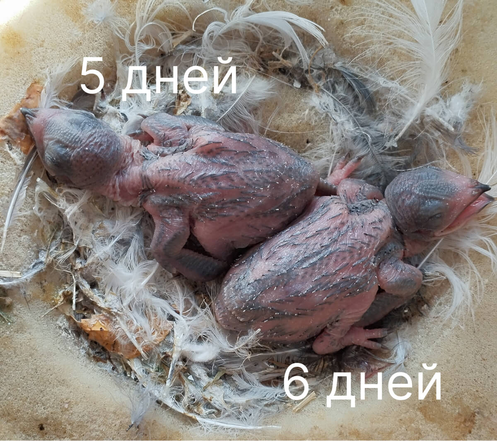</td>
        </tr>
        <tr>
            <td>6-й день Птенец весь темный от подкожно развивающегося оперения. Веки разомкнулись. Слуховое отверстие закрыто. На спинной стороне тела из-под кожного покрова выступили беловатые кончики пуховидного пера (подкожная часть пера размером 3−4 мм). Основное перо представлено в виде светлых бугорков, выступающих двумя полосами среди развивающегося пуховидного пера. Голова потемнела от развивающегося подкожно оперения. Крыловые птерилии в виде темных ребристых полосок (5 мм). Маховые в виде мелких зубчиков (0,2 мм). Рулевые выглядят также. На брюшной стороне оперение развивается подкожно (3 мм). Яйцевой зуб сохранен.

  Длина тела 78−83 мм. Длина крыла 20−23 мм. Масса тела 17,5 (16,3−19,2) г.

  Время кормления родителями: 

4:14, 4:21, 6:34, 8:34, 11:50, 12:43, 13:04, 14:43, 14:45, 16:07, 17:06, 17:16, 18:47, 18:51, 20:15, 20:27, 20:59</td>
            <td>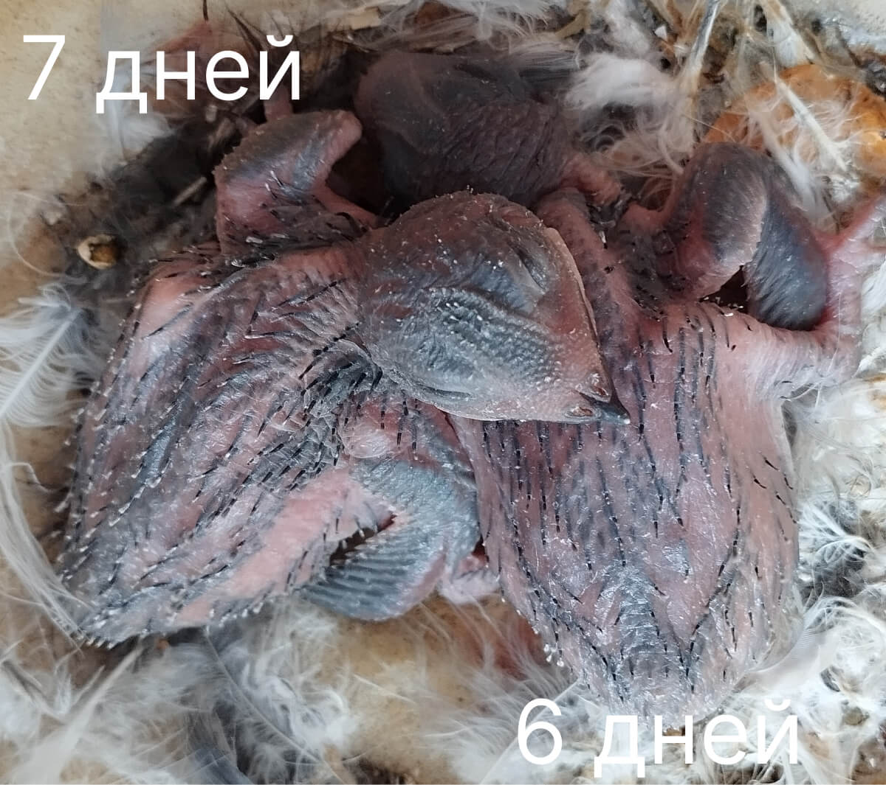</td>
        </tr>
        <tr>
            <td>7-й день Пуховидное перо выступило из-под кожи (5 мм) в виде мелких беловатых кисточек (0,5−1 мм). Линии пера растущего подкожно слились в темные пятна и полосы на головной, крыловых, плечевых птерилиях. Спинная, поясничная, вентральная и ножные птерилии покрыты штрихами и черточками подкожного пера (3−6 мм). Глаза приоткрываются. Слуховые отверстия приоткрыты.

  Длина тела 80−86 мм. Длина крыла 16−26 мм. Масса тела 16,0 (19,8−22,2) г.

  Время кормления родителями: 

3:48, 5:11, 6:51, 8:11, 9:23, 10:05, 10:29, 12:13, 13:26, 13:50, 14:36, 15:06, 16:49, 17:06, 18:26, 19:36, 20:01, 20:54, 21:13</td>
            <td></td>
        </tr>
        <tr>
            
            <td>8-й день.   Все птерилии хорошо видны в виде ребристых и выпуклых черных полос пера развивающегося подкожно. На спинно-поясничной птерилии кончики выступившего из-под кожи пера лопнули на концах — появились многочисленные беловато-сероватые мелкие кисточки растущего пуховидного пера (1−2 мм) подкожная часть пера (4−5 мм). Пуховидное перо также выступило из-под кожи на грудной птерилии. Клюв и когти черные. Яйцевой зуб сохранился. Слуховое отверстие открылось.

  Длина тела 82−88 мм. Длина крыла 20−29 мм. Длина маховых-первостепенных 0,2−1,7 мм. Длина рулевых 0,2−1,0 мм. Масса тела 18,0 (16,3−22,0) г.

  Время кормления родителями: 

3:39, 3:52, 4:26, 4:56, 7:02, 11:24, 12:56, 13:22, 13:50, 15:00, 15:44, 18:52, 19:59, 20:09, 21:05.</td>
            <td>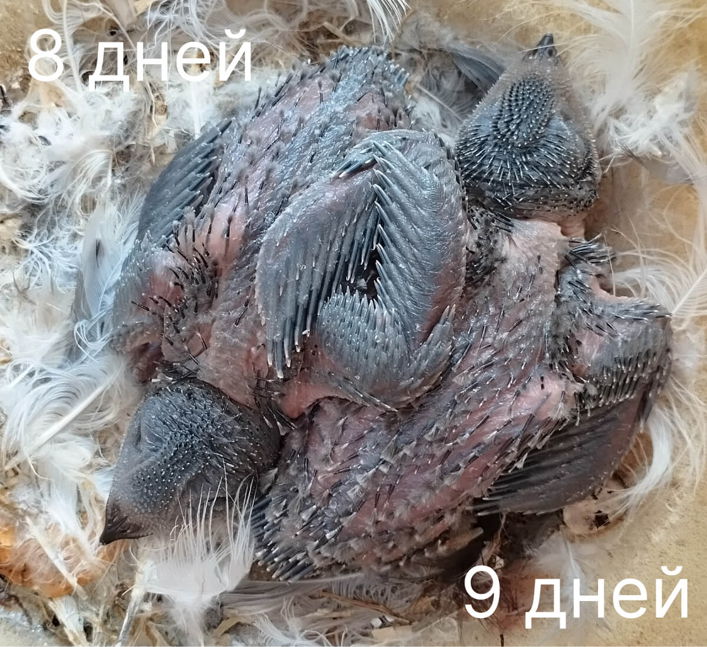</td>
        </tr>
        <tr>
            
            <td>9-й день   Многочисленные игольчатые пеньки растущего пера появились на головной (1 мм), спинной, крыловых и хвостовых птерилиях (3−4 мм). На плечах, спине и надхвостье многочисленные кисточки пуховидного пера (3−4 мм). Глаза приоткрыты. Слуховое отверстие открыто.

  Длина тела 90−95 мм. Длина крыла 33−36 мм. Масса тела 25,0 (23,8−26,7) г.

  Время кормления родителями: 

3:59, 4:23, 4:39, 8:59, 12:07, 12:44, 13:38, 14:45, 15:02, 15:13, 15:49, 16:39, 17:25, 18:04, 19:00, 19:19, 20:02, 20:28</td>
            <td>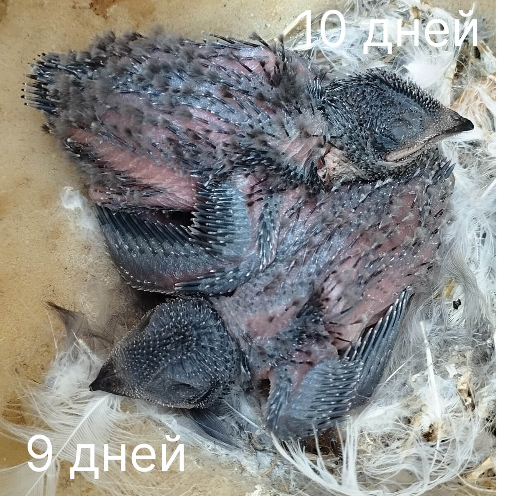</td>
        </tr>
        <tr>
            
            <td>10-й день   Многочисленные кисточки пуховидного пера (3−4 мм) разворачиваются на спинной стороне и образуют редкий пушистый покров на плечах и каудальной части тела. Перо спинно-поясничной птерилии в виде мелких пеньков (1−1,5 мм). Глаза полуоткрыты. Яйцевой зуб сохранился. Первостепенные и второстепенные маховые и рулевые в виде небольших пеньков (или трубочек).

  Длина тела 98−103 мм. Длина крыла 37−42 мм. Длина маховых-первостепенных 3−8 мм. Длина рулевых 1−3 мм. Масса тела 23,5 (15,5−31,1) г.

  Время кормления родителями: 

6:20, 8:59, 9:38, 12:43, 14:43, 16:29, 17:39, 18:08, 20:23, 20:45, 21:02, 21:08</td>
            <td>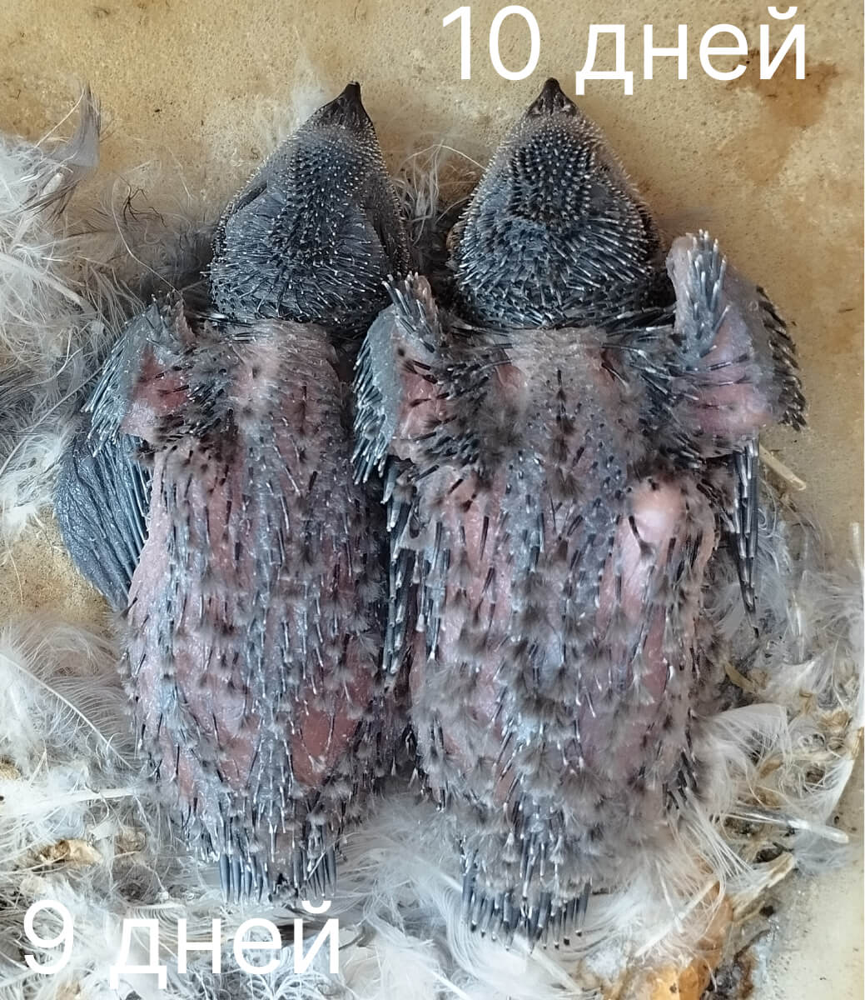</td>
        </tr>

        <tr>
            
            <td>11-й день   Пушистость повысилась)))

  Время кормления родителями: 

3:46, 3:54, 4:26, 5:16, 6:31, 8:16, 9:41, 10:23, 12:44, 13:05, 14:44, 15:18, 15:57, 15:58, 16:58, 17:44, 18:54, 20:04, 20:11</td>
            <td></td>
        </tr>
        <tr>
            
            <td>12-й день   Внешний вид птенца подобен 11-дневному, лишь удлинились трубочки (пеньки) пера. На головной, крыловых и хвостовой птерилиях трубочки 3−5 мм. На спинной стороне и на каудальной части тела расположены редкие кисточки пуховидного пера (3−5 мм). Первостепенные маховые (2−5-е) в трубочках. Большие кроющие первостепенных маховых одинаковой длины с ними. Второстепенные маховые также трубочки (кроющие 1−4 м). Рулевые в трубочках (3−5 мм), которые лопнули на концах.

 Длина крыла 38−45 мм. Длина маховых-первостепенных 4−8 мм. Длина рулевых 3−5 мм. Масса тела 28,5 (24,2−34,2) г.

  Время кормления родителями: 

3:58, 5:15, 5:53, 7:22, 7:48, 8:28, 9:39, 10:03, 10:44, 11:53, 11:58, 14:15, 14:48, 15:30, 16:16, 17:41, 18:17, 19:07, 19:50, 20:42, 20:46, 21:10</td>
            <td>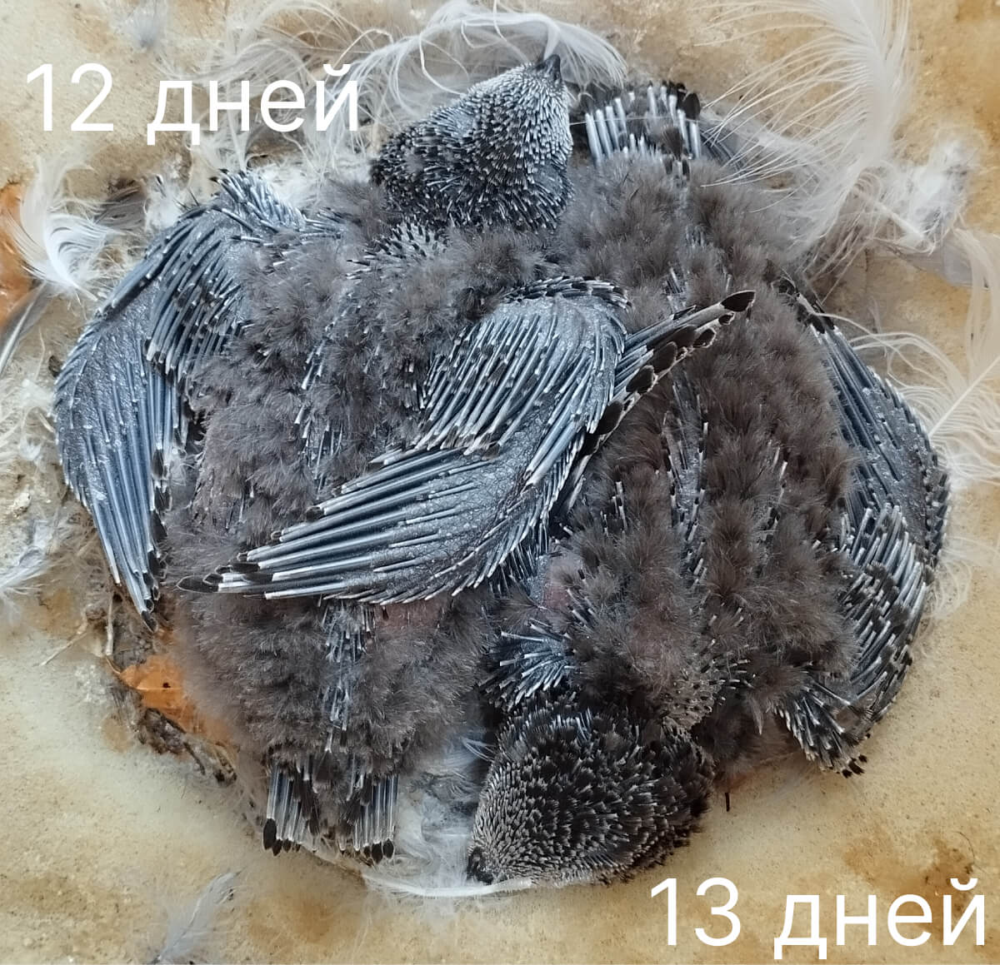</td>
        </tr>
        <tr>
            
            <td>13-й день   Птенец весь покрыт короткими трубочками стального цвета, которые лопнули на концах. На голове игольчатые пеньки и мелкие охристо-серые кисточки развивающегося пера (0,5−1 мм). На спине и брюшной стороне редкое пуховидное перо (3−5 мм). На грудной птреилии тонкие трубочки (3 мм). Первостепенные маховые трубочки (7−8) с небольшими кисточками (0,5 мм). Второстепенные маховые — трубочки (5 мм). Рулевые — трубочки (центральные короткие, крайние длинные).

  Длина тела 95−103 мм. Длина маховых-первостепенных 7−8 мм. Длина рулевых 0,5−7 мм. Масса тела 28,5 (17,6−39,0) г.

  Время кормления родителями: 

4:38, 5:59, 6;06, 7:12, 8:49, 9:14, 10:57, 11:16, 13:24, 13:26, 14:38, 15:04, 15:58, 17;06, 17:11, 19:14, 19:29, 20:24, 20:33, 20:58, 21:01, 21:11</td>
            <td>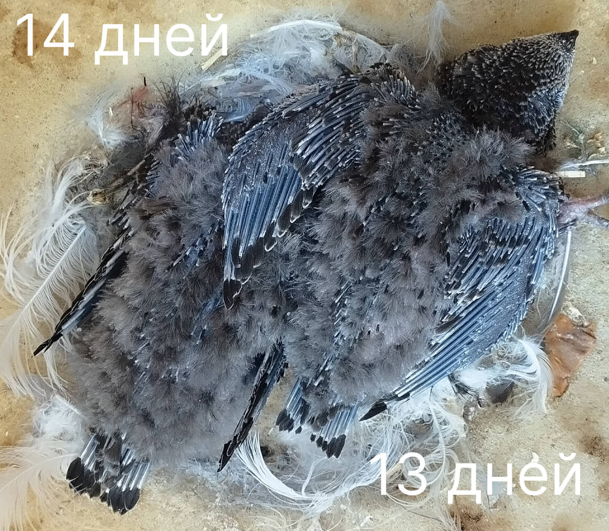</td>
        </tr>
        <tr>
            
            <td>14-й день   Птенец покрыт длинными трубочками пера лопнувшими на концах, и густым пуховидным пером. Пуховидное перо сильно ветвится на концах, оно развернуто наполовину, пушистые кисточки густо окружают основные птерилии спинно-поясничную и вентральную, которые покрыты игольчатыми пеньками, трубочками. Голова в мелких серовато-охристых кисточках. Первостепенные маховые в трубочках с кисточками (1−4 мм). Второстепенные маховые также в небольших трубочках с мелкими (1 мм) кисточками. Рулевые в мелких кисточках (1−2 мм)_. Длина пуховидного пера 5−6 мм. Длина трубочек основных птерилий — 5 мм.

  Длина тела 110 мм. Длина крыла 52 мм. Длина маховых-первостепенных 13 мм. Длина рулевых 10 мм. Масса тела 28,0 (17,5−38,0) г.

  Время кормления родителями: 

3:47, 4:52, 5:00, 6:12, 7:55, 8:16, 9:52, 10:28, 12;00, 12:55, 13;14, 15:32, 15:58, 17:14, 17:16, 18:41, 18:49, 19:49, 20:31, 20:42, 20:57</td>
            <td></td>
        </tr>
        <tr>
            
            <td>15-й день   Птенец покрыт длинными трубочками пера и густым темно-серым пуховидным пером, особенно хорошо развитым вокруг спинно-поясничной птерилии. Голова в мелких трубочках и кисточках основного пера. Первостепенные маховые в длинных трубочках и кисточках (2−5 мм) на концах их. Второстепенные маховые выглядят так же (кисточки: 2−3 мм). На рулевых кисточки развернулись больше (5−7 мм). Яйцевой зуб есть.

  Длина тела 110 мм. Длина крыла 60 мм. Длина маховых-первостепенных 19−20 мм. Длина рулевых 10−17 мм. Масса тела 33,0(28,5−37,8) г.

  Время кормления родителями: 

4:38, 4:42, 6:08, 6:26, 8:26, 9:17, 10:42, 13:58, 14:47, 16:17, 16:49, 19;00, 20:12, 20;54,20:59</td>
            <td></td>
        </tr>
        <tr>
            
            <td>16-й день   Птенец весь покрыт мелкими кисточками контурного пера растущего и разворачивающегося на всех птерилиях (в мелких кисточках, 1−3 мм, головная, грудная и спинно-поясничная птерилии). Пуховидное перо, развернувшееся полностью, очень густое и ветвящееся на концах, окружает полоски контурного пера (в мелких трубочках с кисточками на концах) спинно-поясничной птерилии. Первостепенные маховые в кисточках (5−7 мм) большие кроющие от 5 до 20 мм (кисточки 1−6 мм). Второстепенные маховые от 5 до 20 мм (кисточки0,2−0,5 мм). Рулевые в длинных трубочках и мелких кисточках (0,2−3 мм). Клюв и когти черные. Яйцевого зуба нет. Глаза открыты широко (полностью).

 Длина крыла 68 мм. Длина маховых-первостепенных 15−25 мм. Длина рулевых 7−18 мм. Масса тела 35,5(26,6−45,0) г.

  Время кормления родителями: 

4:20, 4:30, 6:16, 6:38, 8:25, 9;07, 9:54, 10;20, 10:56, 12:08, 14:10, 14:45, 15;46, 16:41, 19;01, 19:13, 20:15, 20:47, 21;00</td>
            <td></td>
        </tr>
        <tr>
            
            <td>17-й день    Время кормления родителями: 

3;50, 3:59, 4:50, 4:51, 5:33, 6:21, 6:50, 8:16, 9:42, 10:08, 11:06, 12;01, 12:13, 13:29, дождь, 16:15, 16:25, 16:55, 16:57, 18:16, 18:33, дождь, 20:05</td>
            <td></td>
        </tr>
        <tr>
            
            <td>18-й день   Птенец обильно покрыт темно-серым пушистым пуховидным пером. Основные птерилии в трубочках (на концах кисточки) растущего и разворачивающегося пера, едва выступают из-под покрова пуховидного пера. Голова оперена, вокруг клюва мелкие трубочки и кисточки растущего, но не развернувшегося пера. Рулевые развернулись на 1/2 (кисточки 5−10 мм).

 Длина крыла 78 мм. Длина рулевых 12−20 мм. Масса тела 37,5(32,5−43,0) г.

  Время кормления родителями: 

4:04, 4:24, 5:08, 5:59, 7:36, 9:40, 10:14, 11:19, 12:29, 12:45, 13:14, 13:23, 14:18, 14:44, 15:27, 15:35, 16:38, 16:50, 17:51, 18:17, 19:29, 19:35, 20:45, 20:49</td>
            <td></td>
        </tr>
        <tr>
            
            <td>19-й день  Время кормления родителями: 

4:12, 4:21, 8:25, 9:03, 11:12, 11:31, 12:53, 13:03, 14:30, 15:24, 16:30, 18:07, 18:20, 18:54, 20:13, 20:21</td>
            <td>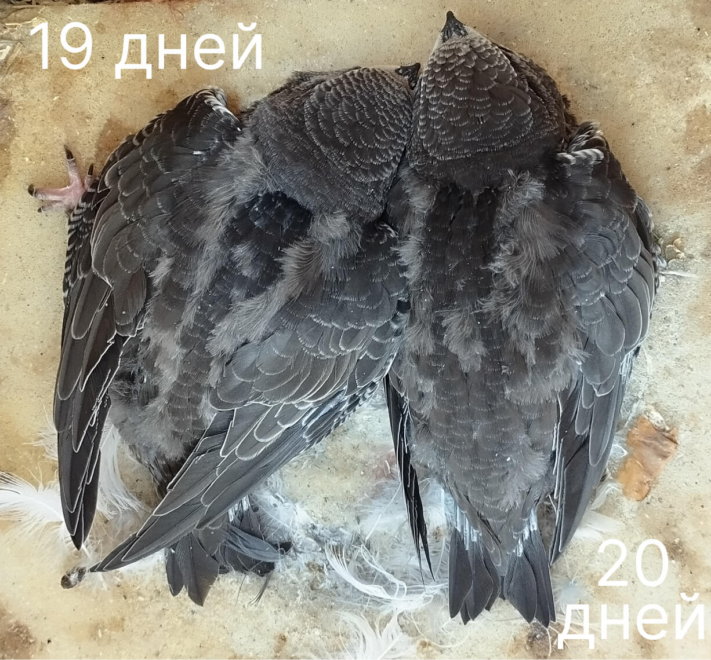</td>
        </tr>
        <tr>
            
            <td>20-й день   Птенец оперён на 1/3, покрыт крупными кисточками разворачивающегося пера. Голова оперена полностью. Полосы контурного пера на главных птерилиях отчетливо выступают из-под покрова пуховидного пера. Грудная птерилия в мелких перышках развернувшегося оперения. Первостепенные маховые развернулись на 1/3. Рулевые в крупных кисточках (12−14 мм).

 Длина крыла 82−91 мм. Длина рулевых 8−22 мм. Масса тела 40,0 (31,5−48,0) г.

  Время кормления родителями: 

4:11, 4:41, 4:48, 6:37, 8:41, 11:42, 12:51, 13:35, 14:03, 15:06, 16:02, 16:30, 17:05, 17:07, 18:59, 19:07, 20:20, 20:30</td>
            <td></td>
        </tr>
        <tr>
            
            <td>21-й день    Время кормления родителями: 

4:37, 4:44, 6:24, 7:34, 7:34 (нет, я не ошиблась, они прилетели друг за другом), 10:48, 11:05, 13:57, 16:21, 16:56, 17:51, 18:39, 20:31, 20:33</td>
            <td></td>
        </tr>
        <tr>
            
            <td>22-й день  Птенец в крупных кисточках пера, развернутого на 1/3. Пуховидное перо на спине и гузке на 50% прикрыто контурным пером. На крыльях и хвосте отчетливо видны не прикрытые полуразвернутым пером трубочки растущего оперения. Вокруг глаз и на шее мелкие кисточки. Первостепенные маховые (от 9-го до 6-го и от5-го до 2-го) развернулись примерно на 1/2 (кисточки 15−22 мм). Второстепенные маховые также развернулись наполовину (кисточки 14 мм). У рулевых кисточки (15 мм) также составляют ½ пера.

 Длина крыла 95 мм. Длина маховых-первостепенных 38−42 мм. Длина рулевых 28−34 мм. Масса тела 43,5 (35,7−51,0) г.

  Время кормления родителями: 

5:11, 7:12, 7:23, 8:28, 11:45, 11:47, 13:35, 14:03, 14:33, 14:34, 15:12, 17:55, 17:58, 19:22, 19:42, 20:18</td>
            <td></td>
        </tr>
        <tr>
            
            <td>23-й день    Время кормления родителями: 

5:40, 5:52, 9:24, 11:44, 11:56, 12:38, 13:06, 13:18, 15:53, 16:35, 16:55, 17:31, 18:48, 18:49, 20:16, 20:50</td>
            <td></td>
        </tr>
        <tr>
            
            <td>24-й день  Птенец оперен наполовину, обильно покрыт крупными кисточками развивающегося, разворачивающегося пера. На крыльях и хвосте трубочки полуразвернутого оперения не прикрываются опахалами кроющих перьев (вместе с тем поверхность крыла сплошная, без заметных просветов). На шее видны кисточки полуразвёрнутого пера. Пуховидное перо прикрыто перышками спинной птерилии и выступает из-под контурного пера только на плечах и гузке. Рулевые развернуты на 2/3 (опахала пера 20−30 мм).

 Длина крыла 105−114 мм. Длина рулевых 35−45 мм. Масса тела 42,0 (30,8−52,2) г.

  Время кормления родителями: 

5:06, 5:46, 6:30, 7:02, 8:12, 8:18, 10:20, 10:25, 11:35, 12:48, 13:02, 14:59, 17:04, 18:03, 18:32, 20:02, 20:10</td>
            <td>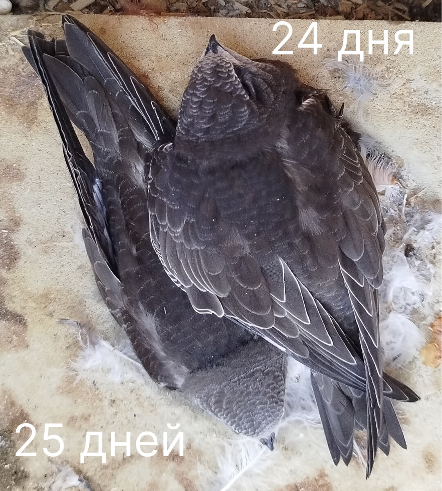</td>
        </tr>
        <tr>
            
            <td>25-й день    Время кормления родителями: 

4:40, 4:58, 5:34, 5:48, 6:50, 8:32, 10:25, 10:43, 11:21, 12:33, 13:38, 14:30, 14:45, 16:36, 16:52, 18:21, 18:25, 19:28 19:49</td>
            <td></td>
        </tr>
        <tr>
            
            <td>26-й день  Птенец оперен на 2/3. Трубочки перьев видны лишь на шее и хвосте. остальную поверхность тела сверху покрывают опахала разворачивающегося оперения. Пуховидное перо выступает из-под основного на шее и у надхвостья. Крыло оперено на 70%. На сгибе видна кожистая поверхность, не покрытая пером. Опахала первостепенных маховых раскрылись на 2/3. Опахала рулевых также раскрыты на 2/3 длины пера.

 Длина крыла 110 мм. Длина маховых-первостепенных 35−50 мм. Длина рулевых 43−48 мм. Масса тела 44,5 (37,7−51,0) г.

  Время кормления родителями: 

5:04, 5:30, 6:07, 9:02, 10:55, 12:20, 12:35, 13:33, 16:00, 16:31, 17:58, 18:47, 20:01</td>
            <td></td>
        </tr>
        <tr>
            
            <td>27-й день    Время кормления родителями: 

5:20, 5:23, 8:28, 8:32, 11:06, 11:33, 12:51, 13:19, 14:57, 17:31, 17:45, 19:45</td>
            <td></td>
        </tr>
        <tr>
            
            <td>28-й день  Птенец весь покрыт черно-бурым пером с тонкими светлыми окаймлениями, хорошо заметными на плечах и голове. Пуховидное перо на спине прикрыто контурным пером, развернутым на ¾. На брюшной стороне осталось небольшое пятно кожи, не прикрытой пером. На сгибе крыла также видна кожистая поверхность, не прикрытая пером. Опахала первостепенных маховых раскрылись на 3/4 (47−57 мм). Опахала рулевых также раскрыты на 2/3 или ¾ общей длины пера (35−43 мм).

 Длина крыла 125 мм. Длина маховых-первостепенных 74−78 мм. Длина рулевых 45−60 мм. Масса тела 47,5 (45,3−49,4) г.

  Время кормления родителями: 

5:11, 5:38, 6:17, 6:44, 8:11, 8:54, 11:49, 12:18, 14:32, 18:25, 19:44, 20:21</td>
            <td></td>
        </tr>
        <tr>
            
            <td>29-й день    Время кормления родителями: 

8:07, 10:29, 11:41, 13:05, 13:45, 15:38, 17:30, 17:46, 19:04, 20:16</td>
            <td></td>
        </tr>
        <tr>
            
            <td>30-й день  Внешне птенец вполне оперён, но при раздувании оперения везде видны многочисленные кисточки неразвернувшегося пера. Сверху крыло имеет сплошную несущую поверхность, но трубочки маховых перьев видны сквозь развернувшееся оперение. На сгибе крыла видно кожистое пятно. Опахала первостепенных маховых 52−57 мм, трубочки 25−30 мм. Опахала рулевых 32−35 мм.

 Длина крыла 123−127 мм. Длина маховых-первостепенных 80−85 мм. Длина рулевых 47−60 мм. Масса тела 45,5 (40,5−49,0) г.

  Время кормления родителями: 

5:13, 6:02, 6:47, 7:08, 8:42, 10:35, 11:11, 14:53, дождь, 19:57</td>
            <td></td>
        </tr>
        <tr>
            
            <td>31-й день    Время кормления родителями: 

дождь, 11:15, 11:28, 13:51, 14:56, 18:37, 19:22, 20:21</td>
            <td>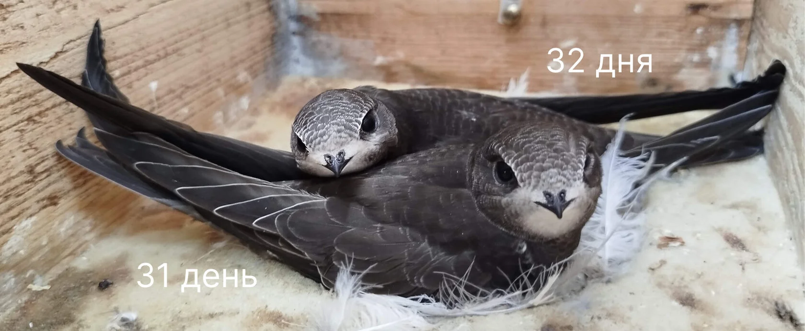</td>
        </tr>
        <tr>
            
            <td>32-й день  Птенец покрыт хорошо развернувшимся пером, трубочки не видны. Просветов на поверхности крыла нет: кроющие перья крыла сверху развернулись полностью, кроющие крыла снизу — в трубочках с кисточками на концах. Первостепенные маховые не развернулись до конца (опахала 54−69 мм). Второстепенные маховые развернулись, но основание перьев, чехлах. Рулевые не развернулись до конца (опахала 39−43 мм).

 Длина крыла 128−136 мм. Длина маховых-первостепенных 80−87 мм. Длина рулевых 54−60 мм. Масса тела 45,3 (37,0−50,5) г.

  Время кормления родителями: 

Один родитель улетел на зимовку, оставив детей на попечении второго родителя, предположительно мамы (но это не точно). Т. е. мы понимаем, что интервалы между между кормлениями одного птенца увеличились, а количество порций в день уменьшилось.

практически весь день кратковременный дождь, 13:11, 16:52, 18:16, 19:40</td>
            <td></td>
        </tr>
        <tr>
            
            <td>33-й день     Время кормления родителями: 

С ночи начался затяжной дождь и шел весь день. Родитель смог вылететь из дома только ближе к вечеру и принес еды только один раз, покормив одного птенца. Второй в этот день остался голодным.

Оставляем редактирование этих дней на следующий год.</td>
            <td></td>
        </tr>
        <tr>
            
            <td>34-й день  Оперившаяся молодая птица. Крылья длинные без просветов. Оперение спины, головы и брюшка развернуто полностью. Второстепенные маховые и нижние кроющие крыла развернулись до основания. Первостепенные маховые и кроющие крыла снизу недоразвернуты, трубочки пера хорошо видны на нижней стороне крыльев (опахала первостепенных маховых 65−87 мм, трубочки 20−28 мм). Рулевые у основания в трубочках (15−17 мм).

 Длина крыла 137−155 мм. Длина маховых-первостепенных 92−95 мм. Длина рулевых 56−63 мм. Масса тела 44,0 (37,5−51,0) г.

  Время кормления родителями: 

16:17, 10:20, 12:14, 15:04, 18:07, 19:59, 20:11</td>
            <td>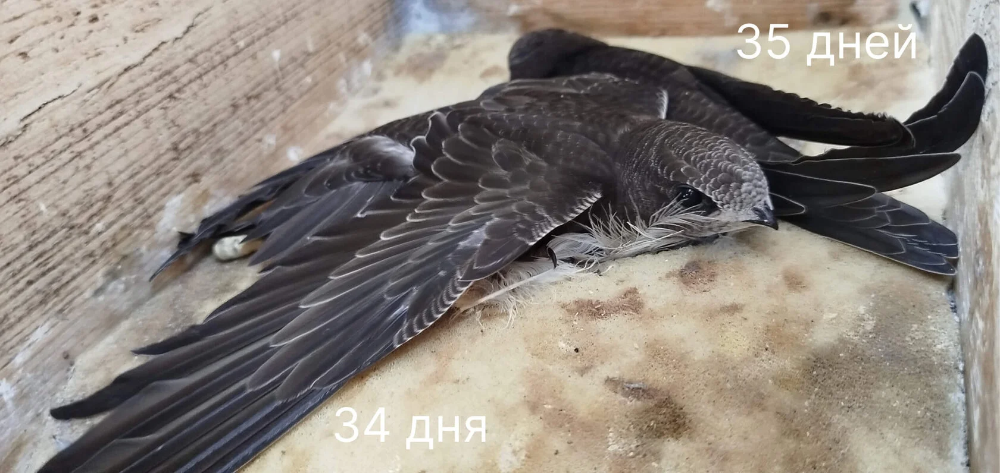</td>
        </tr>
        <tr>
            
            <td>35-й день  Время кормления родителями: 

5:53, 8:32, 12:53, 13:10, 16:05, 19:24</td>
            <td></td>
        </tr>
        <tr>
            
            <td>36-й день Оперившаяся молодая птица (внешне выглядит как на 35-й день). Кроющие крыла снизу у основания в трубочках. Первостепенные маховые (9−3-е) в трубочках (17−25 мм). Крайние рулевые у основания в трубочках (12−14 мм).

 Длина крыла 150−160 мм. Длина рулевых 63−64 мм. Масса тела 47,5 (40,5−54,2) г.

  Время кормления родителями: 

15:14, 20:08, 19:27</td>
            <td></td>
        </tr>
        <tr>
            
            <td>37-й день   Время кормления родителями: 

10:24, 12:31, 13:21, 15:17, 17:16, 18:45, 19:51

В 20:20 первому птенцу исполнилось 39 дней и в 20:44 он вылетел из гнезда, отправившись в свой первый полет до Африки.</td>
            <td>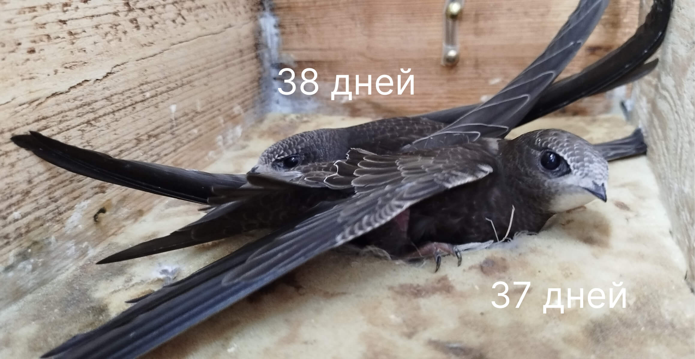</td>
        </tr>
        <tr>
            
            <td>38-й день Молодая птица. Черно-бурое оперение с тонкими светлыми окаймлениями плотно покрывает всю поверхность тела. Кисточки пера не развернувшегося до основния просматриваются на спине, надхвостье и на нижних кроющих крыла, снизу. Первостепенные маховые имеют в основании чехлы или трубочки (12−20 мм). Рулевые в основании в трубочках (10−12 мм).

 Длина крыла 160−162 мм. Длина рулевых 60−68 мм. Масса тела 43,0 (34,5−47,5) г.

  Время кормления родителями: 

7:19, 11:46, 15:04, 18:36, дождь

Вес нашего птенца 42,57 гр.</td>
            <td></td>
        </tr>
        <tr>
            
            <td>39-й день Второй родитель все утро провел с птенцом. Улетел в 7 утра и больше не вернулся. Птенец весь день просидел голодом. В 18:17 ему исполнилось 40 дней. Днем я его осмотрела: вес 38,75 гр, перо развернулось до основания, трубочек нет. Вечером я планировала его покормить, если родитель так и не прилетит, но не успела. В 20:30 он вылетел из гнезда и отправился в Африку вслед за братом и родителями. Улетел голодный. Мы с мужем на всякий случай сходили с фонариками проверили — никого не нашли. В добрый путь!</td>
            <td>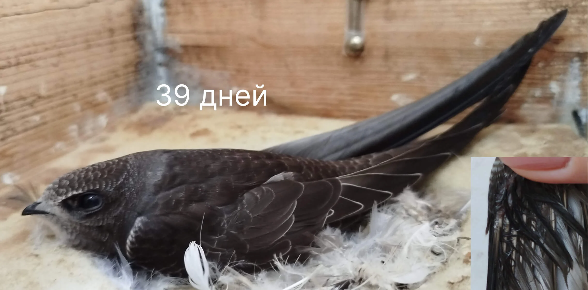</td>
        </tr>
        <tr>
            <td>40-й день А это снова птенцы Михаила</td>
            <td></td>
        </tr>
        <tr>
            
            <td>41-й день Оперенная молодая птица отличающаяся от взрослой более светлой окраской оперения, благодаря белым окаймлениям пера, особенно развитым на голове, на сгибах крыла и на брюшной стороне тела.

 Длина крыла 165−173 мм. Длина рулевых 64−70 мм. Масса тела 43,0 (37,0−46,7) г.

Первый птенец покинул гнездо в ночь.</td>
            <td></td>
        </tr>
        <tr>
            <td>42-й день Второй птенец вылетел из гнезда тоже в ночь.
        </td>
            <td></td>
        </tr>
 
    </table>

 

Дина Сафоновна Люлеева в своей работе также отмечает:

— Проверяя гнезда мы часто встречали вполне взрослых на вид молодых птиц, которые упорно держались в гнезде даже многократно потревоженные. Причиной тому было то, что крайние маховые перья практически целиком развернулись, но в основании 10−7-го махового пера были видны недоразвернувшееся трубочки длиной не более 3−5 мм или чехлы до 2 мм. Особенное удивление задержка таких молодых стрижей вызывала в поздние сроки отлета, когда основная масса черных стрижей уже улетела, покинув территорию гнездования. Подобное поведение молодых стрижей понятно, поскольку известно, что при вылете из гнезд они сразу становятся самостоятельными, способными без поддержки взрослых добывать себе корм.
Крылья молодых, таким образом, должны быть развернуты полностью, соответствуя крыльям взрослых стрижей, всегда способных к длительному и маневренному полету. Факт особой прочности оперения крыла и особенно первостепенных маховых, образующих вершину крыла (10−8-го) ежегодно подтверждается отсутствием линьки у годовалых черных стрижей, которые меняют свои первостепенные маховые практически ровно через год после вылета из гнезда. Известно, что молодые стрижи 2-го календарного года в некоторых случаях также не успевают сменить крайнее первостепенное маховое во время предбрачной линьки и оно остается до следующей зимовки.

    <h3>Источник</h3>
    
Информация адаптирована на основе данных с сайта <a href="https://apus-apus.tilda.ws/vozrast">Стрижепедия</a>.

 
 
 <!-- 
 #Lightbox for all images  -->

</body>

