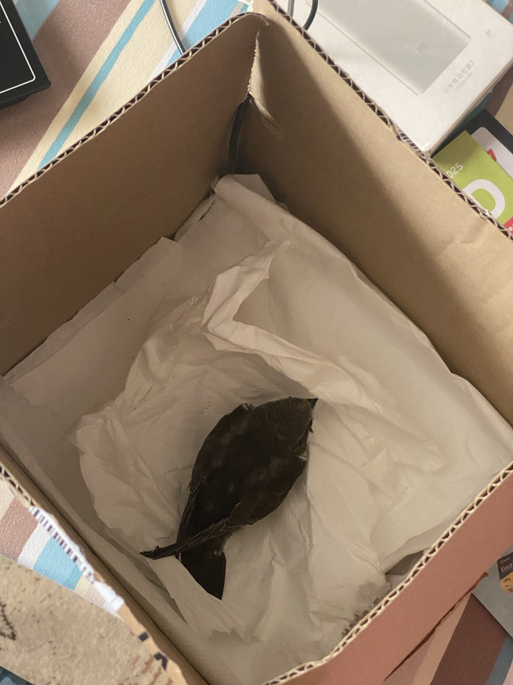

**Этот сайт создан в помощь волонтёрам, спасающим стрижей (Apus apus)**

В Эстонии это  <a href="https://www.metsloom.ee/kontaktid/" target="_blank" rel="noopener noreferrer">Eesti Metsloomaühing (откроется в новом окне)</a>

Сайт содержит фото 

### Как выглядит стриж (чёрный или башенный стриж, Apus apus)

Стриж - небольшая птица, размером с ладонь, темно-бурого практически однотонного окраса с небольшим белым пятном под клювом и темно-карими глазками-бусинками. Крылья длинные, серповидные, <b>у взрослой птицы</b> выступают за хвост примерно на 3,5 сантиметра, вес в норме 38-43 грамма.

У взрослой птицы лапы тёмного цвета, все четыре пальца на каждой лапке направлены вперед (у ласточки это не так), имеют длинные острые коготки.

### Если стриж на земле, ему нужна помощь

Если вы нашли взрослого (без светлой каймы на перьях) стрижа, и у него нет явных повреждений, можно поднять и подержать его на вытянутой руке на открытом месте, не подбрасывая. 
Пробовать это надо над мягкой землёй, чтобы птица при возможном падении не навредила себе ещё больше.

Возможно, он уже пришёл в себя и сможет улететь. Если он не улетает, значит ему требуется помощь, а вам — картонная коробка, чтобы положить туда птицу. 

Следующий шаг - [связаться с Eesti MetloomaÜhing](contact-metloomayhing.html)

  
### Птенец

**Слётков у стрижей нет**, то есть, взрослые птицы никогда не докармливают своих подросших птенцов на земле.

Если к вам попал птенец, [переходите сразу к специальному разделу, время дорого.](#for-chicks)

Если остались сомнения, вот 
[определитель с картинками возраста птицы по дням](identifying-swift.html)

<figure>
  
  <figcaption>Стрижу 6 дней, он ещё голый</figcaption>
</figure>
<figure>
  
  <figcaption>Стриж 11 дней от роду. Перо растёт из т.н. "трубочек", поэтому он похож на динозавра.</figcaption>
</figure>
<figure>
  
  <figcaption>И это тоже птенец! Подросток ещё не летал в Африку, у него есть светлые каёмки на перьях головы и крыла. И ещё розовые, не загоревшие лапы.
  </figcaption>
</figure>

### Взрослая птица
<figure>
  
  <figcaption>Взрослый стриж. Летал в Африку</figcaption>
</figure>

### Неотложные состояния
  - Высокая степень истощения.
  
  Признаки: для птенца вес меньше 25 грамм, для взрослой птицы - меньше 35 грамм.
   
  Стрижу нужен внешний обогрев и требуется начать действовать по [cхеме выведения из истощения](exhaustion.html), у стрижа может не быть сил для переваривания даже правильного корма.
  
  - Укус кошки - требуется срочный визит к ветеринару для получения курса антибиотика от пастереллы. 
  
  Например, взрослому стрижу Ciprofloxacin, птенцу Amoxicillin/clavulanate. 
  Ciprofloxacin может повлиять на рост пера, поэтому птенцу его стараются не давать.

### Безопасное обустройство стрижа

  Стрижу клетка совсем не подходит, это травмоопасно и портит перо. 

  Ищем коробку размером как из-под обуви или больше (размах крыльев стрижа примерно 45 см), делаем изнутри наружу отверстия для вентиляции. Также подойдёт таз или любой пластиковый контейнер, накрытый тканью на прищепках. На дно кладём бумажные сухие салфетки без запаха и красителей.

  <figure class="image-float">
  
  <figcaption>Птенец в коробке, снизу подогреваем ковриком</figcaption>
  </figure>

  Помещаем птицу в затемнённое место, чтобы она оставалась в покое.

  Не бойтесь перекладывать стрижа в коробку.
  Даже если стриж на вас шипит, он вас не клюнет. Будьте аккуратны с когтями, он может сильно их сжать, например, зацепившись за палец.

  Не надо класть в коробку солому, какой-либо корм, пытаться ставить блюдечко с водой, потому что стриж не умеет склёвывать.
  Достаточно салфеток или мягкой материи без ниток, в которой не путаются коготки птицы, вентиляция в коробке, бутылка для обогрева и покой.

  Чтобы вернуться в природу, у стрижа должно быть идеальное оперение: чистое и в полном комплекте. Берите стрижа в чистых перчатках или оборачивайте тканью.
  Не пытайтесь кормить птицу несвойственной ей пищей: **стрижи исключительно насекомоядные**.
  
  У многих есть домашние животные, пусть это вас не смущает, когда вы помогаете птице.
  Разместите коробку со стрижом вне их доступа, например, на шкаф или в шкаф.

### Вес и состояние истощения

  Вес — это очень важный показатель состояния птицы.
   При отсутствии кухонных весов стрижа можно взвесить в магазине в коробке, а потом вынуть и увидеть вес коробки. Разница – это будет вес стрижа. Кухонные весы лучше иметь дома, чтобы следить за динамикой состояния стрижа (особенно птенца).
  
  
  Если вес ниже нормы 38 – 43 грамма, необходимо начать обогрев и кормление по часам. При восстановлении массы тела и хорошей погоде эти птицы возвращаются в природу. Если найденный вами взрослый стриж не имеет дефицита веса, не пытайтесь накормить его любой ценой в первые сутки пребывания, у него есть запас.

  **При сильном истощении важно восстанавливать пищеварение плавно и щадяще**, с [использованием вытяжки из насекомых](exhaustion.md#extraction)

Подробная информация:
  [**Признаки истощения**](exhaustion.html)

## Специальные инструкции по птенцам {#for-chicks}

Очень часто птенцы попадают в вам уже обезвоженными и с заметным истощением.
Действовать надо быстро, чтобы с минимальными последствиями вывести птицу из этого состояния.

Критический для жизни птенца вес — 22−18 грамм. Истощённые стрижата обычно весят **20−27 грамм**.

