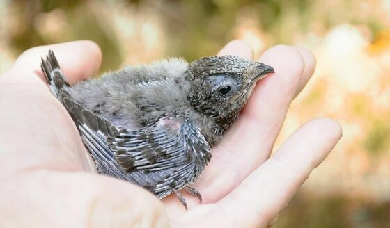

## Как выглядит птица

Давайте убедимся, что Вы нашли именно стрижа, а не ласточку или коршуна.

Небольшая птица, размером с ладонь, темно-бурого практически однотонного окраса с темно-карими глазками бусинками.

Крылья длинные, саблевидные (серповидные), <b>у взрослой птицы</b> выступают за хвост примерно на 3,5 сантиметра.

Все четыре пальца на каждой лапке направлены вперед, имеют длинные острые коготки. 

Взрослый стриж

Подростки этого года выглядят примерно так же, за исключением некоторых признаков.

Стриж 14 дней от роду.
Перо растёт из т.н. "трубочек", поэтому он похож на динозавра.

Подробный определитель возраста птицы вы найдёте <здесь>

## Время
Если вы нашли своего стрижа в мае или июне, то это совершенно точно взрослый стриж. В это время еще нет птенцов.

Важно!
У стрижей нет "слётков", птенец сразу после вылета из гнезда умеет летать и добывать себе корм.
Поэтому не пытайтесь посадить стрижа на ветку дерева. Если стиж на земле, ему нужна помощь!

## Общий алгоритм действий:

0) Не пытаемся заставить его полететь, тем более, не подбрасываем в воздух или с возвышенности.

1) Обеспечте ему безопасное окружение.
По-возможности, ищем коробку и помещаем птицу в затемнённое место, где она будет в покое.
Даже если стриж на вас шипит, он вас не укусит. Впрочем, будьте аккуратны с когтями, он может сильно их сжать, зацепившись за палец.

2) Спросите совета в местной или русскоязычной группе.
Напишите <b>информативное</b> сообщение в группу по спасению стрижей:
* Город
* Чёткое фото и, если возможно, видео перемещения стрижа по полу.
* Вес. Будет идеально, если вы сможете сказать вес, это многое скажет о его состоянии.
Касть птицу на весы не требуется!
Намного проще взвесить коробку со стрижом и вычесть вес коробки без птицы.
* Проверьте, что вы можете получать сообщения от участников сообщества.

