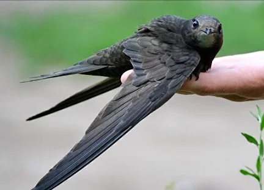

## Как выглядит птица

Давайте убедимся, что Вы нашли именно стрижа, а не ласточку или коршуна.

Небольшая птица, размером с ладонь, темно-бурого практически однотонного окраса с темно-карими глазками бусинками.

Крылья длинные, саблевидные (серповидные), <b>у взрослой птицы</b> выступают за хвост примерно на 3,5 сантиметра.

Все четыре пальца на каждой лапке направлены вперед (у ласточки это не так), имеют длинные острые коготки.

### Взрослая птица
<figure>
  
  <figcaption>Взрослый стриж. Подростки этого года выглядят примерно так же, за исключением некоторых признаков.</figcaption>
</figure>

### Подросток этого года
<figure>
  
  <figcaption>Подростки этого года выглядят примерно так же, как взрослые, но у них есть светлые перья на шее и голове, ещё розовые не загоревшие лапы .</figcaption>
</figure>

### Птенец
<figure>
  
  <figcaption>Стриж 11 дней от роду. Перо растёт из т.н. "трубочек", поэтому он похож на динозавра.</figcaption>
</figure>

Подробный определитель возраста птицы вы найдёте <здесь>

## Прикидываем по датам 
Если вы нашли своего стрижа в мае или июне, то это совершенно точно взрослый стриж, прилетевший из Африки(!). В это время еще нет птенцов.

<table style="border-collapse: collapse; width: 100%;">
  <tr style="background-color: #f2f2f2;">
    <th style="border: 1px solid #ddd; padding: 8px;">Месяц</th>
    <th style="border: 1px solid #ddd; padding: 8px;">Май</th>
    <th style="border: 1px solid #ddd; padding: 8px;">Июн</th>
    <th style="border: 1px solid #ddd; padding: 8px;">Июл</th>
    <th style="border: 1px solid #ddd; padding: 8px;">Авг</th>
    <th style="border: 1px solid #ddd; padding: 8px;">Сен</th>
  </tr>
  <tr>
    <td style="border: 1px solid #ddd; padding: 8px;">Стрижи</td>
    <td style="border: 1px solid #ddd; padding: 8px;">🟢</td>
    <td style="border: 1px solid #ddd; padding: 8px;">🟡</td>
    <td style="border: 1px solid #ddd; padding: 8px;">🐣</td>
    <td style="border: 1px solid #ddd; padding: 8px;">🔴</td>
    <td style="border: 1px solid #ddd; padding: 8px;"></td>
  </tr>
</table>

**Легенда:**

- 🟢 — Прилет (май)  
- 🟡 — Гнездование и яйца (июнь)  
- 🐣 — Птенцы (июль)  
- 🔴 — Отлёт (август)

Важно!
У стрижей нет "слётков", птенец сразу после вылета из гнезда умеет летать и добывать себе корм.
Поэтому не пытайтесь посадить стрижа на ветку дерева. Если стиж на земле, ему нужна помощь!

## Общий алгоритм действий:

0) Не пытаемся заставить его полететь, тем более, не подбрасываем в воздух или с возвышенности.

1) Обеспечте ему безопасное окружение.
По-возможности, ищем коробку и помещаем птицу в затемнённое место, где птица будет в покое.
Даже если стриж на вас шипит, он вас не укусит. Впрочем, будьте аккуратны с когтями, он может сильно их сжать, зацепившись за палец.

2) Попытайтесь понять, что случилось со стижом перед тем, как попасть к вам.

3) Спросите совета в местной или русскоязычной группе.
Напишите <b>информативное</b> сообщение в группу по спасению стрижей:
* Город
* Чёткое фото и, если возможно, видео перемещения стрижа по полу.
* Вес. Будет идеально, если вы сможете сказать вес, это многое скажет о его состоянии.
Касть птицу на весы не требуется!
Намного проще взвесить коробку со стрижом и вычесть вес коробки без птицы.
* Проверьте, что вы можете получать сообщения от участников сообщества.

