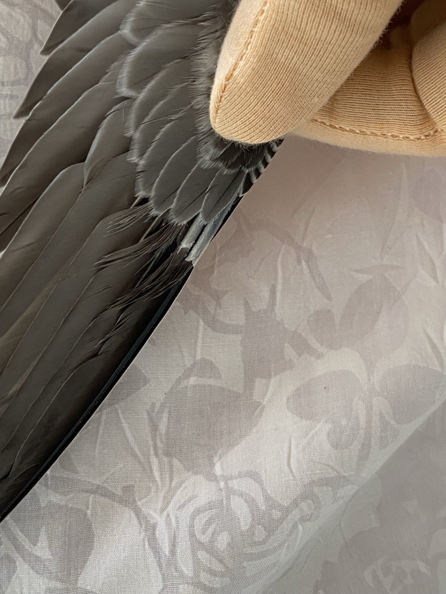
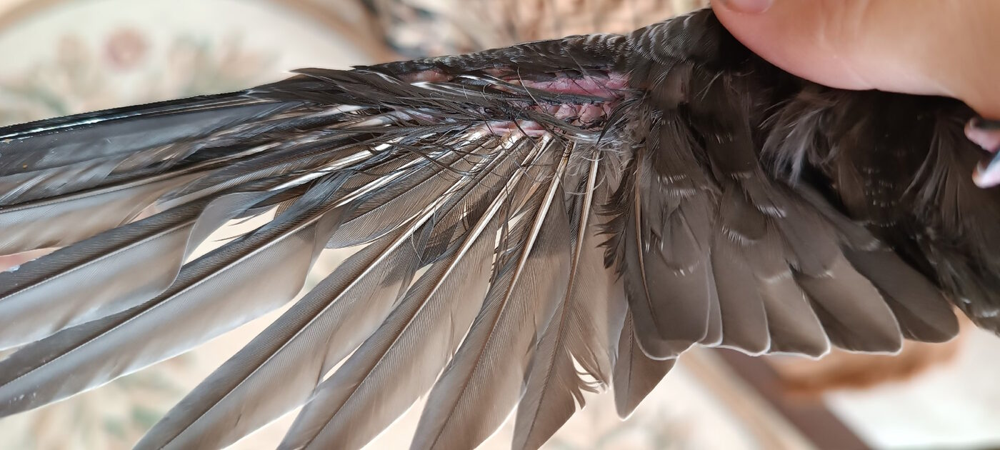
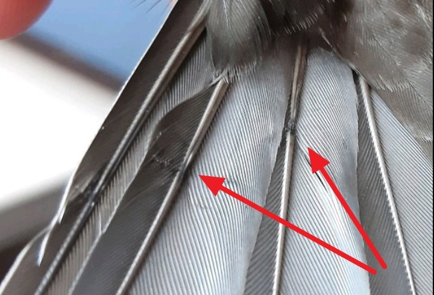
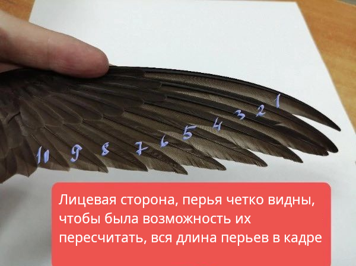

---
layout: default
title: Повернення у природу
lang: ua
is_home: false
---

# Повернення у природу

* TOC
{:toc }

Головна мета реабілітації серпокрильця — випуск здоровог птаха в його природне середовище існування.

## Готовність до випуску

Перед випуском переконайтеся, що серпокрилець відповідає усім наступним критеріям:

### 1. Стан оперення

- Усі махові та кермові перра повністю виросли, трубочки біля основи пера повністю зійшли.

<figure>
    
    <figcaption>Трубочка біля основи пера (не готовий до випуску)</figcaption>
</figure> 
<figure>
    
    <figcaption>Трубочки повністю зійшли (готовий до випуску)</figcaption>
</figure>

- Пір'я не має стрес-ліній, деформацій або пошкоджень.

<figure>
    
    <figcaption>Стрес-лінія на пері</figcaption>
</figure>

- Підрахунок пір'я: 10 махових пер першого порядку на кожному крилі.

<figure class="image-block">
    
    <figcaption>Схема нумерації пір'я крила</figcaption>
</figure>

### 2. Вага та фізична форма

- Нормальна вага дорослого серпокрильця перед випуском: **38–42 грами** (для молодих зльотків можливе зниження ваги перед вильотом до 38-40 г).
- Грудні м'язи добре розвинені (кіль не випирає гостро).
- Птах активний, робить віджимання на крилах та активно тренує крила у коробці.

### 3. Погода та умови для випуску

- Суха, тепла погода без сильного дощу та поривчастого вітру.
- Відсутність заморозків за маршрутом міграції.
- Наявність інших серпокрильців у небі (ідеально, але для пізніх птахів у серпні/вересні не обов'язково).
- Для випуску обирайте відкрите поле, стадіон або пагорб без високих дерев та дротів поблизу.

## Процес випуску

1. Прибудьте на місце випуску у світлий час доби.
2. Посадіть серпокрильця на відкриту долоню піднятої руки.
3. Дайте птаху озирнутися. Не підкидайте його!
4. Здоровий та готовий птах легким поштовхом сам злетить з долоні та почне набирати висоту.