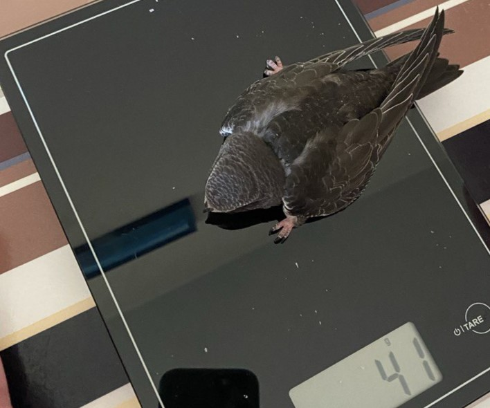
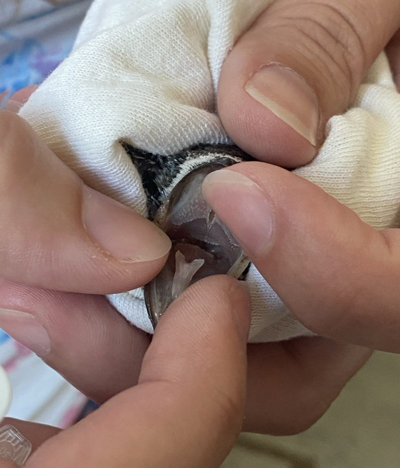
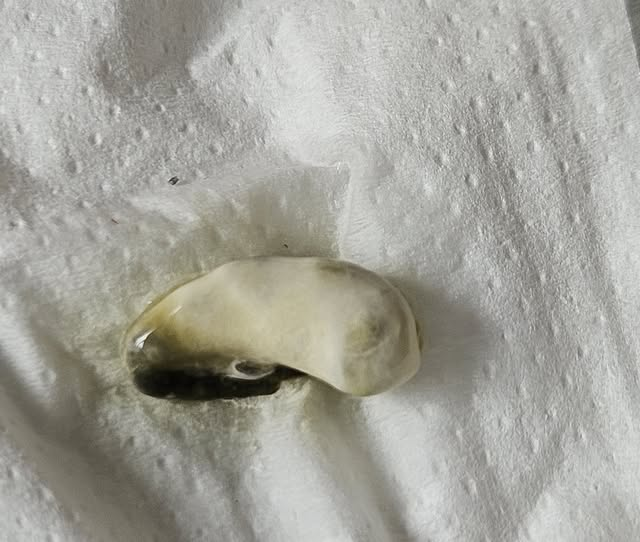
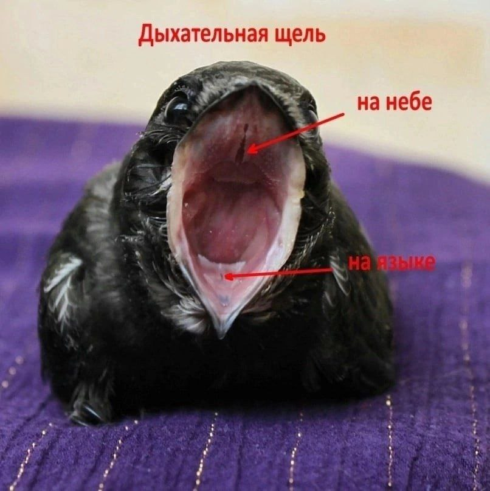
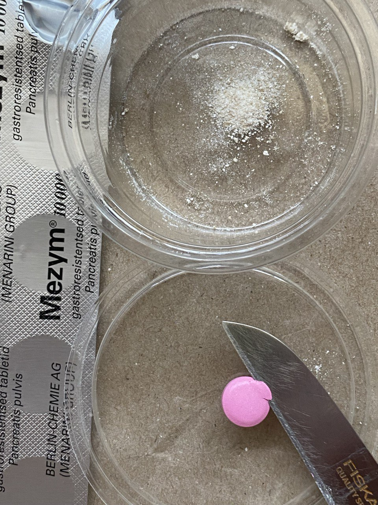
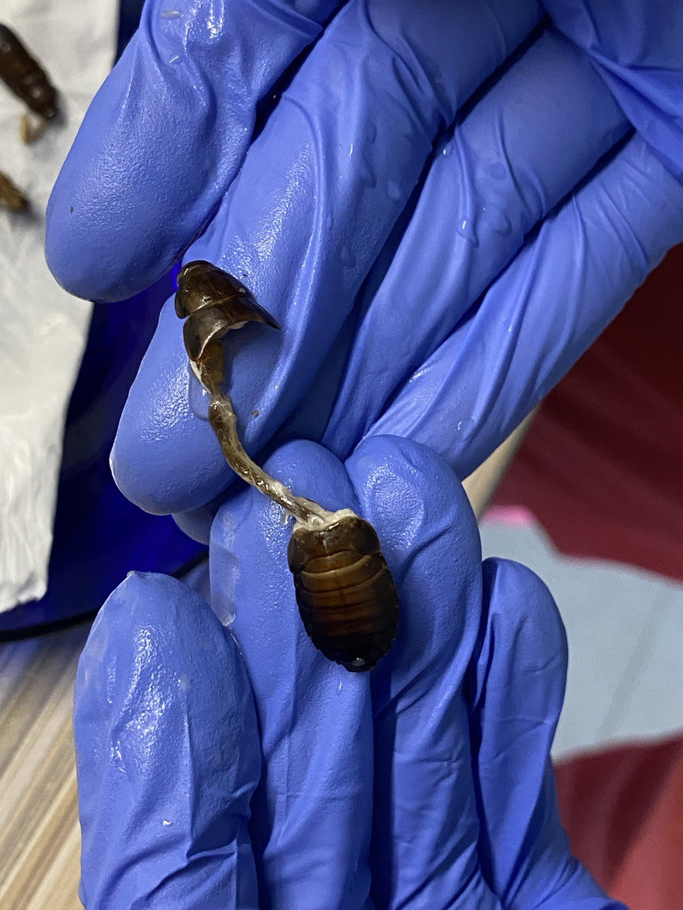
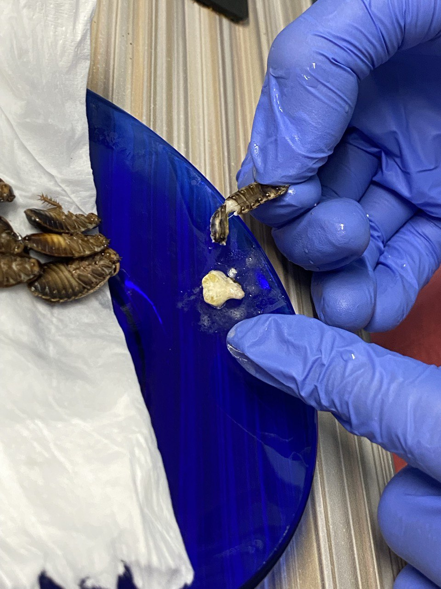
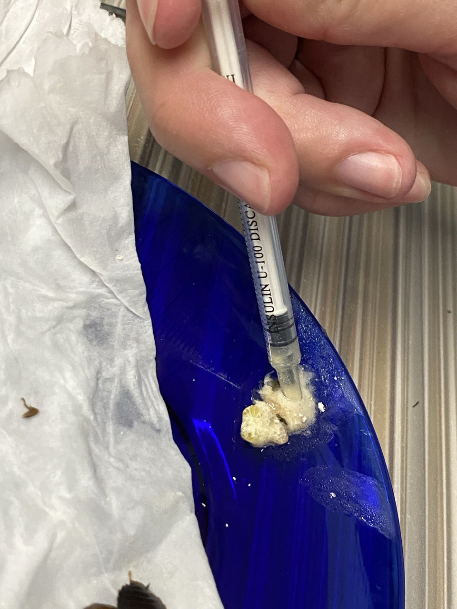
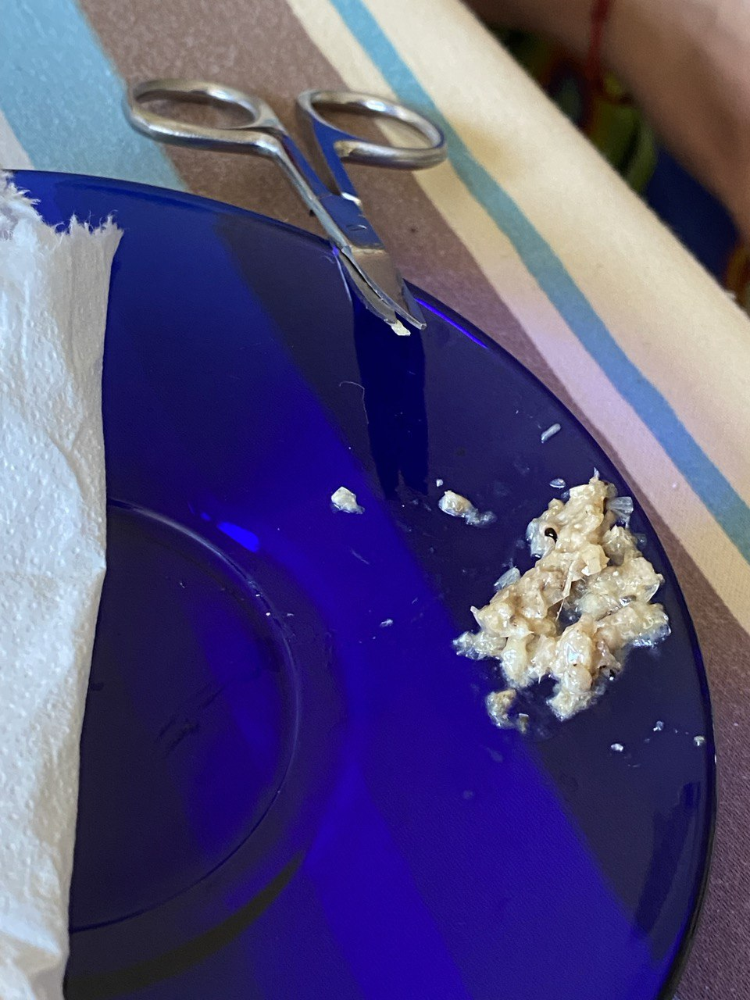

---
layout: default
title: Виснаження
lang: ua
is_home: false
toc: true
---

Детально про те, як визначити виснаження у серпокрильця і що робити у разі його наявності. Практичні рекомендації та поради досвідчених волонтерів про те, як виходити виснаженого серпокрильця. Усе написане нижче однаково для дорослих птахів та пташенят. Відмінності будуть вказані окремо.

---

Пропустити ознаки виснаження і перейти одразу [до опису реанімації](#reanimation)

При виснаженні серпокрильця не можна одразу годувати як здорового птаха. **Не давати їжу у великих об'ємах!** Інакше відмовить шлунок, і серпокрилець загине.

Для здорового невиснаженого пташеняти: [Таблиця з необхідною кількістю їжі для одного пташеняти серпокрильця](amount-of-feed.md)

## Визначаємо ступінь виснаження
Від того, наскільки виснажений серпокрилець, залежатимуть наші подальші дії.

### Вгодованість грудки

По центру грудки є кістка, яка йде дугою від шиї до живота — це кіль. Трохи намочіть пір'я на грудці теплою водою і розгребіть його в сторони пальцями. Як виглядає кіль? Боковини грудини круглі, сама грудка буквою U? Чи рівні, грудина буквою V (гострий куточок)? Чи грудина як тонка дощечка, буквою Y або I?

### Вага

<figure class="image-float">
  
  <figcaption>Зважуємо пташеня, це дуже важливий показник</figcaption>
</figure>

Вага здорового серпокрильця, у тому числі пташеняти старше 10 днів — **від 35 грамів і більше.**

Критична для життя пташеняти вага — 22–18 грамів. Для дорослого птаха критична вага — нижче 30 грамів.

Виснажені знайдені пташенята серпокрильця зазвичай важать 20–27 грамів.

Насамперед треба дізнатися точну вагу серпокрильця на електронних (кухонних або ювелірних) вагах. Вагу треба знати з точністю до 1 грама! Відхилення на вагах ±10 грамів не підходить, тому механічні ваги з приблизною вагою не знадобляться.

Якщо вдома немає ваг і немає в кого їх позичити, то зважити можна непомітно в магазині у відділі самообслуговування (фрукти, овочі, цукерки). Посадіть серпокрильця в коробочку, наприклад, з-під чаю і зважте разом із цією тарою. Потім коробочку зважте окремо і відніміть її вагу від загальної ваги. Надалі за динамікою приросту ваги буде зрозуміла терміновість тих чи інших дій.

[Відповідність віку та ваги](identifying-swift.html)

### Колір ротової порожнини (ротика)

<figure class="image-float">
  
  <figcaption>Сіруватий рот у пташеняти означає поганий стан</figcaption>
</figure>

Якого кольору рот усередині?

-   Яскраво-рожевий
    
    Нормальна слизова. Пташеня достатньо вгодоване.
    
-   Блідо-рожевий
    
    Пташеня ослаблене, але не при смерті.
    
-   Білий, жовтий, сірий
    
    Пташеня при смерті.

Увага! Відкривати рот за кінчики дзьоба **не можна**! Великий ризик зламати дзьоб. Фіксуйте голову серпокрильця пальцями однієї руки з боків, а іншою рукою беріть серпокрильця за шкіру під дзьобом (не за одне пір'я, а за пір'я зі шкірою) і тягніть униз, щоб відкрити дзьоб. Відкритий дзьоб можна зафіксувати пальцем. Не здавлюйте дзьоб з боків, це травмує його з'єднання.

### Очі

Вони частіше відкриті чи закриті? Якщо відкриває, то відкриває повністю (широкі круглі)? Чи відкриває наполовину, очі ніби напівприкриті? Звіртеся з [таблицею росту](identifying-swift.html): широко відкриті очі можуть бути тільки у серпокрильця старше двох тижнів.

-   Нормально відкриті очі
    
    Пташеня в порядку.
    
-   Щільно закриті очі
    
    Серпокрилець ослаблений.
    
-   Впалі очі (іноді здається, що очей ніби немає, такі сухі)
    
    Пташеня вкрай виснажене.

### Послід серпокрильця

Нормальний послід птаха складається з трьох частин: фекалій, уратів та сечі. Біла частина — це виводять нирки: сеча та урати. Темна частина — з шлунково-кишкового тракту (залишки хітину та перетравлені залишки комах).

-   Послід при виснаженні
    
    Щось чорне та розмазане. І цього чогось вкрай мало. Калюжка навколо може бути зеленого кольору. У птахів шлунковий сік зеленого кольору, і зелена калюжа в посліді говорить нам про те, що шлунку немає чого перетравлювати.
    
-   Хороший послід
    
    Велика калюжка навколо капсули говорить про зайву воду в кормі.

-   Ідеальний послід
    
    Добре сформована біла капсула, яка не розтікається, з невеликим чорним хвостиком.

Це цікаво: послід у вигляді капсули використовується батьками пташенят, щоб ефективно прибирати його з гнізда.

<figure class="image-block">
  
  <figcaption>Хороший послід у пташеняти після перших годувань</figcaption>
</figure>

-   Послід при годуванні кониками
    
    Капсула більш розпливчаста, чорний хвостик довший, може бути рожевий, буряковий або зеленкуватий відтінок.

### Інші ознаки виснаження

Лапки та тіло холодні, при крайньому виснаженні можуть бути крижаними.  
У нормі повинні бути теплі та гарячі, оскільки температура тіла серпокрильців вища, ніж у людини.

Виснажений серпокрилець скуйовджений, пір'я на спинці стоїть дибом.

-   У нормі пір'я гладко прилягає до тіла.

Дихання уповільнене, спинка може при цьому помітно підніматися. Якщо серпокрилець ритмічно відкриває рот при кожному вдосі — він вже при смерті.

-   У нормі дихання часте, у 2 рази частіше, ніж у людини, а по спинці майже непомітно, що серпокрилець дихає.

## Реанімація починається з обігріву {#reanimation}

Виснажений серпокрилець сам зігрітися не може. Будь-який птах отримує енергію та обігрів, перетравлюючи їжу. Навіть якщо ви посадите серпокрильця в хутро, він не отримуватиме тепло, тому що повинен спочатку нагріти його своїм тілом.

Для обігріву використовуйте:
-   свої руки: тримайте серпокрильця в долонях, притисніть його до себе
-   водяну грілку
-   пляшку з дуже теплою водою, засунуту в шкарпетку
-   лампу розжарювання, направивши її на серпокрильця зверху. З лампою треба бути дуже обережним! Якщо у птаха ЧМТ (вдарився головою при падінні), то гріти зверху не можна!
-   електричну грілку (тільки на найнижчих температурах та під вашим наглядом)

У серпокрильця має бути простір у коробці, щоб відповзти від грілки убік, якщо стане жарко.

Усі рідини та їжу давати потрібно **теплими**! Тепле краще засвоюється, і організму потрібно менше зусиль на перетравлення.

### Гігієна

Перш ніж починати реанімаційні дії, ретельно вимийте руки з милом та обробіть їх антисептиком. Усі інструменти повинні бути чистими. Підготуйте чисті серветки, паперові рушники.

Якщо кормова комаха впала на підлогу, значить серпокрильцю вона вже не дістанеться. Серпокрильці дуже схильні до інфекцій!

Використовуйте рукавички при годуванні. Найзручніші — нітрилові.

### Підготовка до реанімації

Знадобиться фізрозчин або розчин Рінгера, оскільки виснажений серпокрилець насамперед сильно зневоднений. Можна зробити фізрозчин самостійно: повну чайну ложку кухонної солі розмішати в одному літрі кип'яченої води.

Також потрібно зробити медову воду з розрахунку 1 чайна ложка меду на склянку кип'яченої води (або глюкоза 5-5% з аптеки).

Змішайте фізрозчин із медовою водою 1:1. Підтримуйте температуру рідини близько 40 градусів (дуже тепла, але не гаряча).

Підготуйте шприц без голки (краще 1 мл, інсуліновий), ватні палички та серветки.

Мезим (Mezym) у таблетках. Містить травні ферменти, допомагає шлунку перетравлювати їжу. З таблетки потрібно здерти рожеву оболонку та розім'яти її в порошок.

Кормові комахи, в ідеалі цвіркуни.

### Реанімація

Насамперед дати серпокрильцю в дзьоб 0,2–0,3 мл суміші фізрозчину з медовою водою 1:1 (це 5–7 крапель). Зі шприца без голки у теплому вигляді, випоюючи по краплі та переконуючись, що рідина протікає в горло і птах ковтає її. Будьте дуже обережні з дихальними щілинами птаха на язиці та на піднебінні! Рідина не повинна туди потрапити.

<figure class="image-float">
 
  <figcaption>Дихальні щілини серпокрильця</figcaption>
</figure>

Чекаємо 20 хвилин. Птах увесь цей час перебуває в теплі.

Щоб шлунково-кишковий тракт почав працювати, годувати треба часто маленькими дозами.
Приготуйте вижимку з цвіркуна або таргана. Для цього видаліть у комахи голову з шлунком, а з черевця видавіть «м'ясо» комахи. Хітинову оболонку не давайте. Потрібно набрати 0,2–0,25 мл вижимок. У порцію додати порошок Mezym розміром із кунжутне насіння. Погладжуйте серпокрильця по горлечку зверху вниз, щоб йому легше було ковтати. Ретельно стежте, щоб їжа не потрапила в дихальну щілину!

У першу добу годуємо тільки вижимками. Робимо вижимки по 0,2–0,25 мл і годуємо кожні 25–40 хвилин перші 5 годувань. Після п'ятого годування зазвичай з'являється послід. Коли є послід, збільшуємо порцію до 0,3–0,35 мл, а інтервал — до 1 години до кінця доби.
Нічні перерви між годуваннями — не більше трьох годин.

#### Вижимка {#extraction}

Підготовка вижимки з додаванням крихт таблетки Mezym на прикладі мармурового таргана (передімаго).

<figure>
  
  <figcaption>Очищаємо таблетку від кольорової оболонки, отримуємо порошок</figcaption>
</figure>
<figure>
  
  <figcaption>Відокремлюємо голову таргана, витягуючи разом із нею кишечник</figcaption>
</figure>
<figure>
  
  <figcaption>Отримуємо білу масу з черевця і додаємо крихту Mezym</figcaption>
</figure>
<figure>
  
  <figcaption>Набираємо суміш у шприц, щоб потім акуратно видавлювати збоку від язика</figcaption>
</figure>

### Контроль ваги

Щоранку перед першим годуванням зважуємо серпокрильця натщесерце. Щодня серпокрилець повинен додавати у вазі щонайменше 1–1,5 грама. Перші пару грамів він додасть у перші години реанімації при відновленні від зневоднення. Далі вага повинна продовжувати збільшуватися.

### Здутий животик

Якщо ви годуєте серпокрильця, а в нього довго немає посліду, помацайте живіт серпокрильця. Якщо він твердий і надутий, потрібно припинити годування до появи посліду. Дати 2 краплі вазелінової олії з водою в дзьоб. Смастити анус олією. Тримати животом над теплом. Акуратно масажувати животик ватним диском.

### Нарізані комахи (різанка)

Коли ротик серпокрильця став блідо-рожевим, вижимки засвоюються і є регулярний послід, можна почати поступово вводити годування дрібно нарізаними черевцями комах з інтервалом 1,5 години.

<figure>
    
    <figcaption>Підготовка дрібно нарізаних комах</figcaption>
</figure>

  <figure>
    <video width="500" height="405" controls>
      <source src="{{ 'assets/video/feeding-with-finely-chopped-insects.mp4' | relative_url }}" type="video/mp4">
      Ваш браузер не підтримує відео.
    </video>
    <figcaption>
      Годування дрібно нарізаними комахами. Закладаємо шматочки в рот, намагаючись не замастити дзьоб.
    </figcaption>
  </figure>

### Годування черевцями

Цілі ненарізані черевця цвіркунів вводьте також поступово. Дайте 2–3 черевця разом із різанкою і подивіться, яким буде послід.

## Серпень — місяць покинутих та виснажених пташенят серпокрильців

Зграя відлітає на південь на початку-середині серпня, і частина птенців залишається сидіти у своїх гніздах недогодованими. Пташенята чекають день, два, тиждень… а потім вистрибують шукати їжу самостійно. Тут їх і підбирають на землі.

Кіль гострий і тонкий, як фанера, очі закриті та впалі, ротик білий, вага 20–24 грами.

Волонтеру потрібна особлива наполегливість. Час іде на хвилини! Якщо не вжити термінових заходів — пташеня гине протягом доби. Реанімовані пташенята поступово відновлюються та виходять на норму ваги та розвитку і здатні повернутися в природу.

