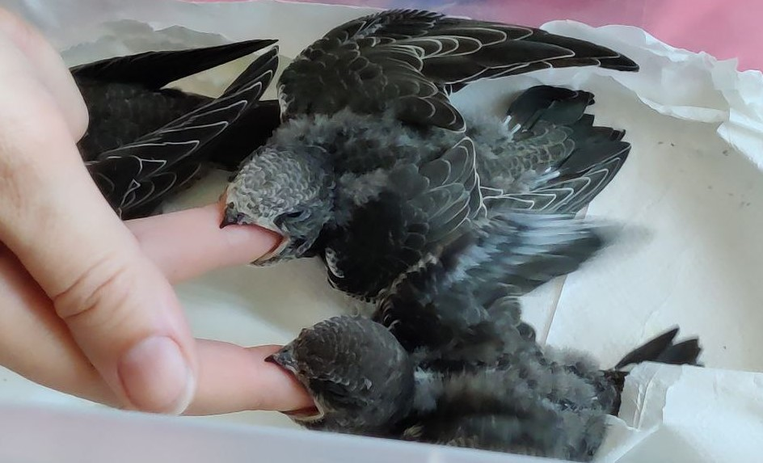

---
layout: default
title: Правильне годування серпокрильця
lang: ua
is_home: false
---

# Основні пункти

Серпокрилець — це повністю комахоїдний птах. Абсолютно.

Його травна система взагалі не пристосована для ефективного перетравлення тваринного білка (кисломолочний сир, м'ясні продукти), а також хробаків, дощових черв'яків, гамаруса тощо. Природний раціон серпокрильця — це повітряний планктон. Простіше кажучи: комарі, мухи та інша дрібнота. Найближчі за складом з доступного — кормові комахи: цвіркуни та кормові таргани.

<figure>
    
    <figcaption>Маленькі серпокрильці хапають за пальці</figcaption>
</figure> 

Для пташенят головна мета — виростити якісне пір'я для польоту. Серпокрильці живуть у буквальному сенсі в небі: вони не тільки харчуються, а й сплять у повітрі. Гніздо використовується виключно в період розмноження. Оперення, вирощене у вас, має дозволити серпокрильцю дістатися Південної Африки. Якщо пташеня виживе, але виросте з поганим пір'ям, воно не зможе повернутися в природу або загине невдовзі після випуску. Рекомендації тут є консервативними та орієнтовані на досвід формування якісного оперення та повноцінного розвитку птаха.

З цієї причини даний посібник виключає будь-які мешанки та пташині суміші, у тому числі ті, що нібито призначені для комахоїдних птахів.
Способи примусового годування серпокрильців дивіться нижче в описі основного та додаткового корму або переходьте далі.

## Основні корми

- **Домові цвіркуни або бананові цвіркуни**
- **Кормові мармурові або туркменські таргани**

Ці комахи можуть бути живими (щойно забитими) або замороженими. Найкраще купувати живих і заморожувати самостійно. Комахи мають різні стадії розвитку. Дорослі (з крилами) особини погано підходять для годування: вони тверді й потребують багато обробки. Передімаго — великі, але ще без крил — підходять ідеально. Дрібні (імаго-німфи) — також підходять, але виходять дорожчими, бо їх потрібно більше. Усі тверді та гострі частини комах (задні ноги, крила) необхідно видаляти.

## Додаткові корми

- **Зофобас (личинки)**
- **Борошняні черв'яки**
- **Личинки чорної львинки (Hermetia illucens)**

Зофобас занадто жирний, щоб бути основним кормом. Але 3–5 шт. на день може бути додатком до основного раціону. Зофобас дають без голови та кишечника.
Борошняні черв'яки бідніші за складом, тому не підходять для основного годування. У крайньому разі їх можна використовувати з вітамінними комплексами. Вони мають твердий покрив, тому обирайте з банки щойно линялих (білих) черв'яків.
Личинки чорної львинки повноцінні за складом і є дуже хорошим кормом. Єдиний мінус — їхня мала вага. Для одного годування потрібно дуже багато личинок.

## Якщо немає можливості купити кормових комах

Природний корм:
- **Заморожені мухи** (не з липкої стрічки!)
- **Черевця цвіркунів або коників**
- **Некольорові метелики без лусочок/волосин** (наприклад, нічні)
- **Некольорові гладкі гусениці** (не волохаті!)
- **Мурашині яйця (лялечки)**

Важливо! Займані в природі мухи та цвіркуни/коники повинні бути заморожені щонайменше на 4 години для запобігання зараженню паразітами.

## Коротка таблиця об'єму їжі

<table>
  <tr>
    <th>Вік пташеняти (днів)</th>
    <th>Необхідний об'єм їжі на день (г)</th>
    <th>Бананові цвіркуни на день (шт)</th>
    <th>Домові цвіркуни на день (шт)</th>
    <th>Дрібні домові цвіркуни на день (шт)</th>
    <th>Великі черевця мармурових тарганів (шт)</th>
    <th>Дрібні мармурові таргани цілком (шт)</th>
  </tr>
<tr><td>10-16</td><td style='background-color:#ff4500'>20</td><td>60</td><td>100</td><td>200</td><td>80</td><td>160</td></tr>
<tr><td>17-20</td><td style='background-color:#ff7f50'>18</td><td>54</td><td>90</td><td>180</td><td>72</td><td>144</td></tr>
<tr><td>21-38</td><td style='background-color:#f4a460'>15</td><td>45</td><td>75</td><td>150</td><td>60</td><td>120</td></tr>
</table>

І за посиланням [**точна таблиця по днях** з необхідною кількістю їжі та контролем ваги для одного пташеняти серпокрильця](amount-of-feed.md)

[Читайте про види корму детальніше у спеціальному розділі, там багато нюансів](#types-of-food)

# Особливості годування серпокрильців

Маленьке пташеня, яке потрапило до людей, та молодий птах (зльоток), який вже звик до батьків, годуються по-різному. Для дорослого або зльотка годування, найімовірніше, буде примусовим.

  <figure>
    <video width="300" height="405" controls>
      <source src="{{ 'assets/video/feeding-adult-swift2-ru.mp4' | relative_url }}" type="video/mp4">
      Ваш браузер не підтримує відео.
    </video>
    <figcaption>
      Детальна інструкція, як годувати серпокрильця.
    </figcaption>
  </figure>

  <figure>
    <video width="570" height="405" controls>
      <source src="{{ 'assets/video/feeding-adult-swift1.mp4' | relative_url }}" type="video/mp4">
      Ваш браузер не підтримує відео.
    </video>
    <figcaption>
      Коротко (відео без звуку): годуємо дорослого серпокрильця. Тарган закладається глибоко, після чого погладжуємо горлечко.
    </figcaption>
  </figure>

Помічено, що група з кількох пташенят зазвичай їсть краще, ніж поодинці.

# Тепер про види корму детальніше {#types-of-food}

## Цвіркуни

### Тільки передімаго (без крил):
- Домовий цвіркун: 1,5–2 см, висока поживність, білок 17,8%, жир 5,33%
- Банановий цвіркун: до 3 см, білок 17,51%, жир 5,33%
- Двоплямистий цвіркун: до 3 см, білок 17,7%, жир 5,33%

#### Підготовка:
1. Заморожених цвіркунів потрусити в контейнері, щоб відпали лапки.
2. Розморозити у теплій (не гарячій!) воді.
3. Покласти на серветку, видалити залишки лапок, роздушити голову (якщо тверда); для великих екземплярів краще видалити голову та кишечник.

## Кормові таргани

Підходять тільки культивовані кормові види, рудих тарганів («прусаків») з кухні використовувати не можна!

- **Мармуровий тарган**: до 3,5 см, білок 22,13%
- **Туркменський тарган**: ~2,5 см, білок 18,16%, жир 8,645%

#### Підготовка:
- Мармуровий тарган: для великих використовують тільки черевця, розрізані вздовж. Дрібних (1 см) дають цілком без лапок.
- Туркменський тарган: видаляють лапки.

## Зофобас (личинки)

- Білок 17,4%, жир 16,56%
- Не заморожувати!

## Частота годування та розрахунок порцій

- Пташеня їсть 15–20 г на день, годують кожні 1,5–2 години — приблизно 8–9 разів на день, нічна перерва 6 годин.
- Дорослий серпокрилець — ~12 г на день, 3–4 годування (можна і 2, якщо він здатний з'їсти денну норму за два рази).

**Приклади порцій для одного годування**:
- Домові цвіркуни: 15–20 шт (1,5–2 см)
- Бананові цвіркуни: 10–15 великих або 15–20 дрібних
- Мармурові таргани: 10–15 черевець або 20–25 дрібних
- Мурашині яйця: 1 чайна ложка з гіркою

Використовуйте ваги з точністю до 0,01 г для контролю порцій.

## Що робити, якщо немає кормових комах

Швидкі варіанти здобичі:
- Нічні метелики — ловити біля світла ліхтаря на біле простирадло.
- Коники/цвіркуни — ловити в траві. Заморозити, давати тільки черевця.
- Мухи (не з липкої стрічки!) — заморозити.
- Мурашині яйця — промити, сформувати в порційну кульку.

## Вітаміни

За відсутності різноманітності комах:
- **Multibiotin‑Birds** або **NEKTON‑Biotin**
- Давати щодня до випуску. Порошок наносити на корм сухими руками або розчиняти у воді та давати зі шприца краплею за язик, уникаючи дихальної щілини.

## Способи годування

<figure>
<video width="300" height="405" controls>
  <source src="{{ '/assets/video/how-to-give-water-to-swift.mp4' | relative_url }}" type="video/mp4">
  Ваш браузер не підтримує відео.
</video>
<figcaption>Даємо серпокрильцю воду, підносячи краплю до кутика дзьоба. При підозрі на струс мозку воду не давати!</figcaption>
</figure>

## Залишки для синичок

Лапки, голови та хітинові крила комах можна зберігати в морозильнику і взимку додавати в годівнички для синичок.